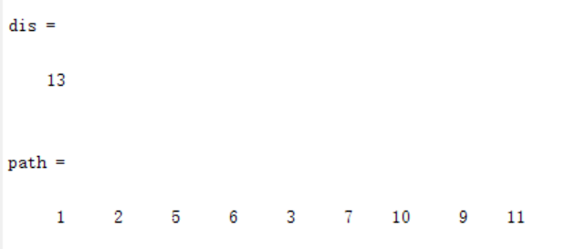

一，

1，需求

2，Floyd算法思想

<table>
<colgroup>
<col style="width: 100%" />
</colgroup>
<thead>
<tr class="header">
<th>
function [D,path,min1,path1]=floyd(a,start,terminal)

D=a;n=size(D,1);path=zeros(n,n);

for i=1:n

for j=1:n

if D(i,j)~=inf

path(i,j)=j;

end,

end,

end

for k=1:n

for i=1:n

for j=1:n

if D(i,k)+D(k,j)&lt;D(i,j)

D(i,j)=D(i,k)+D(k,j);

path(i,j)=path(i,k);

end,

end,

end,

end

if nargin==3

min1=D(start,terminal);

m(1)=start;

i=1;

path1=[ ];

while path(m(i),terminal)~=terminal

k=i+1;

m(k)=path(m(i),terminal);

i=i+1;

end

m(i+1)=terminal;

path1=m;

end
</th>
</tr>
</thead>
<tbody>
<tr class="odd">
<td>
a= [ 0,50,inf,40,25,10;

50,0,15,20,inf,25;

inf,15,0,10,20,inf;

40,20,10,0,10,25;

25,inf,20,10,0,55;

10,25,inf,25,55,0];

[D, path]=floyd(a)
</td>
</tr>
</tbody>
</table>

路程：D（2,5）+D（4,5）=30+10

二，Dijkstr与Floyd对比
输入
\[0 8 Inf Inf Inf Inf 7 8 Inf Inf Inf;
Inf 0 3 Inf Inf Inf Inf Inf Inf Inf Inf;
Inf Inf 0 5 6 Inf 5 Inf Inf Inf Inf;
Inf Inf Inf 0 1 Inf Inf Inf Inf Inf 12;
Inf Inf 6 Inf 0 2 Inf Inf Inf Inf 10;
Inf Inf Inf Inf 2 0 9 Inf 3 Inf Inf;
Inf Inf Inf Inf Inf 9 0 Inf Inf Inf Inf;
8 Inf Inf Inf Inf Inf Inf 0 9 Inf Inf;
Inf Inf Inf Inf 7 Inf Inf 9 0 2 Inf;
Inf Inf Inf Inf Inf Inf Inf Inf 2 0 2;
Inf Inf Inf Inf 10 Inf Inf Inf Inf Inf 0;\];

Dijkstr

Floyd

