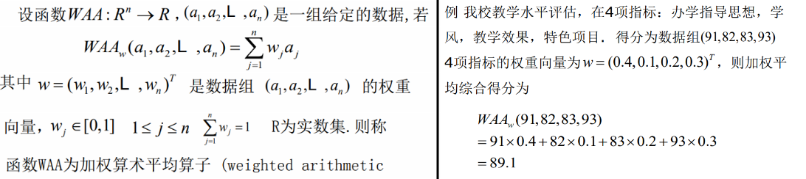
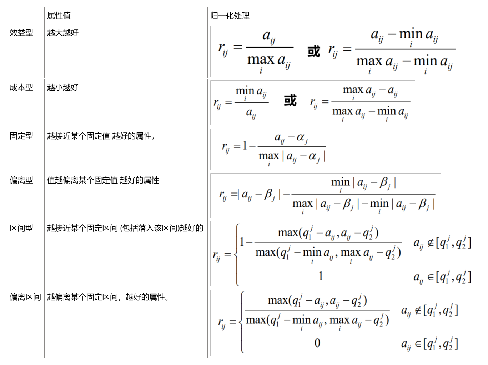
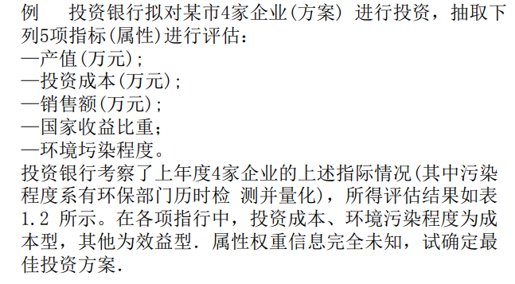
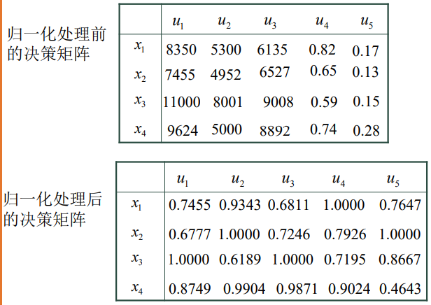
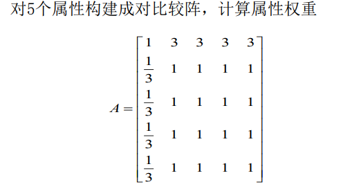
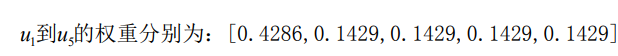
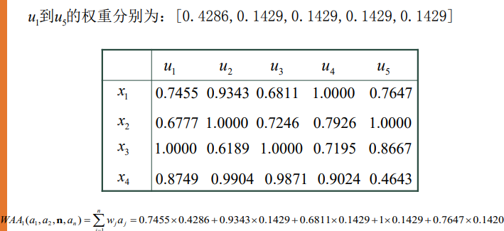
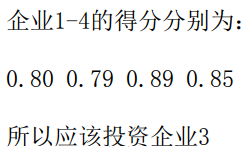

一、基本知识
1，应用范围：投资决策、项目评估、维修服务、 武器系统性能评定、工厂选址、投标招标、产业部门发展 排序和经济效益综合评价等

2，实质：利用已有的决策信息通过一定的方式对**一组(有限个)备选方案进**
**行排序或择优**．

3，,主要由两部分组成：
\(l\) 获取决策信息．决策信息一般包括两个方面的内容：属性权重和属性
值(属性值主要有三种形式：实数、区间数和语言)．其中，属性权重的确定是多属性决策中的一个重要研究内容；

(2)通过一定的方式对决策信息进行集结并对方案进行排序和择优

二、信息集结方法
加权算术平均(WAA)算子、加权几何平均(WGA)算子：有序加权平均(OWA)算子。。。

1，加权平均算子

2，属性值的归一化处理
2.1属性值
2.2为了消除不同物理量纲对决策结果的影响，对数据进行规范化处理

案例

1，填入数据，进行归一化处理

2,计算属性权重

**用比较分析法计算权重**

3,由属性权重和属性值计算总得分

4,做出最后决策

