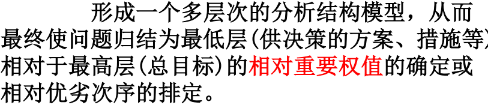

1，

Eg，多种影响因素

2，原理
在达成总目标的路上，有多个不同的因素影响选择，因素的影响关系不同。
要

3，步骤

3.1 构建层次结构模型

3.2比较矩阵
自我填入数据太主观
使用使用一致矩阵法【填入的数据也是自己设定】

a12:C1对C2
a21：C2对C1

3.3 一致性检验

案例

1，建立层次结构

2，构造判断（成对比较矩阵）【数据自己定义】

制定数据，输入程序
<table>
<colgroup>
<col style="width: 100%" />
</colgroup>
<thead>
<tr class="header">
<th>
disp('请输入判断矩阵A(n阶)');

A=input('A=');

[n,n]=size(A);

x=ones(n,100);

y=ones(n,100);

m=zeros(1,100);

m(1)=max(x(:,1));

y(:,1)=x(:,1);

x(:,2)=A*y(:,1);

m(2)=max(x(:,2));

y(:,2)=x(:,2)/m(2);

p=0.0001;i=2;k=abs(m(2)-m(1));

while k&gt;p

i=i+1;

x(:,i)=A*y(:,i-1);

m(i)=max(x(:,i));

y(:,i)=x(:,i)/m(i);

k=abs(m(i)-m(i-1));

end

a=sum(y(:,i));

w=y(:,i)/a;

t=m(i);

disp(w);

%以下是一致性检验

CI=(t-n)/(n-1);RI=[0 0 0.52 0.89 1.12 1.26 1.36 1.41 1.46 1.49 1.52 1.54 1.56 1.58 1.59];

CR=CI/RI(n);

if CR&lt;0.10

disp('此矩阵的一致性可以接受!');

disp('CI=');disp(CI);

disp('CR=');disp(CR);

end
</th>
</tr>
</thead>
<tbody>
<tr class="odd">
<td>
[1, 1/2, 4, 3, 3;

2, 1, 7, 5, 5;

1/4, 1/7, 1, 1/2, 1/3;

1/3, 1/5, 2, 1, 1;

1/3, 1/5, 3, 1, 1;]

[1,2,5;

1/2,1,2;

1/5,1/2,1;]

[1,1/3,1/8;

3,1,1/3;

8,3,1;]

[1,1,3;

1,1,3;

1/3,1/3,1;]

[1,3,4;

1/3,1,1;

1/4,1,1;]

[1,1,1/4;

1,1,1/4;

4,4,1;]
</td>
</tr>
</tbody>
</table>

得到

