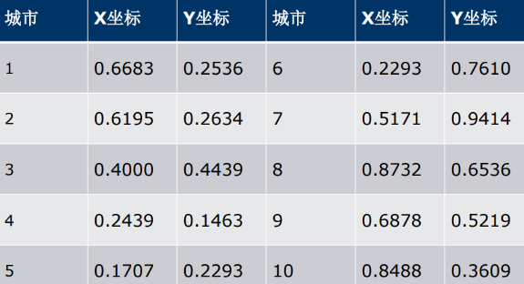

一、了解.
1，类似大自然的退火模型
缓缓降温，使得物体分子在每一温度时，能够有足够 时间找到安顿位置，则逐渐地，到最后可得到最低能态，系 统最稳定

利用了物理中固体
物质的退火过程与一般优化问题的相似性从某一初
始温度开始，伴随温度的不断下降，结合概率突跳
特性在解空间中随机寻找全局最优解

二、对TSP问题的求解
1，旅行商问题，即TSP问题（Travelling Salesman Problem）又译为旅行推销员问题、货郎担问题，是 数学领域中著名问题之一。

2，应用TSP“旅行商问题”的应用领域包括：
如何规划最合理高效的道路交通，以减少拥堵；
如何更好地规划物流，以减少运营成本；
在互联网环境中如何更好地设置节点，以更好地让信息流动等。

案例：假设有一个旅行商人要拜访 n个城市，他必须选择所要走的路径，路径的限制是每 个城市**只能拜访一次**，而且最后要回到原来出发的城市。
路径的选择目标是要求得的路径路程为所有路径之中的 最小值。

**结果：每一次运行的结果大多数都不一样，所以它只是模拟近似解，得到的不是精确的解，难找最优解**

<table>
<colgroup>
<col style="width: 100%" />
</colgroup>
<thead>
<tr class="header">
<th>
重点修改tsp.m

<table>
<colgroup>
<col style="width: 78%" />
<col style="width: 21%" />
</colgroup>
<thead>
<tr class="header">
<th>
clear;

% 程 序 参 数 设 定

Coord = ... % 城 市 的 坐 标 Coordinates

[ 0.6683 0.6195 0.4 0.2439 0.1707 0.2293 0.5171 0.8732 0.6878 0.8488 ; 0.2536 0.2634 0.4439 0.1463 0.2293 0.761 0.9414 0.6536 0.5219 0.3609 ] ;

t0 = 1 ; % 初 温 t0

iLk = 20 ; % 内 循 环 最 大 迭 代 次 数 iLk

oLk = 50 ; % 外 循 环 最 大 迭 代 次 数 oLk

lam = 0.95 ; % λ lambda

istd = 0.001 ; % 若 内 循 环 函 数 值 方 差 小 于 istd 则 停 止

ostd = 0.001 ; % 若 外 循 环 函 数 值 方 差 小 于 ostd 则 停 止

ilen = 5 ; % 内 循 环 保 存 的 目 标 函 数 值 个 数

olen = 5 ; % 外 循 环 保 存 的 目 标 函 数 值 个 数

% 程 序 主 体

m = length( Coord ) ; % 城 市 的 个 数 m

fare = distance( Coord ) ; % 路 径 费 用 fare

path = 1 : m ; % 初 始 路 径 path

pathfar = pathfare( fare , path ) ; % 路 径 费 用 path fare

ores = zeros( 1 , olen ) ; % 外 循 环 保 存 的 目 标 函 数 值

e0 = pathfar ; % 能 量 初 值 e0

t = t0 ; % 温 度 t

for out = 1 : oLk % 外 循 环 模 拟 退 火 过 程

ires = zeros( 1 , ilen ) ; % 内 循 环 保 存 的 目 标 函 数 值

for in = 1 : iLk % 内 循 环 模 拟 热 平 衡 过 程

[ newpath , v ] = swap( path , 1 ) ; % 产 生 新 状 态

e1 = pathfare( fare , newpath ) ; % 新 状 态 能 量

% Metropolis 抽 样 稳 定 准 则

r = min( 1 , exp( - ( e1 - e0 ) / t ) ) ;

if rand &lt; r

path = newpath ; % 更 新 最 佳 状 态

e0 = e1 ;

end

ires = [ ires( 2 : end ) e0 ] ; % 保 存 新 状 态 能 量

% 内 循 环 终 止 准 则 ：连 续 ilen 个 状 态 能 量 波 动 小 于 istd

if std( ires , 1 ) &lt; istd

break ;

end

end

ores = [ ores( 2 : end ) e0 ] ; % 保 存 新 状 态 能 量

% 外 循 环 终 止 准 则 ：连 续 olen 个 状 态 能 量 波 动 小 于 ostd

if std( ores , 1 ) &lt; ostd

break ;

end

t = lam * t ;

end

pathfar = e0 ;

% 输 入 结 果

fprintf( '近似最优路径为：\n ' )

%disp( char( [ path , path(1) ] + 64 ) ) ;

disp(path)

fprintf( '近似最优路径路程\tpathfare=' ) ;

disp( pathfar ) ;

myplot( path , Coord , pathfar ) ;
</th>
<th>
111111111

只改这个

[坐标一一对应]

修改对应的x坐标

修改对应的y坐标
</th>
</tr>
</thead>
<tbody>
</tbody>
</table>

swap.m

<table>
<colgroup>
<col style="width: 100%" />
</colgroup>
<thead>
<tr class="header">
<th>
function [ newpath , position ] = swap( oldpath , number )

% 对 oldpath 进 行 互 换 操 作

% number 为 产 生 的 新 路 径 的 个 数

% position 为 对 应 newpath 互 换 的 位 置

m = length( oldpath ) ; % 城 市 的 个 数

newpath = zeros( number , m ) ;

position = sort( randi( m , number , 2 ) , 2 ); % 随 机 产 生 交 换 的 位 置

for i = 1 : number

newpath( i , : ) = oldpath ;

% 交 换 路 径 中 选 中 的 城 市

newpath( i , position( i , 1 ) ) = oldpath( position( i , 2 ) ) ;

newpath( i , position( i , 2 ) ) = oldpath( position( i , 1 ) ) ;

end
</th>
</tr>
</thead>
<tbody>
</tbody>
</table>

pathfare.m

<table>
<colgroup>
<col style="width: 100%" />
</colgroup>
<thead>
<tr class="header">
<th>
function [ objval ] = pathfare( fare , path )

% 计 算 路 径 path 的 代 价 objval

% path 为 1 到 n 的 排 列 ，代 表 城 市 的 访 问 顺 序 ；

% fare 为 代 价 矩 阵 ， 且 为 方 阵 。

[ m , n ] = size( path ) ;

objval = zeros( 1 , m ) ;

for i = 1 : m

for j = 2 : n

objval( i ) = objval( i ) + fare( path( i , j - 1 ) , path( i , j ) ) ;

end

objval( i ) = objval( i ) + fare( path( i , n ) , path( i , 1 ) ) ;

end
</th>
</tr>
</thead>
<tbody>
</tbody>
</table>

distance.m

<table>
<colgroup>
<col style="width: 100%" />
</colgroup>
<thead>
<tr class="header">
<th>
function [ fare ] = distance( coord )

% 根 据 各 城 市 的 距 离 坐 标 求 相 互 之 间 的 距 离

% fare 为 各 城 市 的 距 离 ， coord 为 各 城 市 的 坐 标

[ v , m ] = size( coord ) ; % m 为 城 市 的 个 数

fare = zeros( m ) ;

for i = 1 : m % 外 层 为 行

for j = i : m % 内 层 为 列

fare( i , j ) = ( sum( ( coord( : , i ) - coord( : , j ) ) .^ 2 ) ) ^ 0.5 ;

fare( j , i ) = fare( i , j ) ; % 距 离 矩 阵 对 称

end

end
</th>
</tr>
</thead>
<tbody>
</tbody>
</table>

myplot.m

<table>
<colgroup>
<col style="width: 100%" />
</colgroup>
<thead>
<tr class="header">
<th>
function [ ] = myplot( path , coord , pathfar )

% 做 出 路 径 的 图 形

% path 为 要 做 图 的 路 径 ，coord 为 各 个 城 市 的 坐 标

% pathfar 为 路 径 path 对 应 的 费 用

len = length( path ) ;

clf ;

hold on ;

title( [ '近似最短路径如下，路程为' , num2str( pathfar ) ] ) ;

plot( coord( 1 , : ) , coord( 2 , : ) , 'ok');

pause( 0.4 ) ;

for ii = 2 : len

plot( coord( 1 , path( [ ii - 1 , ii ] ) ) , coord( 2 , path( [ ii - 1 , ii ] ) ) , '-b');

x = sum( coord( 1 , path( [ ii - 1 , ii ] ) ) ) / 2 ;

y = sum( coord( 2 , path( [ ii - 1 , ii ] ) ) ) / 2 ;

text( x , y , [ '(' , num2str( ii - 1 ) , ')' ] ) ;

pause( 0.4 ) ;

end

plot( coord( 1 , path( [ 1 , len ] ) ) , coord( 2 , path( [ 1 , len ] ) ) , '-b' ) ;

x = sum( coord( 1 , path( [ 1 , len ] ) ) ) / 2 ;

y = sum( coord( 2 , path( [ 1 , len ] ) ) ) / 2 ;

text( x , y , [ '(' , num2str( len ) , ')' ] ) ;

pause( 0.4 ) ;

hold off ;
</th>
</tr>
</thead>
<tbody>
</tbody>
</table>

</th>
</tr>
</thead>
<tbody>
</tbody>
</table>

迄今为止，这类问题中没有一个找到有效算法。倾向于 接受NP完全问题（NP-Complet或NPC）和NP难题 （NP-Hard或NPH）不存在有效算法这一猜想，认为 这类问题的大型实例不能用精确算法求解，必须寻求这 类问题的有效的近似算法。
