灰色预测
2020年11月12日
9:15

一、基本了解
1，灰色预测模型（Gray Forecast Model）是通过 少量的、不完全的信息，建立数学模型并做出预 测的一种预测方法.

我们把既含有**已知信息**又含有**未知信息**的系统称为灰色系统.
作为两个极端，我们将称信息完全未确定的系统为黑色系统；称信息完全确定的系统为白色系
统.区别白色系统与黑色系统的重要标志是系统各因素之间是否具有确定的关系

2，灰色系统的特点
（1）用灰色数学处理不确定量，使之量化.
（2）充分利用已知信息寻求系统的运动规律.
（3）灰色系统理论能处理贫信息系统

3，灰色生成
规律.
常用的灰色系统生成方式有: 累加生成,累减生成,均值生成,级比生成等,
下面主要介绍累加生成.

二、实现
1，进行灰色预测，采用
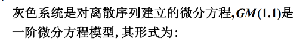

代码
<table>
<colgroup>
<col style="width: 100%" />
</colgroup>
<thead>
<tr class="header">
<th>function []=greymodel(y)</th>
</tr>
</thead>
<tbody>
<tr class="odd">
<td>

% 本程序主要用来计算根据灰色理论建立的模型的预测值。

% 应用的数学模型是 GM(1,1)。

% 原始数据的处理方法是一次累加法。

y=input('请输入数据 ');

n=length(y);

yy=ones(n,1);

yy(1)=y(1);

for i=2:n

yy(i)=yy(i-1)+y(i);

end

B=ones(n-1,2);

for i=1:(n-1)

B(i,1)=-(yy(i)+yy(i+1))/2;

B(i,2)=1;

end

BT=B';

for j=1:n-1

YN(j)=y(j+1);

end

YN=YN';

A=inv(BT*B)*BT*YN;

a=A(1);

u=A(2);

t=u/a;

i=1:n+2;

yys(i+1)=(y(1)-t).*exp(-a.*i)+t;

yys(1)=y(1);

for j=n+2:-1:2

ys(j)=yys(j)-yys(j-1);

end

x=1:n;

xs=2:n+2;

yn=ys(2:n+2);

plot(x,y,'^r',xs,yn,'*-b');

det=0;

sum1=0;

sumpe=0;

for i=1:n

sumpe=sumpe+y(i);

end

pe=sumpe/n;

for i=1:n;

sum1=sum1+(y(i)-pe).^2;

end

s1=sqrt(sum1/n);

sumce=0;

for i=2:n

sumce=sumce+(y(i)-yn(i));

end

ce=sumce/(n-1);

sum2=0;

for i=2:n;

sum2=sum2+(y(i)-yn(i)-ce).^2;

end

s2=sqrt(sum2/(n-1));

c=(s2)/(s1);

disp(['后验差比值为：',num2str(c)]);

if c&lt;0.35

disp('系统预测精度好')

else if c&lt;0.5

disp('系统预测精度合格')

else if c&lt;0.65

disp('系统预测精度勉强')

else

disp('系统预测精度不合格')

end

end

end

disp(['下个拟合值为 ',num2str(ys(n+1))]);

disp(['再下个拟合值为',num2str(ys(n+2))]);
</td>
</tr>
</tbody>
</table>

案例：输入某超市近月的销售额
输入
| \[2.874,3.278,3.337,3.390,3.679\] |
|-----------------------------------|

结果
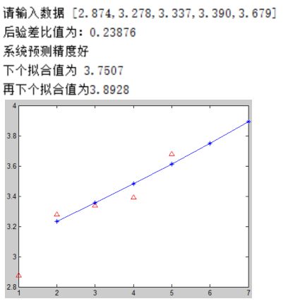

2，进行检验
GM(1.1)模型的精度检验
后验差检验法
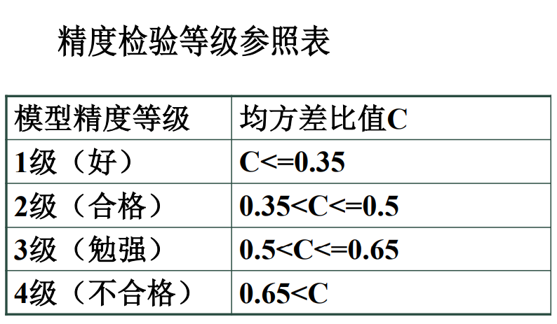

三、累加生成
1，
累加生成,即通过数列间各时刻数据的依个累加以得到新的数据与数列
累加前的数列称原始数列,累加后 的数列称为生成数列

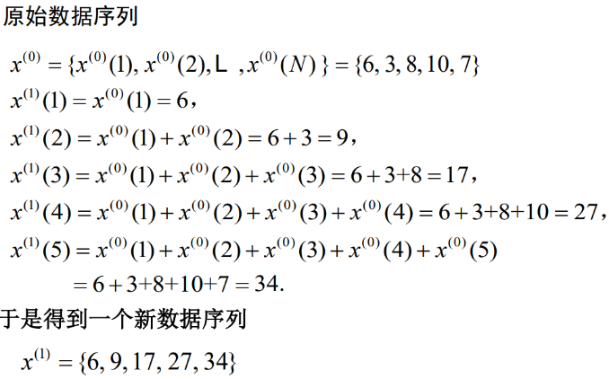

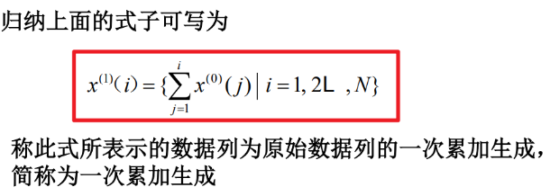
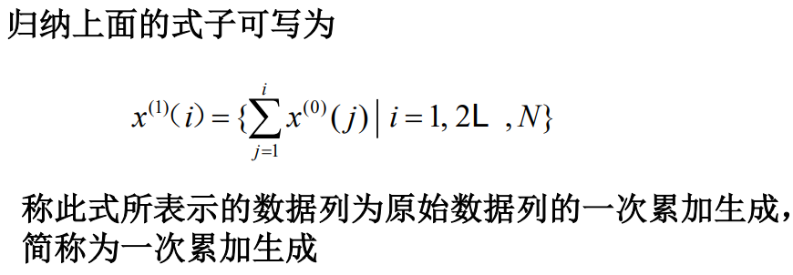

2，
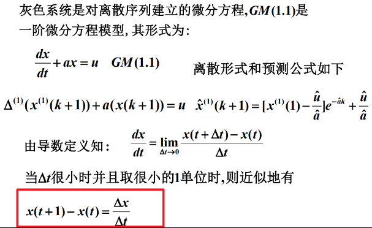
·
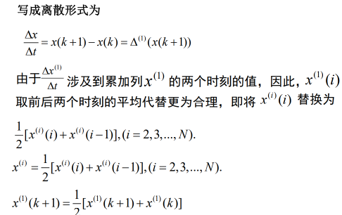

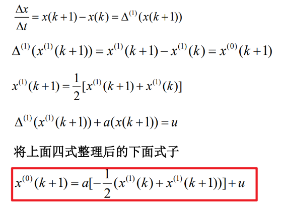

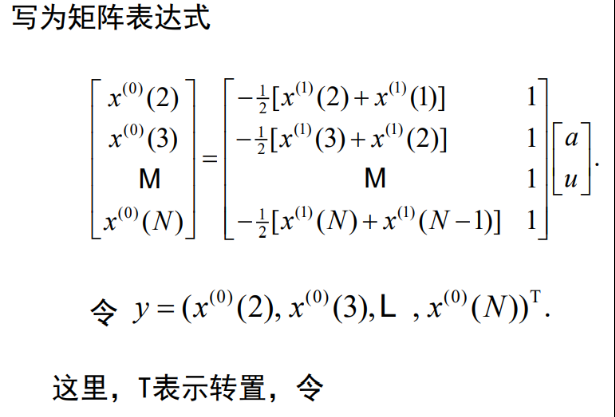

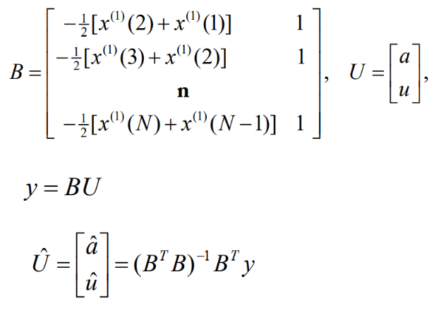

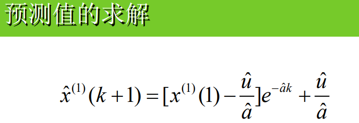
GM(1.1)模型的精度检验
模型选定之后,一定要经过检验才能判定其是否合理,只有通过检验的模型才能用来作预测,灰色模型
的精度检验一般有三种方法:相对误差大小检验法,关联度检验法和后验差检验法.下面主要介绍后验差
检验法

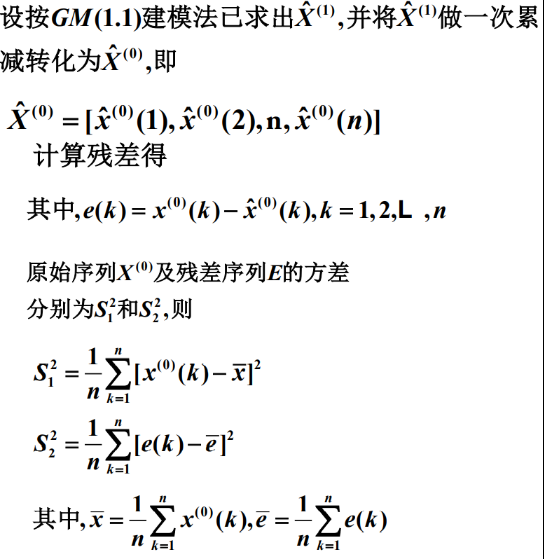

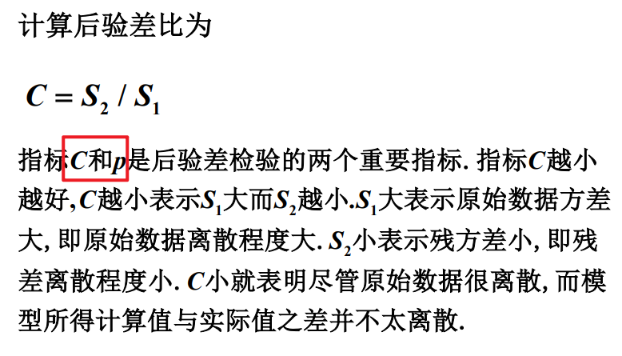

