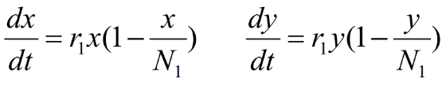
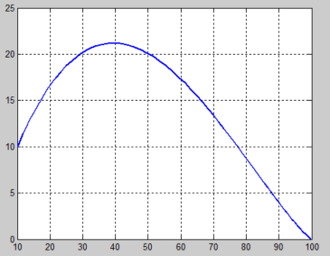

一、了解
1，需求当两个种群为争夺同一食物来源和生存空间相
互竞争时，常见的结局是，竞争力弱的灭绝，
竞争力强的达到环境容许的最大容量。
使用种群竞争模型可以描述两个种群相互竞争的过程，分析产生各种结局的条件。

2，应用
不同企业推出的类似产品可应用种群 竞争模型
二、模型假设
1，有甲乙两个种群，它们独自生存时数量变 化均服从Logistic规律

两种群在一起生存时，乙对甲增长的阻滞作 用与乙的数量成正比；甲对乙有同样作用

其中x(t),y(t)分别为甲乙两种群的数量，
r1 r2为它们的固有增长率，
n1 n2为它们的最大容量。
s1的含义是对于供养甲的资源来说， 单位数量的乙(相对n2)的消耗为单位数量甲 （相对n1）消耗的s1倍，s2同理。【假设s1=0.5，则甲占用的资源比乙多，是乙的两倍】

2，程序
fun.m:在此修改
<table>
<colgroup>
<col style="width: 100%" />
</colgroup>
<thead>
<tr class="header">
<th>
function dx=fun(t,x,r1,r2,n1,n2,s1,s2)

r1=1;

r2=1;

n1=100;

n2=100;

s1=0.5;

s2=2;

dx=[r1*x(1)*(1-x(1)/n1-s1*x(2)/n2);r2*x(2)*(1-s2*x(1)/n1-x(2)/n2)];
</th>
</tr>
</thead>
<tbody>
</tbody>
</table>

p3.m:
<table>
<colgroup>
<col style="width: 100%" />
</colgroup>
<thead>
<tr class="header">
<th>
h=0.1;%所取时间点间隔

ts=[0:h:30];%时间区间

x0=[10,10];%初始条件

opt=odeset('reltol',1e-6,'abstol',1e-9);%相对误差1e-6，绝对误差1e-9

[t,x]=ode45(@fun,ts,x0,opt);%使用5级4阶龙格—库塔公式计算

plot(t,x(:,1),'r',t,x(:,2),'b','LineWidth',2),grid;

pause;

plot(x(:,1),x(:,2),'LineWidth',2),grid %作相轨线
</th>
</tr>
</thead>
<tbody>
</tbody>
</table>

