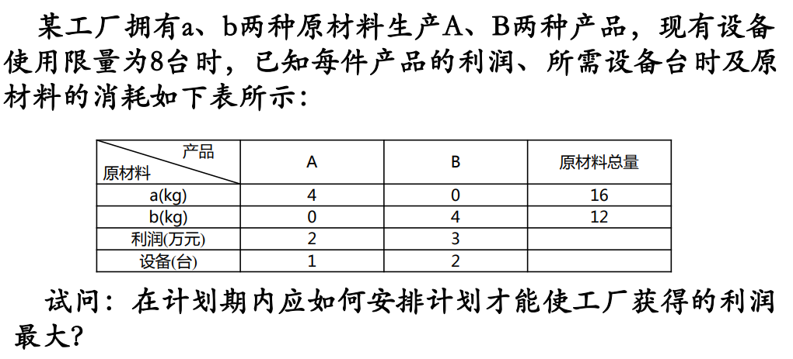
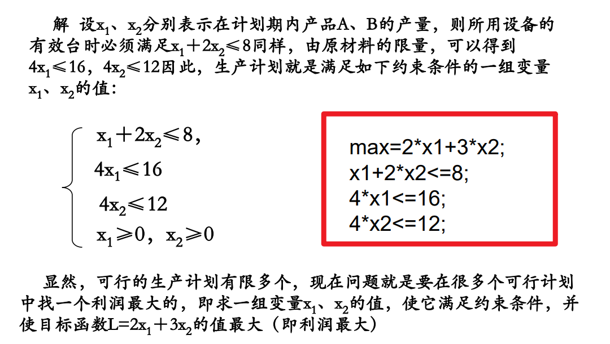
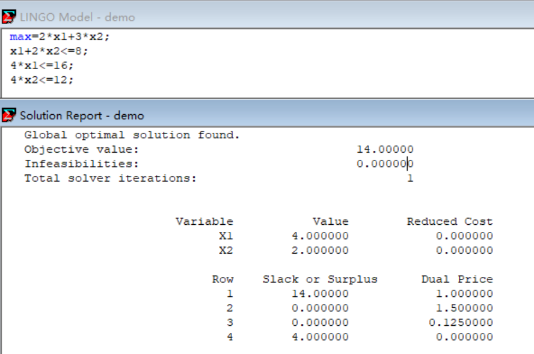

一，了解
1，.一 般地，求线性目标函数在线性约束条件下的最大值或 最小值的问题，统称为线性规划问题。满足线性约束 条件的解叫做可行解，由所有可行解组成的集合叫做 可行域。决策变量、约束条件、目标函数是线性规划 的三要素.

2，需求
在一定条件下， 合理安排人力物力等资源，使经济效果达到最好
【根据问题分析出方程，用LINGO来求解更加方便】

二、案例
注意：LINGO中，值默认大于0

