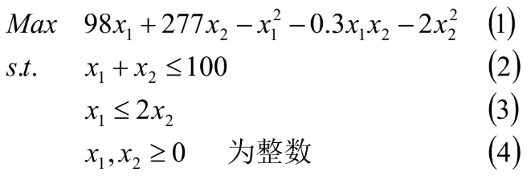
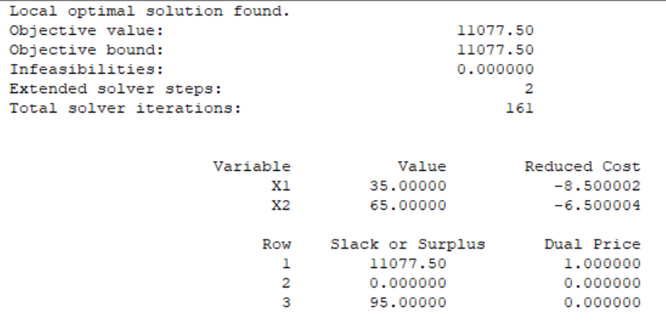
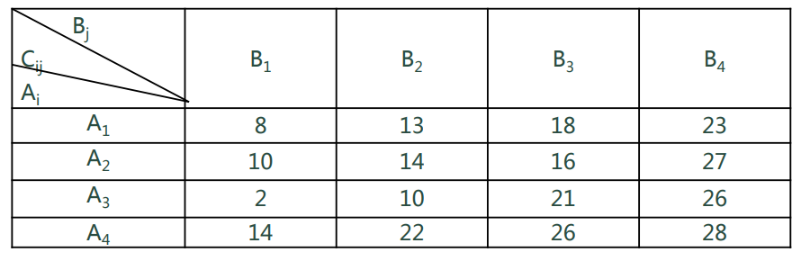
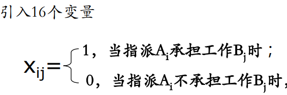
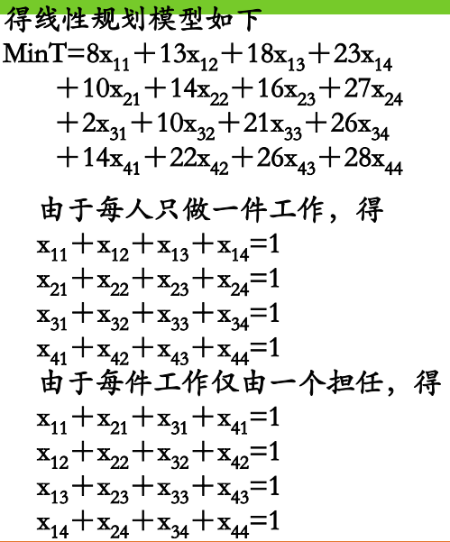
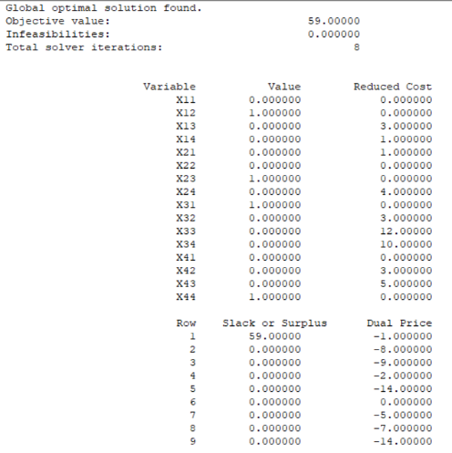

@gin(X); 就是说明X是整数,且在LINGO软件中带有;

一、求解非线性规划
1，

Model:
<table>
<colgroup>
<col style="width: 100%" />
</colgroup>
<thead>
<tr class="header">
<th>
max=98*x1+277*x2-x1*x1-0.3*x1*x2-2*x2*x2;

x1+x2&lt;100;

x1&lt;=2*x2;

@gin(x1);

@gin(x2);

end
</th>
</tr>
</thead>
<tbody>
</tbody>
</table>

二、01规划模型例子
1，01规划是指未知量的取值范围只能是0,1的规划问题， 通常是线性规划
2，案例
设有A1、A2、A3、A4四个人完成B1、B2、B3、B4四项工作， 每人只做一件工作且每件工作仅由一人担任，Ai 完成工作Bj 所 需时间为Cij（i，j=1，2，3，4）（单位：天），如下表所示。

**试问应指派哪个人去承担哪件工作，才能使总的花费时间最少？**

这个问题与上述各例有所不同，上述各例所设的变量都是问题中所要求的数量，而这个例题中我们要引入的变量必须具有指定某人做某件工作，而其他人不能做该工作。数0、1就起到了这种作用，变量取1，说明该人做这件事，在总的花费时间中贡献时间，变量取0表示不做这件事，从而在总的花费时间中不作出贡献。

<table>
<colgroup>
<col style="width: 100%" />
</colgroup>
<thead>
<tr class="header">
<th>
Min=8*x11+13*x12+18*x13+23*x14+10*x21+14*x22+16*x23+27*x24+2*x31+10*x32+21*x33+26*x34+14*x41+22*x42+26*x43+28*x44;

x11+x12+x13+x14=1;

x21+x22+x23+x24=1;

x31+x32+x33+x34=1;

x41+x42+x43+x44=1;

x11+x21+x31+x41=1;

x12+x22+x32+x42=1;

x13+x23+x33+x43=1;

x14+x24+x34+x44=1;

end

int16
</th>
</tr>
</thead>
<tbody>
</tbody>
</table>

求解得x12=x23=x31=x44=1,其余xij=0，即A1 承担工作B2，A2承担工作B3，A3承担工作B1， A4承担工作B4，花费的总时间最少为59天。
