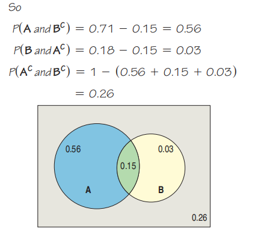
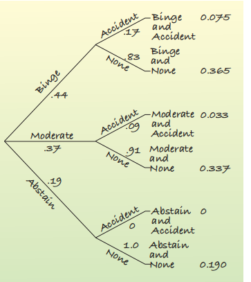

14-Probability Rules!
2021年5月2日
8:49

Tree ：条件概率
Venn diagram： 事件之间有交集
树形图帮助我们研究==条件概率==。
图表是直接针==对不超过2步的==随机事件的概率
## 
## 
## 14.1 The General Addition Rule
1，A,B不disjoint
解决方法：我们加上两个事件的概率，然后减去它们相交的概率

案例

案例

案例

## 14.2 Conditional Probability and the General Multiplication Rule
1，A发生的前提下B再发生

案例

2，The General Multiplication Rule

## 14.3 Independence

## 14.4 Picturing Probability: Tables, Venn Diagrams, and Trees
案例

判断是否independent

1，Tree Diagrams
案例

## 
## 14.5 Reversing the Conditioning and Bayes’ Rule

Bayes’ Rule

## 总结

