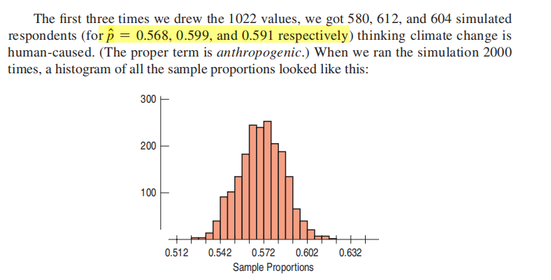
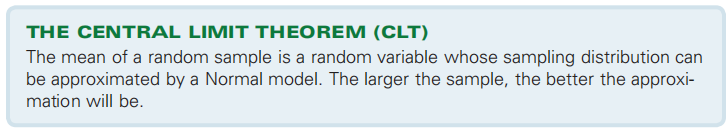
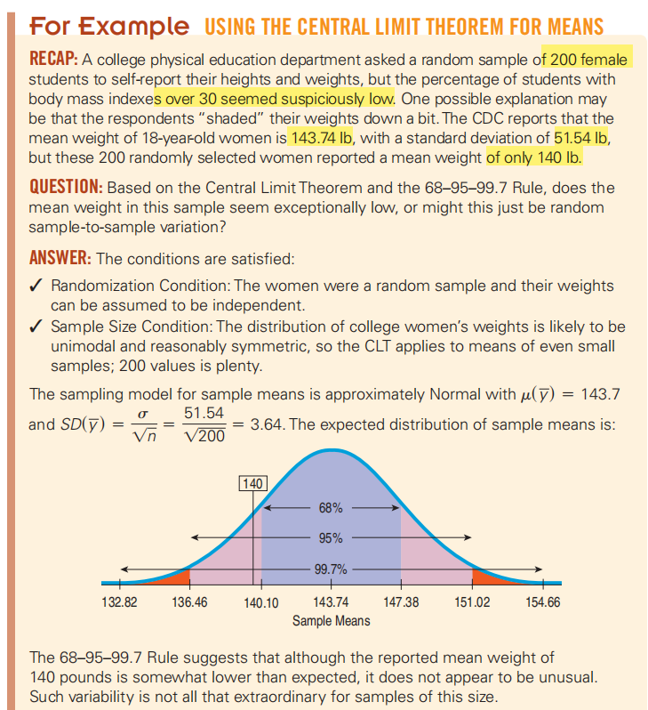

同一个调查，不同时期进行得出的概率不一样

## 17.1 Sampling Distribution of aProportion
背景：对一同一个实验，多次得出的概率分布如下

1，It is called the sampling distribution of the proportions

The histogram is unimodal, symmetric, and centered at p.
样本统计量随样本变化的抽样分布模型使我们能够量化这种变化，并说明我们认为相应的种群参数在哪里
注意：

案例

2，Which Normal?
To use a Normal model, we need to specify two parameters: its mean and standard deviation.
The center of the histogram is naturally at p, so that’s what we’ll use for the mean of
the Normal model.

因为我们有一个正态模型，所以我们可以使用68-95-99.7规则，或使用表或技术查找精确的概率。例如，我们知道95%的正态分布值大约在平均值的两个标准差范围内，因此，如果各种可能问同一问题的民调报告了不同的结果，我们不应该感到惊讶。

Such sample-to-sample variation is sometimes called **sampling error**. It’s **not really an error at al**l, but just variability you’d expect to see from one sample to another.
Abetter term would be **sampling variability**.

## 17.2 When Does the Normal Model Work? Assumptions and Conditions

满足一下条件
**The Independence Assumption**：
样本中的个体（我们发现的比例）必须相互独立；

如果你的数据来自一个实验，其中受试者被随机分配到治疗中，或来自基于一个简单的随机样本的调查，那么这些数据就满足随机化条件Randomization Condition.
**10% Condition:**
抽样过多的人口也可能是一个问题。一旦你抽样了超过10%的人口，剩下的个体就不再真正独立。

**Success/Failure Condition:**
You should have at least 10 successes and 10 failures in your data。np和nq都必须\>=10

案例

## 17.3 The Sampling Distribution of Other Statistics

术语：skewed to the right，

Simulating the Sampling Distribution of a Mean

## 17.4 The Central Limit Theorem: The Fundamental Theorem ofStatistics
中心极限定理告诉我们，当样本量足够大时，样本均值的分布慢慢变成正态分布，就像这个图：

1，Laplace’s result is called the Central Limit Theorem13 (CLT).

随着样本量的增长，重复随机样本的均值分布不仅越来越接近正态模型，而且无论种群分布的形状如何，这都是如此！即使我们从偏态或双峰种群中提取样本，
中心极限定理也告诉我们，随着样本量的增长，重复随机样本的方法将倾向于遵循正态模型

中心极限定理(CLT)随机样本的均值是一个抽样分布可以近似的随机变量,

2，Assumptions and Conditions
<table>
<colgroup>
<col style="width: 100%" />
</colgroup>
<thead>
<tr class="header">
<th>
Independence Assumption:

<blockquote>

样本量n不应超过总人口的10%。

</blockquote>

Sample Size Condition:
</th>
</tr>
</thead>
<tbody>
</tbody>
</table>

3，Which normal

区别：重点

## 17.5 Sampling Distributions: A Summary

