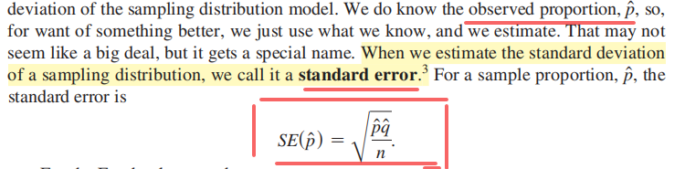
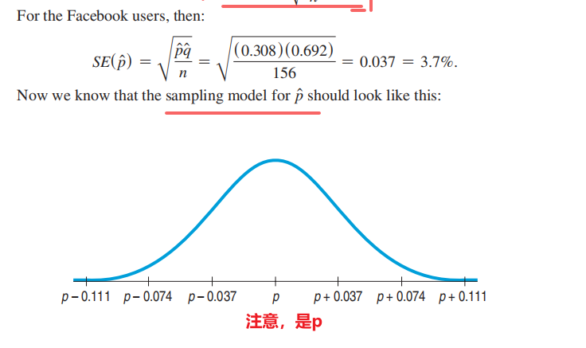
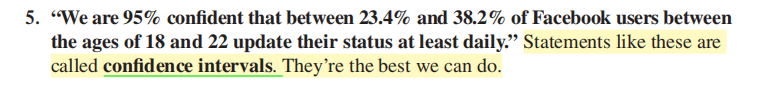
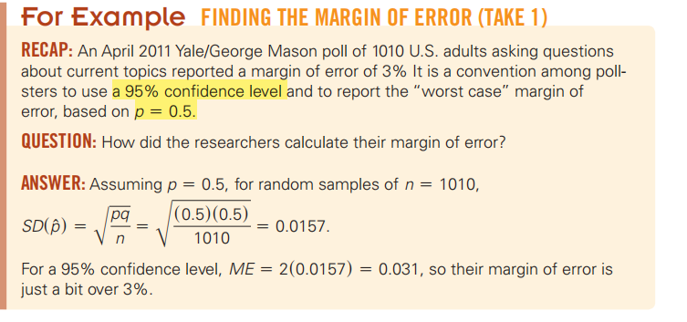
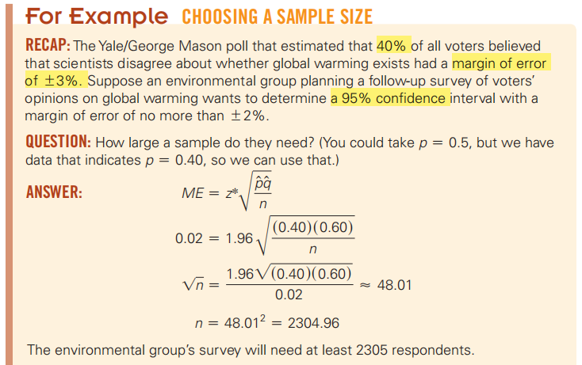
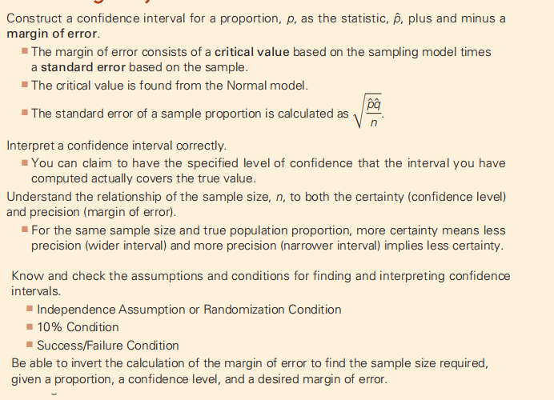

背景：在156名18岁到22岁的受访者中，有48人说，他们至少每天都会更新自己的状态。报告的作者讨论了这一发现，就好像这156名受访者告诉了我们，这个年龄段的数百万Facebook用户的行为一样。当然，这比了解156个Facebook用户更有趣，不管他们的采样是多么仔细。像这样的研究能告诉我们关于18到22岁的Facebook用户的什么呢？

## 18.1 A Confidence Interval
因为

不知道p,但是为了标准差，所以

得到sampling model for p尖

请注意表述，“哔哩哔哩xx%confident哔哩哔哩”

又名

## 18.2 Interpreting Confidence Intervals: What Does 95% Confidence Really Mean?
“we are 95% confident that the true proportion lies in our interval.”

我们知道不同样本的比例也不同。如果其他研究人员选择自己每天更新状态的Facebook用户的样本，每个人的样本比例几乎肯定会有所不同。当他们都试图估计整个人群的真实状态更新率时，他们将把置信区间集中在在自己样本中观察到的比例上。我们每个人都会有一个不同的间隔。

案例

CLT中心极限定理告诉我们，95%的随机样本将产生捕获真实值的区间。这就是我们所说的95%的自信程度。

## 18.3 Margin of Error: Certainty vs. Precision
1，ME

公式

案例

2，Critical Values
2.1 定义

2.2 常用的z\*的值

注：**ME=z\*SE**
案例

## 18.4 Assumptions and Conditions
1，
Independence Assumption
- Randomization Condition:
- 10% Condition:

Sample Size Assumption:
- Success/Failure Condition 10胜10负

案例

2，Choosing Your Sample Size
假设一个候选人正在计划进行投票，并希望以95%的信心将选民的支持率估计在3%以内。她需要一个多大的样本？

案例

案例

总结

