为什么学这个：
其中一家专门生产为飞机工业设计的大型（超过3万磅）锭的工厂，大约20%的锭有某种表面裂纹。为了降低裂纹比例，工厂工程师和化学家最近尝试了铸造过程中的一些变化。从那以后，已经铸造了400块钢锭，其中只有17%破裂了。新方法工作了吗？裂纹率真的下降了，还是17%只是因为运气？我们可以将用新方法铸造的400个钢锭作为随机样本。我们知道每个随机样品的裂锭比例会有所不同。我们观察到的17%仅仅是自然抽样变异性的结果，还是较低的裂率足够有力，足以确保管理层的真正裂率现在真的低于20%？

人们一直都想要得到这样的问题的答案。自上个月以来，总统的支持率已经改变了吗？过去五年里青少年吸烟减少了吗？全球气温还在上升吗？我们买的超级碗广告真的增加了销量吗？为了回答这些问题，我们测试了关于模型的假设。

## 19.1 Hypotheses
我们将假设裂纹率仍然是20%，看看数据是否能说服我们。

H0：null hypothesis—null because it assumes that nothing has changed. We denote it H0.
HA：包含如果我们拒绝零假设，我们认为是合理的参数的值。

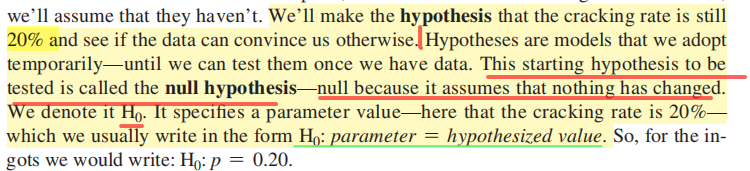

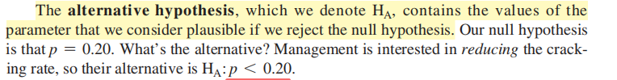

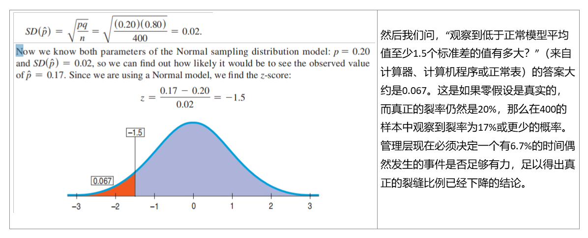
## 19.2 P-Values
考虑到零假设是真实的，我们希望找到看到这样的数据（或者更不太可能的数据）的可能性。这种概率告诉我们，如果零假设是真的，我们看到我们收集的数据会是多么惊讶。它得到一个特殊的名称是非常重要的：它被称为P-value

**当P-value\<0.05，算小，如果p值足够小，我们将拒绝零假设。**

当p值足够小时，它说我们会非常惊讶。这意味着，如果我们的零假设是真的，我们就不太可能观察到这样的数据。
当P值很高时，我们根本没有看到任何不太可能或令人惊讶的事情。很有可能发生的事件经常发生。

<table>
<colgroup>
<col style="width: 100%" />
</colgroup>
<thead>
<tr class="header">
<th>
P值的意义

1. P值是一种概率，一种在原假设为真的前提下出现观察样本以及更极端情况的概率。

2. 拒绝原假设的最小显著性水平。

3. 观察到的(实例的) 显著性水平。

4. 表示对原假设的支持程度，是用于确定是否应该拒绝原假设的另一种方法。

注意：

P值不是给定样本结果时原假设为真的概率，而是给定原假设为真时样本结果出现的概率。
</th>
</tr>
</thead>
<tbody>
</tbody>
</table>

## 19.3 The Reasoning of Hypothesis Testing
### 1. Hypotheses

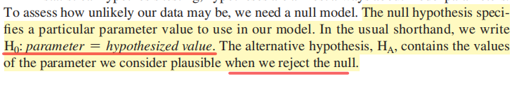
案例
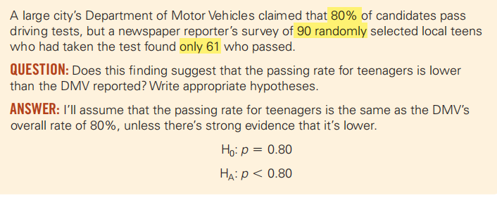

### 2. Model
先check condition
✓ Randomization Condition
✓ 10% Condition
✓ Success/Failure Condition
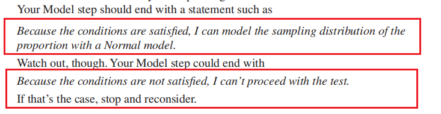

The test about proportions is called a one-proportion z-test.
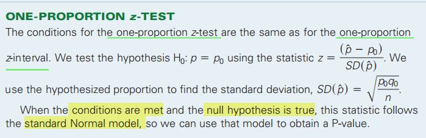

案例
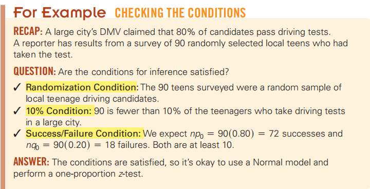

## 3.Mechanics
**如果p值足够小，我们将拒绝零假设**
| **较小的P值(通常≤0.05)表示实验结果是零假设不成立的有力证据,因此零假设可以比较可信地推翻。 · 较大的P值(\> 0.05)表示反对零假设的证据不充分,意味着零假设成立的几率偏大。** |
|-------------------------------------------------------------------------------------------------------------------------------------------------------------------------|

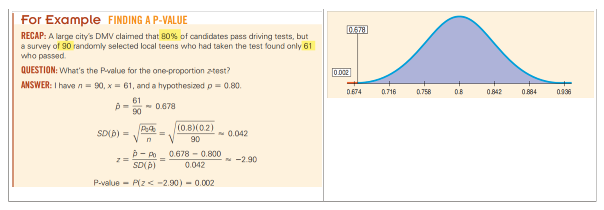
### 
### 4. Conclusion
The conclusion must state either that we reject or that we fail to reject the null hypothesis
<table>
<colgroup>
<col style="width: 70%" />
<col style="width: 29%" />
</colgroup>
<thead>
<tr class="header">
<th>
The size of the effect is always a concern when we test hypotheses. A good way to

look at the effect size is to examine a confidence interval.
</th>
<th>当我们测试假设时，效果的大小总是一个问题。查看效果大小的一个好方法是检查一个置信区间。</th>
</tr>
</thead>
<tbody>
</tbody>
</table>
案例
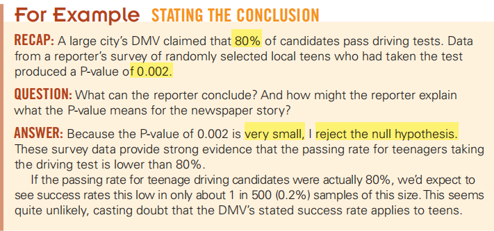

## 19.4 Alternative hypothesis
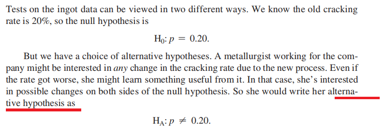
有两种选择，不知道选什么的时候选“不等"【这是实际操作可以这样想，考试要精确】
【If you aren’t sure which to use, a two-sided test is always more conservative】
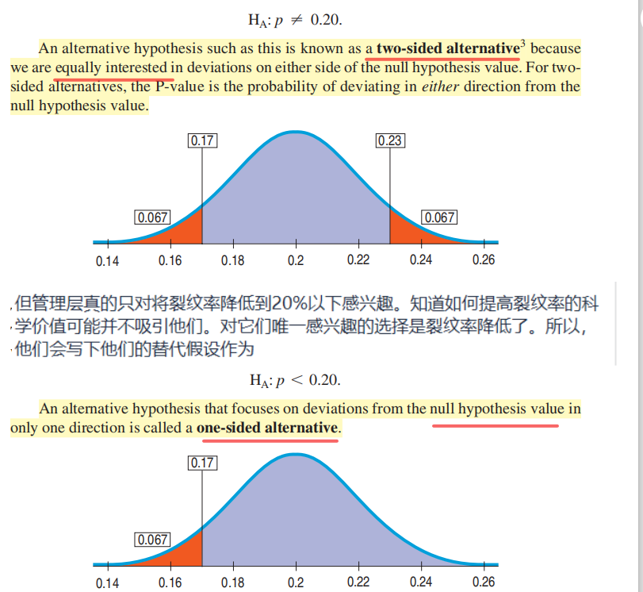

案例
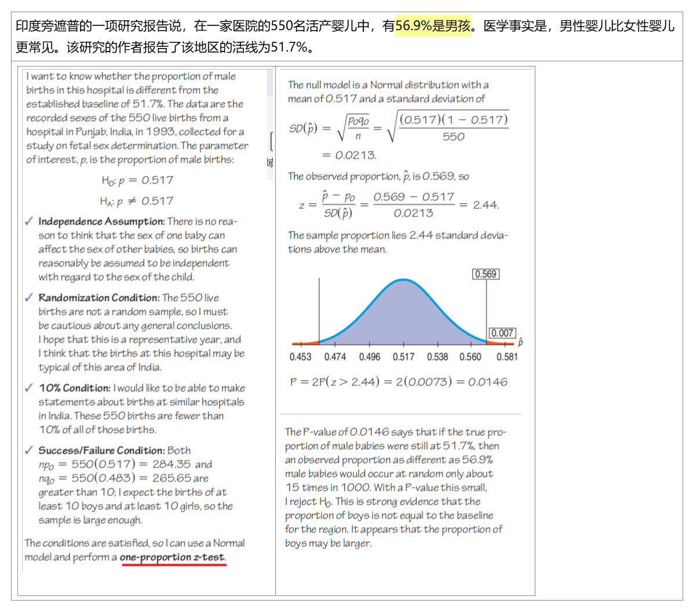
## 19.5 P-Values and Decisions: What to Tell About a Hypothesis Test

案例
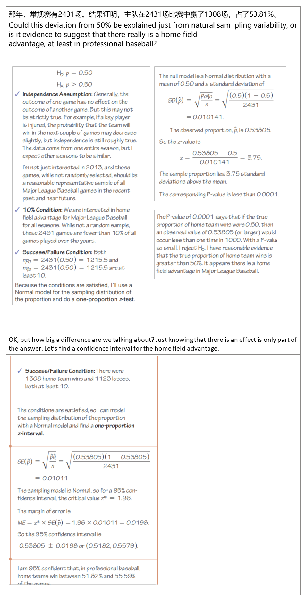

总结
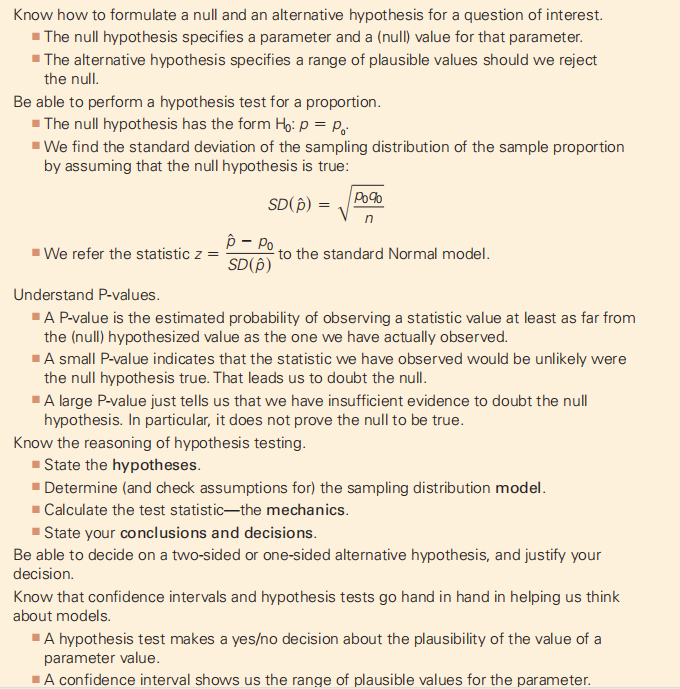

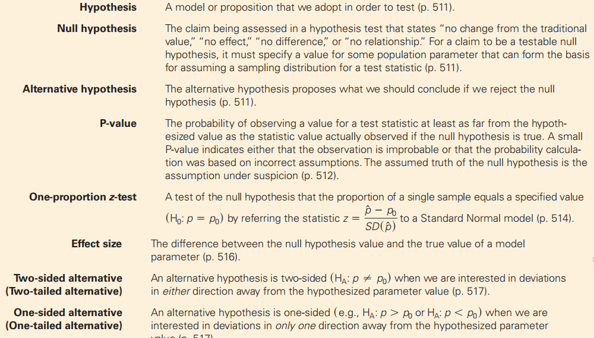

