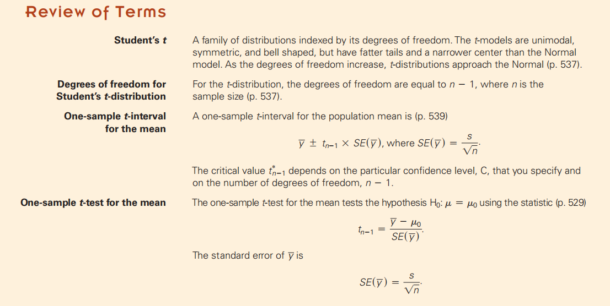

**学习如何建立置信区间，并测试定量变量平均值的假设**
背景
与其他年龄段相比，青少年昏昏欲睡或开车睡觉的可能性也高出71%。（26岁以下的男性面临的风险尤其大。）
他们报告说，成年人每晚需要7到9个小时的睡眠，并声称大学生需要9.25小时的睡眠才能完全警觉。他们指出，“睡眠不足的人有19%的记忆缺陷”（第51页）。
一名学生调查了美国东北部一所小学校的学生，并问他们前一天晚上睡了多少觉。

我们都感兴趣的是估计大学生的平均睡眠量，以及测试它是否低于推荐的最低7小时时间。这些数据是在一个适当的随机调查中收集的，所以我们可以将它们视为该大学学生的代表，也可能作为一般大学生的代表。
这些数据与关于比例的数据在一个重要的方面有所不同。比例是个体反应的总结，它们有两种可能的值，如“是”和“不是”、“男性”和“女性”，或“1”和“0”。不过，定量数据通常报告每个个体的定量值。当您为每个人都有一个定量值时，您应该记住数据分析的三个规则，并绘制数据，就像我们在这里所做的那样。

## 20.1 Getting Started: The Central Limit Theorem (Again)

中心极限定义对于均值也可以。
对均值使用中心极限定理

案例

CLT说，我们所需要模拟y的抽样分布的只是一个定量数据的随机样本

不仅需要考虑误差和p值的额外变化，甚至需要一个新的抽样分布模型。事实上，我们需要一个完整系列的模型，取决于样本大小，n。这些模型是单峰的，对称的，钟形的模型，但我们的样本越小，尾巴就必须越伸展。

## 20.2 Gosset’s t
**1，为了计算小样本**
Gosset的采样分布模型总是bell-shaped钟形的，但细节会随着样本大小的不同而变化。
当样本量非常大时，模型nearly Normal,
但当它很小时，分布的尾部比法态重得多。
这意味着远非平均值的值更为常见，而且这对于小样本可能很重要
**The degrees of freedom of a distribution** represent **the number of independent** quantities that are left after
we’ve estimated the parameters.
Here it’s simply the number of data values, n, minus the
number of estimated parameters.
For means, that’s just **n - 1**.
We often denote **degrees of freedom** as df and the model as tdf, with the degrees of freedom as a subscript

2，Degrees of Freedom
t分布继承了相同的数字，我们称n-1为自由度。degrees of freedom

3，A Confidence Interval for Means
概述

具体

案例

条件Assumptions and Conditions
1，
| Independence Assumption      | Randomization Condition: This condition is satisfied if the data arise from a random sample or suitably randomized experiment.                                                                                     |
|------------------------------|--------------------------------------------------------------------------------------------------------------------------------------------------------------------------------------------------------------------|
| Normal Population Assumption | Nearly Normal Condition: The data come from a distribution that is unimodal and symmetric.通过绘制直方图或正常概率图来检查此条件。规范性对于较大的样本量就不那么重要。只是我们的运气：这在最难检查的时候是最重要的 |

案例

案例

Using Table T to Find t-Values

## 20.3 Interpreting Confidence Intervals

## 20.4 A Hypothesis Test for theMean
我们被告知，成年人需要7到9个小时的睡眠。大学生们得到了他们所需要的东西吗？我们能说大学生的平均睡眠时间至少是7个小时吗？像这样的问题需要一个假设检验，称为单样本t检验。

案例

案例

对于假设检验，计算出的t统计量可以接受任何值，因此您得到的值不太可能是在表中找到的值。我们能做的最好的就是在两列之间陷阱计算的t值。只要用适当的自由度查看这行，就可以找到t统计数据的位置。p值将位于列头的两个值之间。报告P值介于这两个值之间。通常这就足够好了。

Intervals and Tests【没看】

The Special Case of Proportions

20.5 Choosing the Sample Size

How large a sample do we need?
案例

## 总结：

