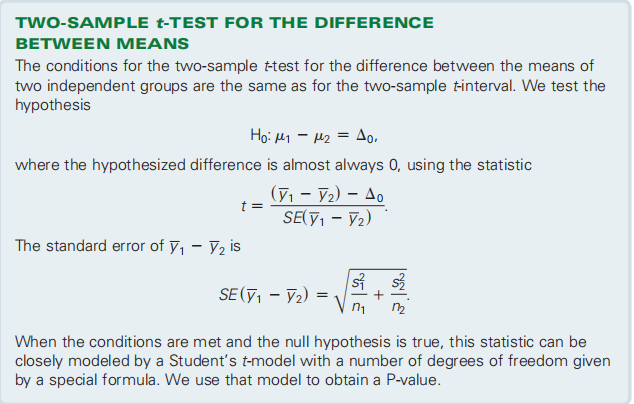

背景：
人们对这个月的经济比上个月感觉更好吗，还是增加只是抽样变化？使用技术的学生比不学的学生更学习统计吗？在实践中，比较两组要比测试单个比例或平均值是否等于一个给定的数字要常见得多。比较两组非常像测试一组。标准错误是不同的，但概念确实是相同的。

## 22.1 The Standard Deviation of a Difference【回顾】

对于概率

## 22.2 Assumptions and Conditions for Comparing Proportions

## 22.3 A Confidence Interval for the Difference Between Two Proportions
总结

步骤
1，检查条件
2，求

3，总结

案例

## 22.4 The Two Sample z-Test: Testing for the Difference Between Proportions

Combining the counts like this to get an overall proportion is called pooling

案例
Are the pre-sleep surfing rates of the two age groups really different?

对于means
检查条件

## 
## 22.5 A Confidence Interval for theDifference Between TwoMeans

1，方法

案例

## 22.6 The Two-Sample t-Test: Testing for the Difference Between Two Means

案例

## 22.7 The Pooled t-Test: Everyone into the Pool?
您可能会遇到另一种方法来测试两组的方法是否不同，称为集合t测试。

