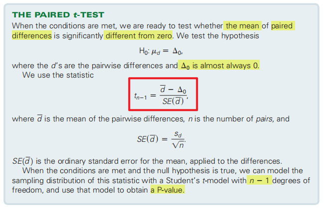
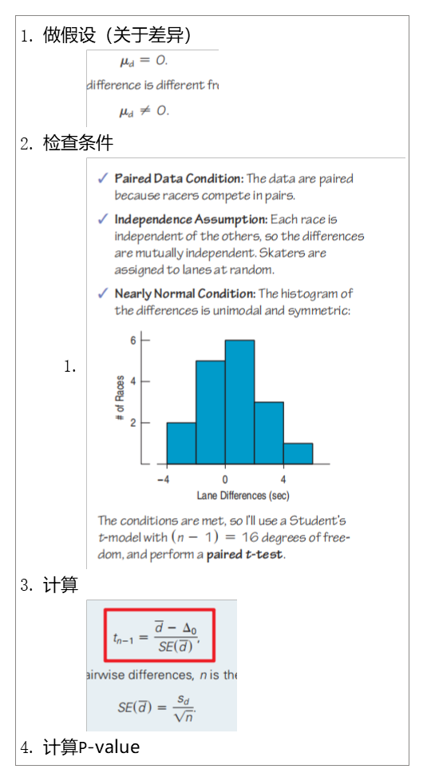
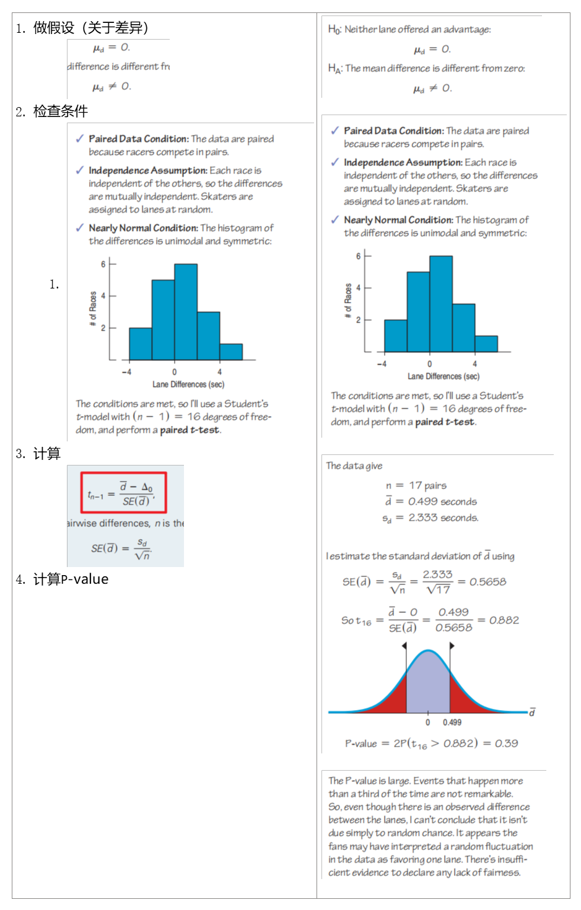
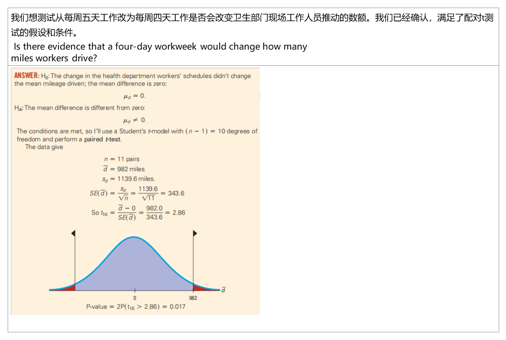
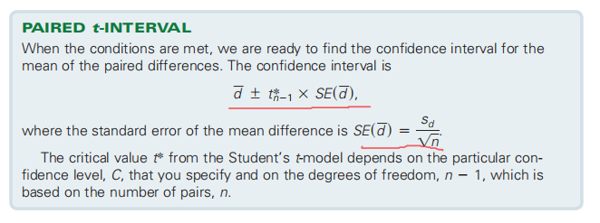
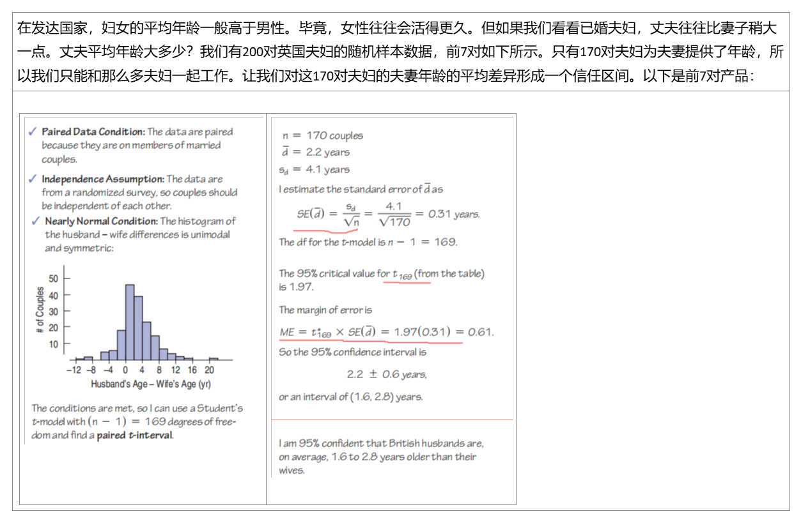
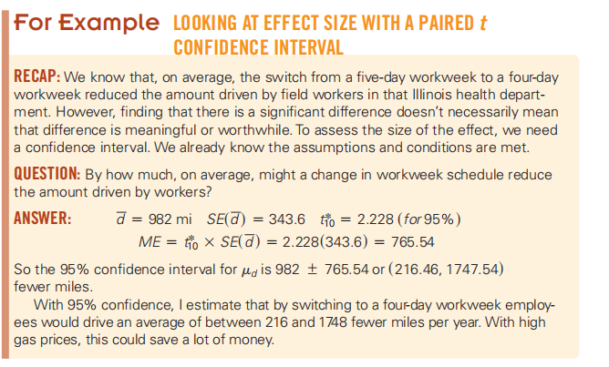
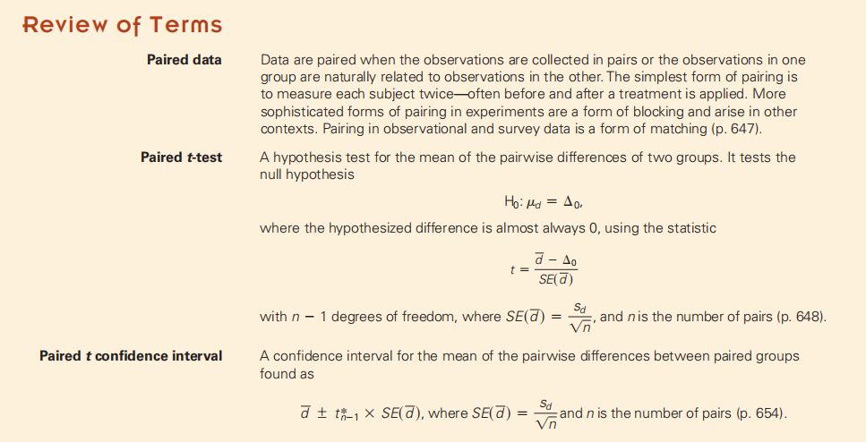

一门LSAT预备课程会提高多少分数？男孩们比他们的姐妹们更擅长玩电脑游戏吗？像这样的问题，看看成对的变量。当观测对自然结合在一起时，它们不能独立，
在本章中，您将看到**如何处理成对数据**

## 23.1 Paired Data
1，Data such as these are called paired.我们有每场比赛的时间。我们想比较所有比赛的内外车道，所以我们感兴趣的是每对比赛的时间差异。

配对的数据会以多种方式出现。也许最常见的方法是与治疗前后进行比较。

When pairs arise from an experiment, the pairing is a type of blocking.
When they arise from an observational study, it is a form of matching.

关心的是差异

Now that we have only one column of values to consider, we can use a one-sample t-test.
Mechanically, a paired t-test is just a one-sample t-test for the means of these pairwise
differences. The sample size is the number of pairs.

## 23.2 Assumptions and Conditions
1，需要满足

<table>
<colgroup>
<col style="width: 31%" />
<col style="width: 68%" />
</colgroup>
<thead>
<tr class="header">
<th>Paired D]GCata Condition</th>
<th>The data are paired because each value is the mileage driven by the same person before and after a change in work schedule.</th>
</tr>
</thead>
<tbody>
<tr class="odd">
<td>Independence Assumption</td>
<td>
The driving behavior of any individual worker is

independent of the others, so the differences are mutually independent.
</td>
</tr>
<tr class="even">
<td>【可以没有】 Randomization Condition</td>
<td>The mileages are the sums of many individual trips, each of which experienced random events that arose while driving. Repeating the experiment in two new years would give randomly different values.</td>
</tr>
<tr class="odd">
<td>Nearly Normal Condition</td>
<td>The histogram of the mileage differences is unimodal and symmetric:</td>
</tr>
</tbody>
</table>

Since the assumptions and conditions are satisfied, it’s okay to use paired t methods
for these data.

2，步骤

案例
Was there a difference in speeds between the inner and outer
speed-skating lanes at the 2006 Winter Olympics?

案例

## 23.3 Confidence Intervals for Matched Pairs
1，

案例

2，Effect Size
因此，即使我们无法辨别出一个真正的差异，但置信区间表明，我们正在考虑的影响可能会大到足够重要。我们可能想继续调查，看看这个冰上的其他比赛，并警惕其他场馆可能出现的差异。

案例

23.4 Blocking【看不懂】

本章的方法要求这对相互独立。他们没有对个体做任何假设，只对个体做任何假设。相比之下，许多其他的推理方法都需要在所有个体之间的独立性。

总结

