背景：你最喜欢的颜色和你接受过的多少教育有关吗？一项调查发现，与受过高等教育的成年人相比，只有受过高中教育的成年人中说红色的比例也较低。这可能只是随机波动，还是不同教育水平的颜色偏好分布不同？我们在第二章中看到了计数和百分比表。在本章中，我们将了解如何测试我们在这些表中看到的模式的强度。
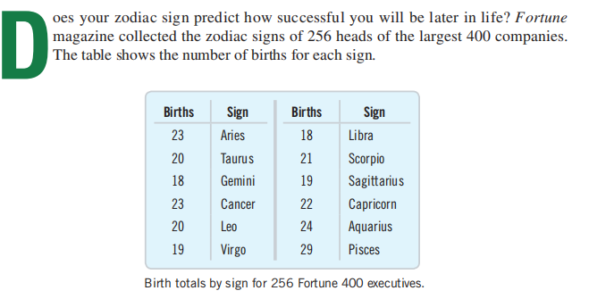

## 24.1 Goodness-of-Fit Tests
准备工作
**1，本章只有假设**
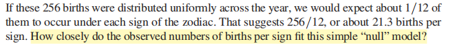

A hypothesis test to address this question is called a test of “**goodness-of-fit.**”
没有单一的参数可以估计，所以置信区间没有多大意义。

**2，Assumptions and Conditions**
| Counted Data Condition  | check to be sure the values in each cell really are counts. |
|-------------------------|-------------------------------------------------------------|
| Independence Assumption | a random sample from the population ofinterest.            |
| Sample Size Assumption  | At least 5 individuals in each cell.                        |

案例
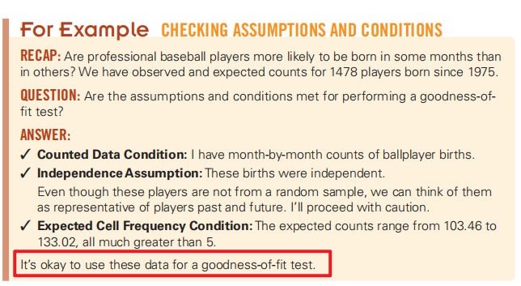

**3，Calculations**
这些观察到的和预期计数之间的差异，表示（Obs-Exp）。
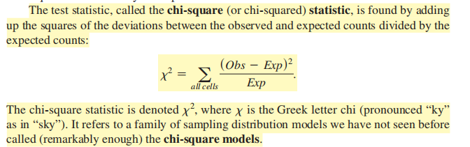

**4，Chi-Square P-Values**
计数表的卡方统计量**仅用于测试假设，而不适用于构造置信区间**。如果观察到的计数与预期的不匹配，则统计数据将会很大。它不能“太小”。“这就意味着我们的模型真的非常适合数据。所以卡方测试总是是片面的。如果计算出的统计值足够大，我们将拒绝零假设。
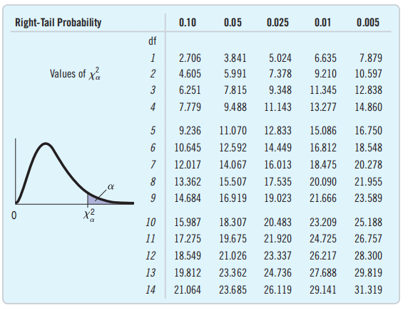

第一类
## The Chi-Square Calculation
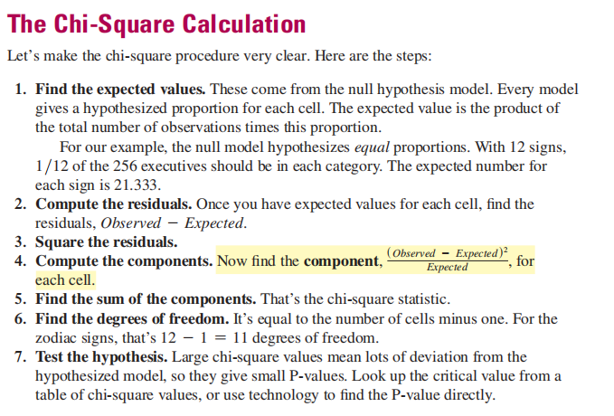
解题步骤
<table>
<colgroup>
<col style="width: 100%" />
</colgroup>
<thead>
<tr class="header">
<th>
1，做假设：一个相同，一个不相同

2，检查条件

3，求df=n-1

4，求X2

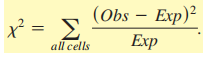

5，查表得P值

6，得出结论
</th>
</tr>
</thead>
<tbody>
</tbody>
</table>

补充：计算过程
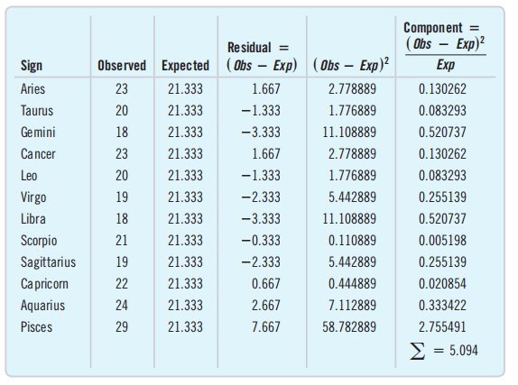
案例
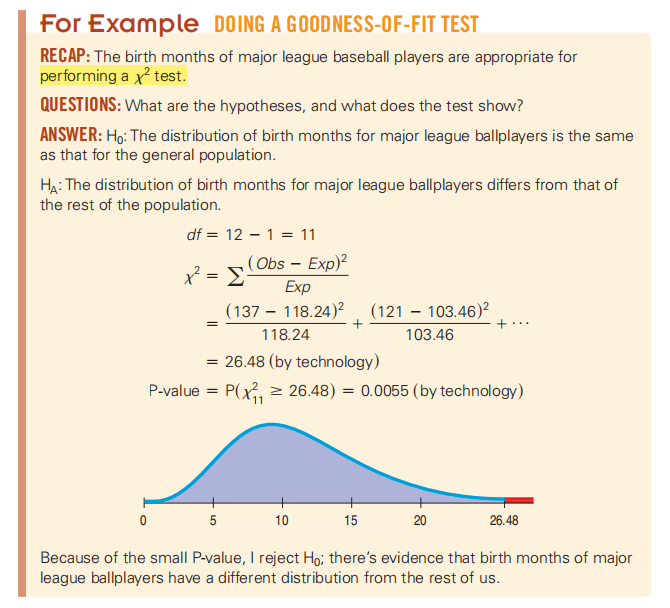

案例
我们有12生肖中的256名高管。自然的零假设是，高管的出生日期在所有十二宫中平均分配。测试统计量观察观测数据与这种理想化情况的匹配程度
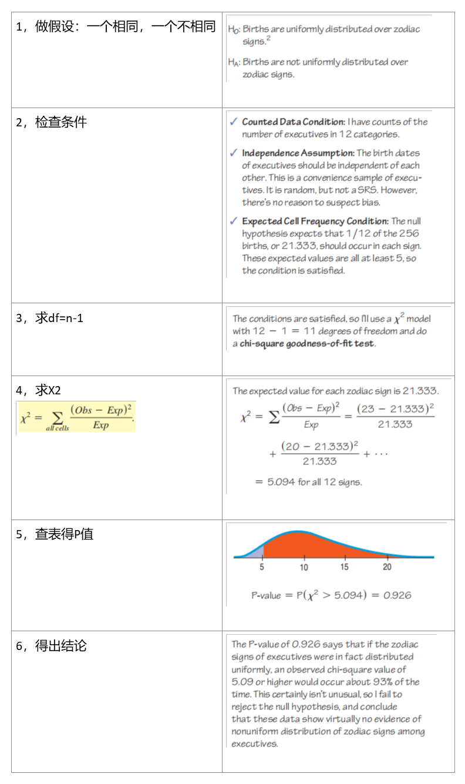

The Trouble with Goodness-of-Fit Tests: What’s the Alternative?

拟合优度检验的唯一零假设是该理论是正确的。

## 24.2 Chi-Square Test of Homogeneity
**查看是否均匀分布**
背景：许多大学对毕业班进行调查，以确定毕业生的计划。我们可能会想知道，大学里不同学院的学生的计划是否一样。
这是一张针对来自一所大学几所学院的2011届毕业生的双向表格。表格中的每个单元格都显示了有多少来自特定大学的学生做出了某种选择。
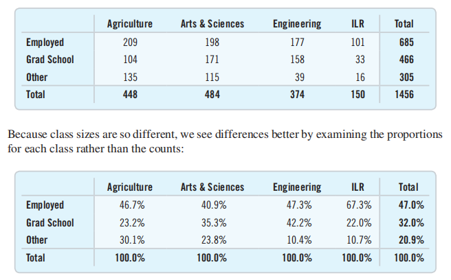
预期
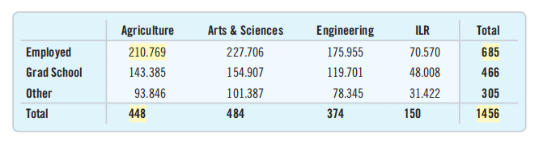

我们已经知道如何测试两个比例是否相同。例如，我们可以使用两比例的z测试来看看学生选择研究生院的比例对农业专业的学生和工程专业的学生是否相同。但现在我们有**两个多组**。我们想测试所有四所学院的学生的选择是否相同。
The z-test for two proportions generalizes to a chi-square test of
homogeneity

检查条件
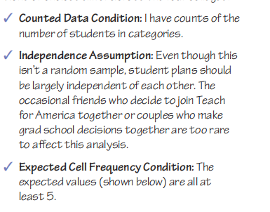
计算
注：自由度
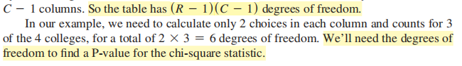
自由度的作用是？
步骤
<table>
<colgroup>
<col style="width: 100%" />
</colgroup>
<thead>
<tr class="header">
<th>
1，做假设

2，检查条件

3，计算df: (R - 1)(C - 1)

4，列出table【预期与实际的对比】

5，计算X2（根据表格）

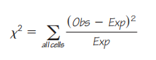

6，计算P值

7，结论
</th>
</tr>
</thead>
<tbody>
</tbody>
</table>

案例

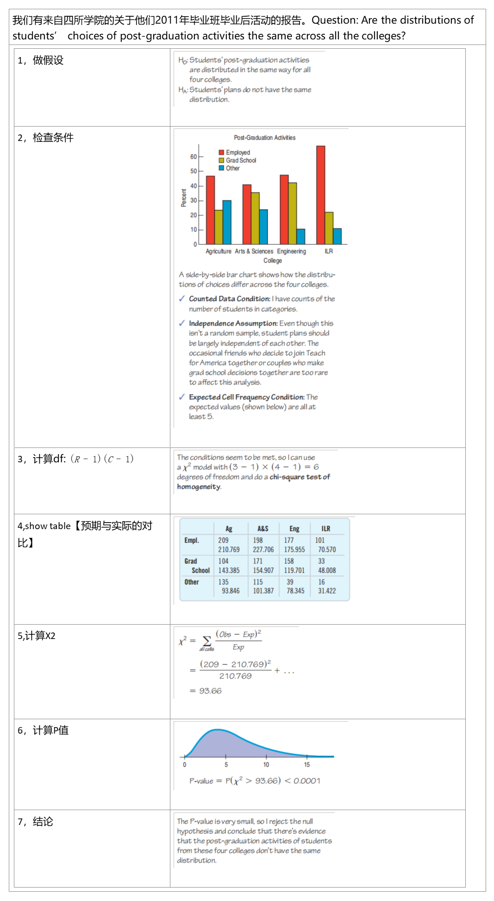

24.3 Examining the Residuals【没认真看】
To standardize a cell’s residual, we just divide by the square root of its expected value:
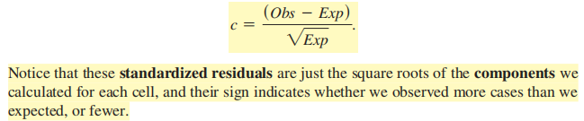

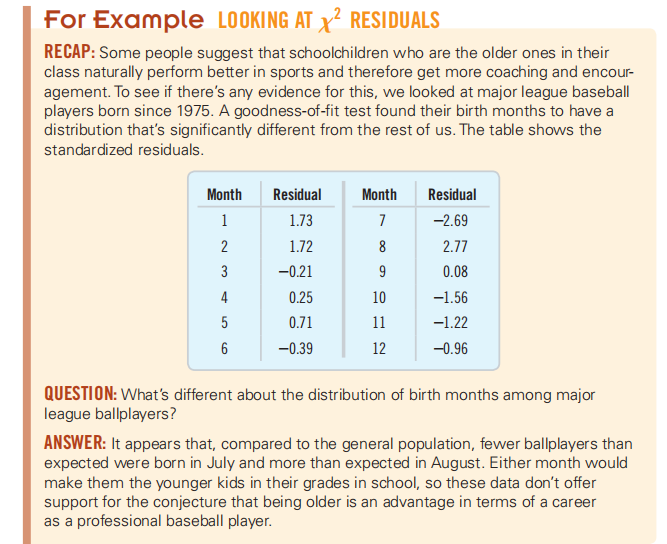

## 24.4 Chi-Square Test of Independence
**查看是否独立**
背景：德克萨斯大学西南医学中心的一项研究检查了626名接受非血液相关疾病治疗的人，
以确定丙型肝炎的风险是否与人们是否有纹身以及纹身有关。在美国，丙型肝炎每年约1万人死亡，但感染后多年未被发现
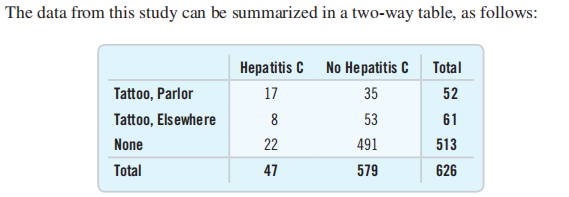

这些数据不同于本章之前考虑的数据类型，因为它们将单个组的对象分类为两个分类变量，而不是只有一个变量。

这里的分类变量是丙型肝炎状态（“丙型肝炎”或“无丙型肝炎”）和纹身状态（“客厅”、“其他地方”、“无”）。我们在第2章中看到了由两个分类变量分类的计数，所以我们知道这样的表被称为contingency tables

Contingency tables对两个（或多个）变量上的计数进行分类，以便我们可以查看一个变量上的计数分布是否取决于另一个变量。

询问这些数据的自然问题是，患丙型肝炎的几率是否与纹身状况无关。记住，如果事件A和B为独立事件，P(A)必须等于P(AB)。在这里，这意味着一个随机选择的患者患有丙型肝炎的概率应该是一样的，无论患者的纹身状态如何。

When we ask whether two variables measured on the same population are independent we’re performing a
chi-square test of independence.

检查条件
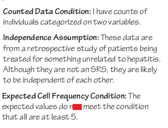

计算
步骤
<table>
<colgroup>
<col style="width: 100%" />
</colgroup>
<thead>
<tr class="header">
<th>
1,做假设

2，检查条件

3，得df=（R-1）（C-1）

4，列出表格（分类）

5，计算X2

6，计算P值

7，结论
</th>
</tr>
</thead>
<tbody>
</tbody>
</table>

案例

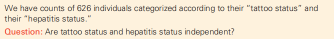

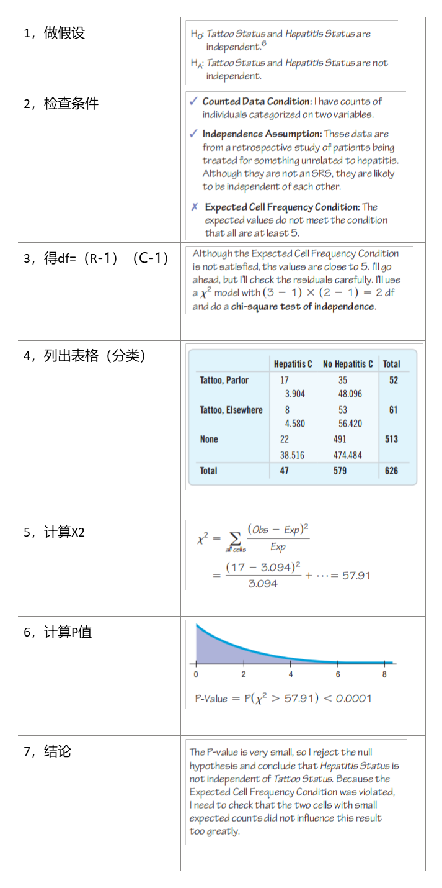
案例

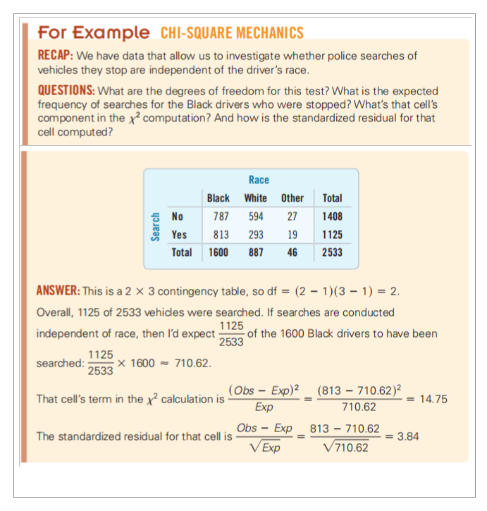

Examine the Residuals【还没看】

Chi-Square and Causation【还没看】

总结
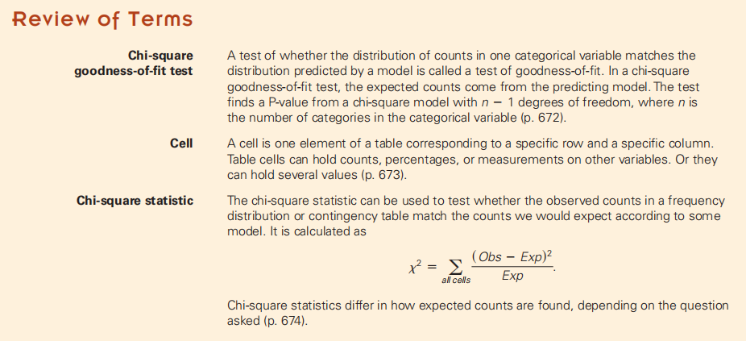
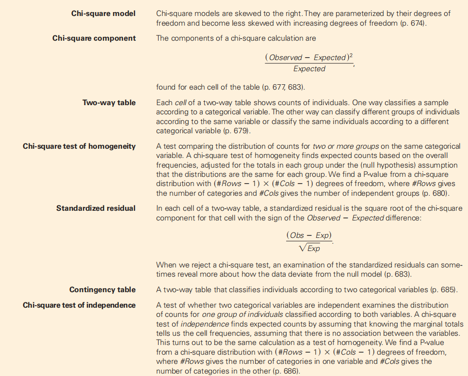
