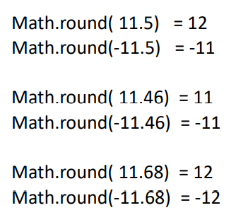
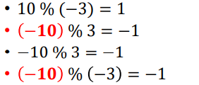
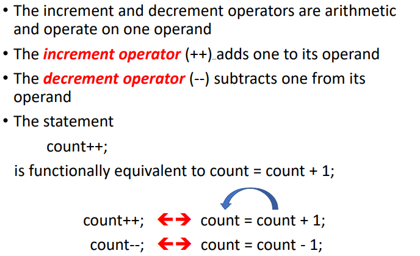
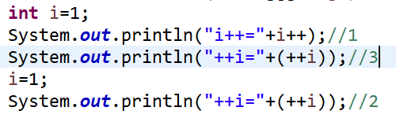
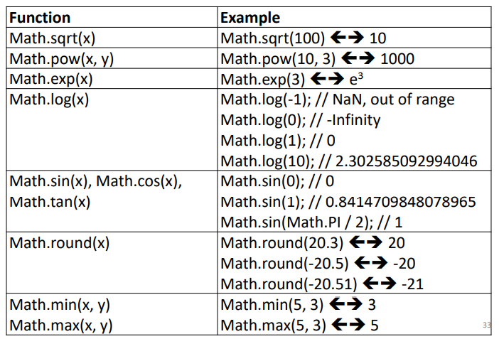
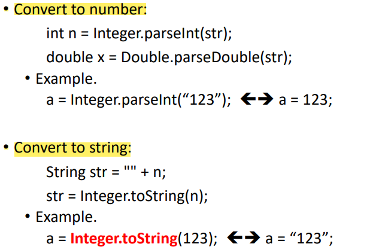
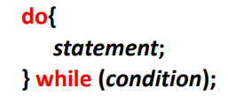

1，Math.round converts a floating-point number to nearest integer
一样近的时候选大的数

2，Modulus operator %
商的符号由被除数决定

**3，自增自减**

4，Mathematical methods in Java

5，Converting between Strings and numbers

6，String
Substrings含头不含尾

7，do while Statement

