一、重点
1，linear search
<table>
<colgroup>
<col style="width: 28%" />
<col style="width: 71%" />
</colgroup>
<thead>
<tr class="header">
<th>
public int search(int[]arr, int key) {

<blockquote>

for(int i=0;i&lt;arr.length;i++) {

if(key==arr[i]) {

return i;

}

}

return -1;

</blockquote>

}
</th>
<th>
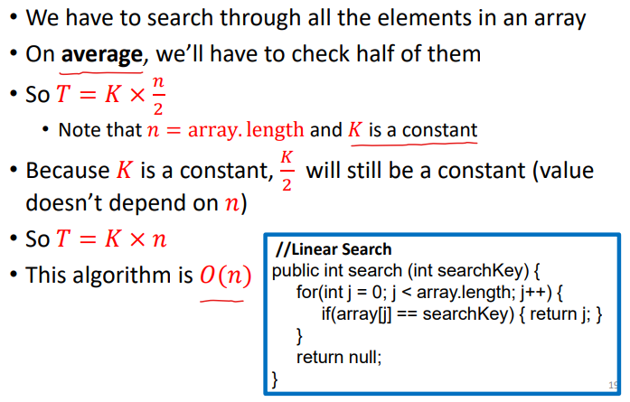

</th>
</tr>
</thead>
<tbody>
</tbody>
</table>

2，binary search
针对有序数组
<table>
<colgroup>
<col style="width: 23%" />
<col style="width: 76%" />
</colgroup>
<thead>
<tr class="header">
<th>
private static int binarySearch(int[] arr, int target) {

<blockquote>

int left=0;

int right=arr.length-1;

while(left&lt;=right) {

int mid=(left+right)/2;

if(target==arr[mid]) {

return mid;

}else if(target&lt;arr[mid]) {

right=mid-1;

}else {

left=mid+1;

}

}

return -1;

</blockquote>

}
</th>
<th>

</th>
</tr>
</thead>
<tbody>
</tbody>
</table>
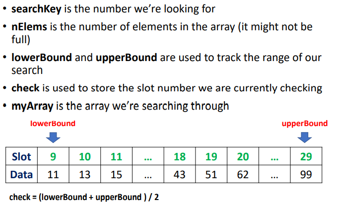

分析二分法
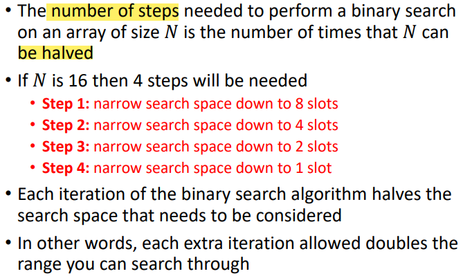

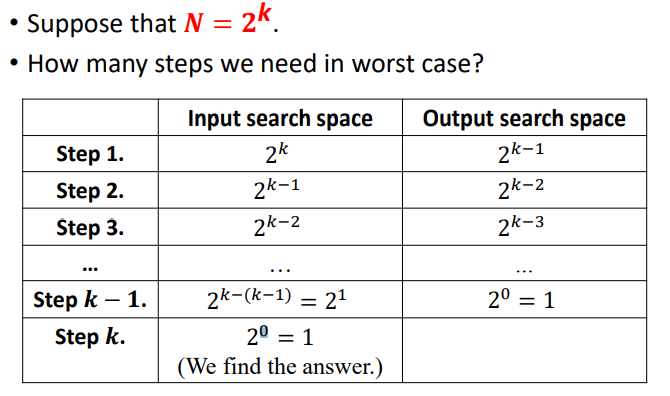

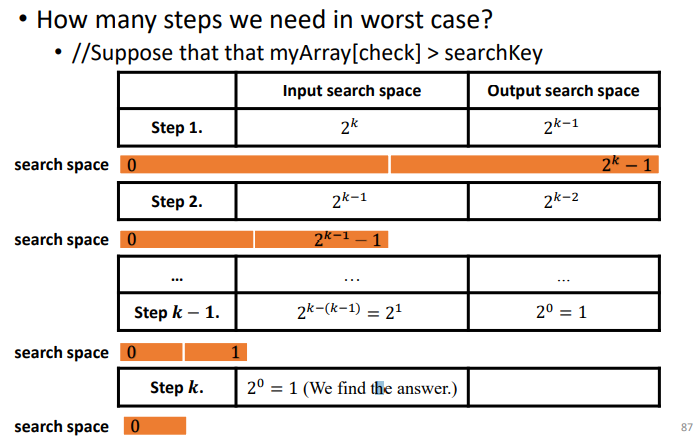

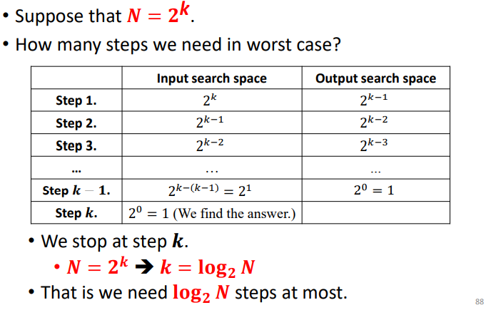

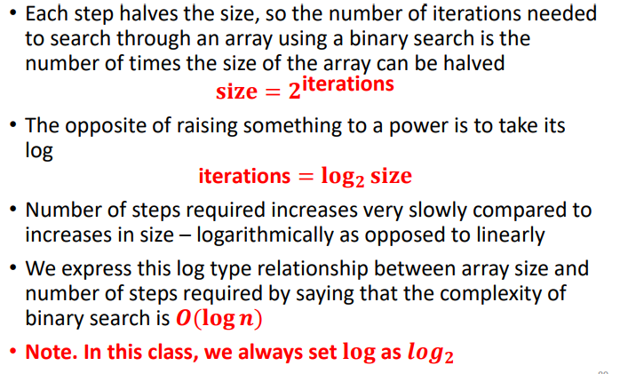
二、复习
1, Arrays

2, Random Numbers
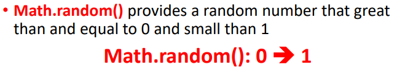

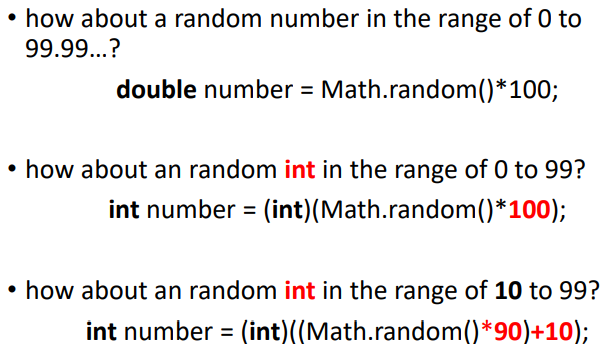
3，Inserting an element
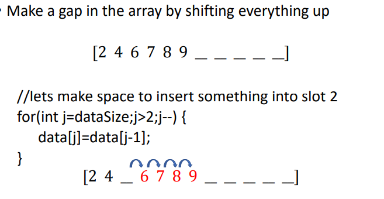

Removing an Element
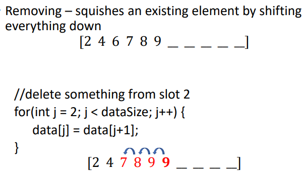

