一、stacks
1，stack，先进后出
The stack mechanism is known as Last-In-First-Out (LIFO) because the last item inserted is the first one removed 【栈的解释】

2，操作
• There are several things you can do with a stack
• Pop ( ) – pop the top item off the stack
• Push ( ) – put another item onto the top
• Peek ( ) – look at the top item and copy it
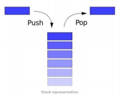

<table>
<colgroup>
<col style="width: 33%" />
<col style="width: 66%" />
</colgroup>
<thead>
<tr class="header">
<th>
push ( element )

• insert an element at the top of the stack
</th>
<th>
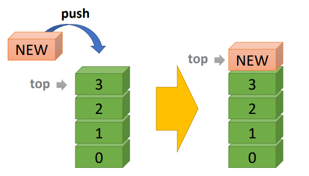

</th>
</tr>
</thead>
<tbody>
<tr class="odd">
<td>
• pop ( )

• remove an element from the top of the stack
</td>
<td>
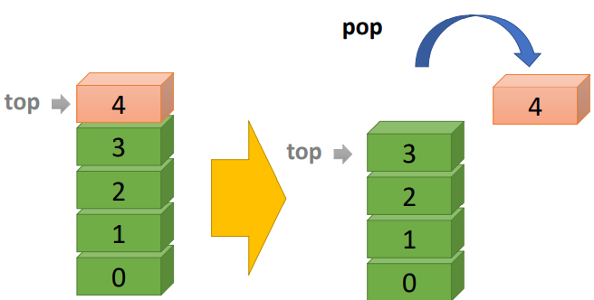

</td>
</tr>
<tr class="even">
<td>
• Peek ( )

• look at the top item and copy it
</td>
<td>
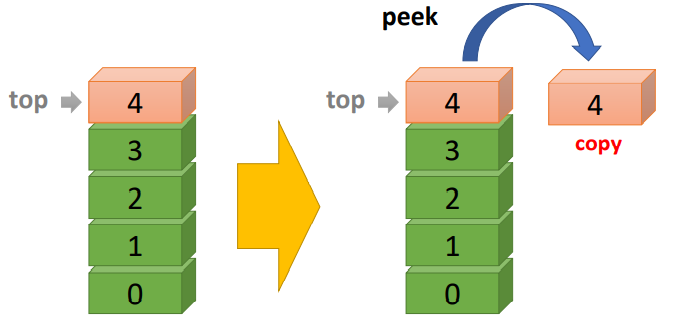

</td>
</tr>
</tbody>
</table>

其他操作
| • MakeEmpty( ) | Remove all items from the stack         |
|----------------|-----------------------------------------|
| • IsEmpty( )   | True if stack is empty, false otherwise |
| • IsFull( )    | True if stack is full, false otherwise  |

3，用数组模拟stack
Array-based Stack
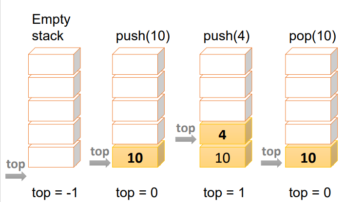

初始情况：top=-1

1，stack满则A push operation will then throw a **FullStackException**
• Limitation of the array-based implementation

• Not intrinsic to the Stack ADT
2，所需字段：
maxSize，stackArray，top=-1
<table>
<colgroup>
<col style="width: 22%" />
<col style="width: 25%" />
<col style="width: 25%" />
<col style="width: 26%" />
</colgroup>
<thead>
<tr class="header">
<th>
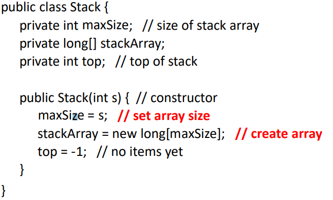

</th>
<th>
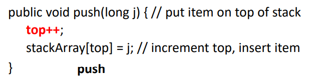

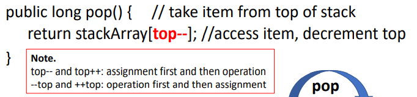

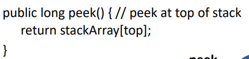

</th>
<th>
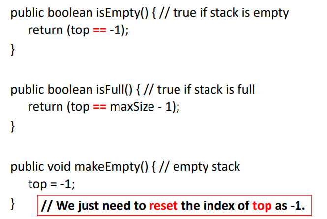

</th>
<th>
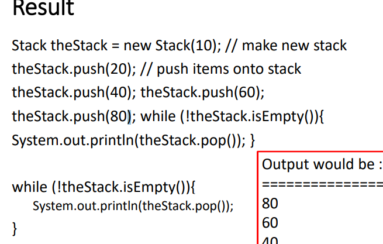

</th>
</tr>
</thead>
<tbody>
</tbody>
</table>

3, Can you think of anything else using a stack structure?
• Web browsers
• Undo sequence in a text editor
• Java Virtual Machine

4，Method Stack in the JVM

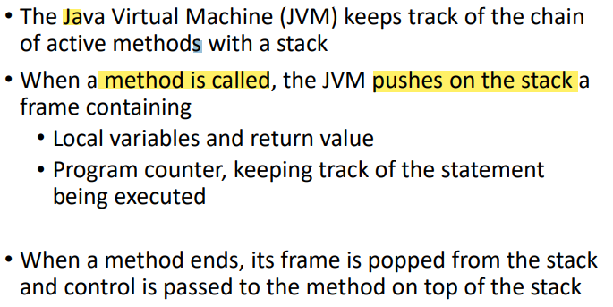
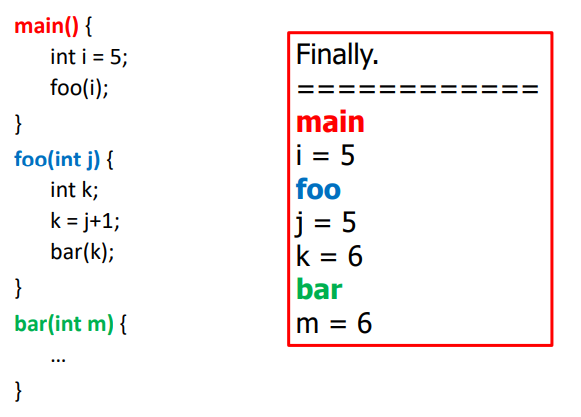

6，例子
（1）The LIFO principle can be used in reversing a word
（2）Checking for palindromes
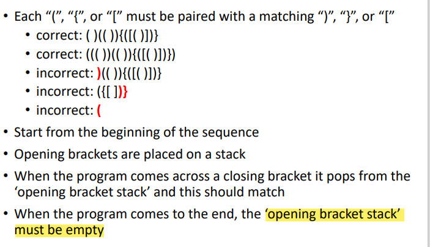

7，Performance
• Let 𝒏 be the number of elements in the stack
• The space used is 𝑶(𝒏)
• Each **operation** runs in time 𝑶(𝟏) (e.g. pop, push)

8,Limitations for **array-based** stacks
• The maximum size of the stack must be defined a
priori and cannot be changed
栈的长度已经定型
• Trying to push a new element into a full stack causes
an implementation-specific exception
向满栈加入元素有异常

二、Queues
1,queues的解释：
• A queue means **to line up for something**
Queues uses the **First-In-First-Out system (FIFO)，** the one that has been in the queue the longest is the one that is popped

2,variables
• Size of the array
• The array itself
• Variables for tracking front and rear

| Empty Queue:      | Front = 0, Rear = -1 |
|-------------------|----------------------|
| 3 items in queue: | Front = 0, Rear = 2  |

3，操作：加在rear，取走在front
Insertions are made at one end, the back of the queue
Deletions take place at the other end, the front of the queue

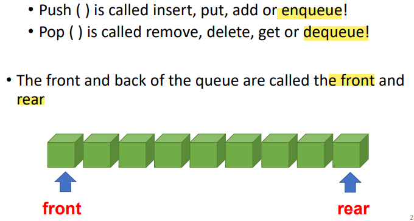

Front=0；rear=-1；
<table>
<colgroup>
<col style="width: 13%" />
<col style="width: 86%" />
</colgroup>
<thead>
<tr class="header">
<th>Insert</th>
<th>
• Assumes the queue is not full

• Inserts at rear

• If <strong>rear is at the top</strong> of the array then it wraps around to the bottom of the array

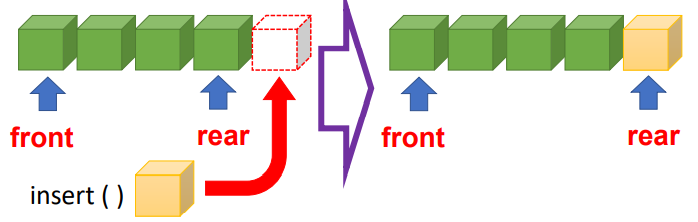

</th>
</tr>
</thead>
<tbody>
<tr class="odd">
<td>Remove()</td>
<td>
Assumes queue is not empty

• Obtains the value at the front

• Increments the front variable

• If front goes beyond the end of the array it must be

wrapped around to 0•如果front超过数组的末尾，它必须绕成0
</td>
</tr>
<tr class="even">
<td>peek ( )</td>
<td>Returns the value at the front</td>
</tr>
<tr class="odd">
<td>size ( )</td>
<td>Assumes queue not empty • Returns total number in queue</td>
</tr>
<tr class="even">
<td>isFull ( )</td>
<td>• Returns true if queue is full</td>
</tr>
<tr class="odd">
<td>isEmpty ( )</td>
<td>• Returns true if queue is empty</td>
</tr>
</tbody>
</table>

案例
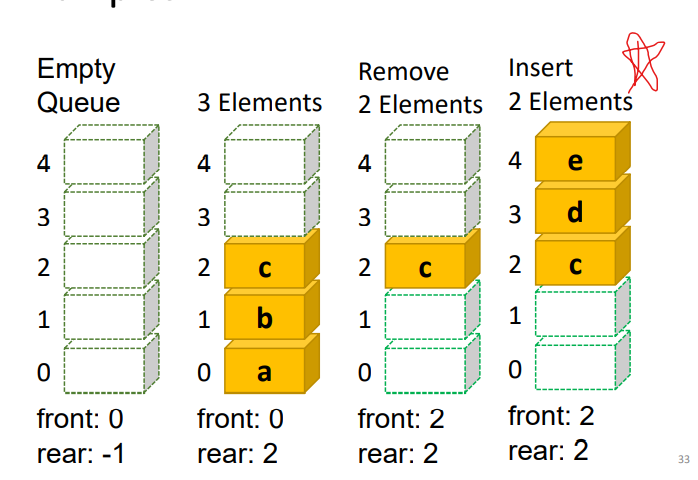

**wrapround包着的**
(rear+1)%maxSize==front \[满\]
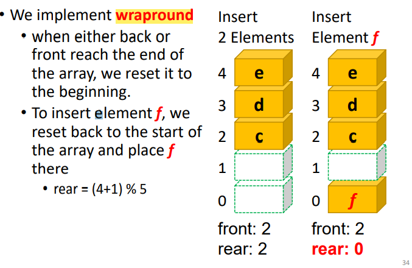

4，Array-based Queue
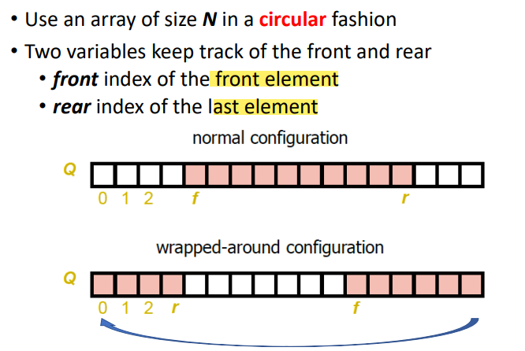
代码
<table>
<colgroup>
<col style="width: 18%" />
<col style="width: 28%" />
<col style="width: 27%" />
<col style="width: 25%" />
</colgroup>
<thead>
<tr class="header">
<th>
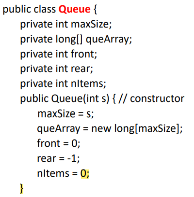

</th>
<th>
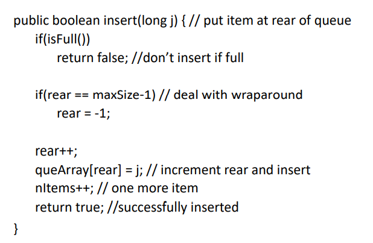

</th>
<th>
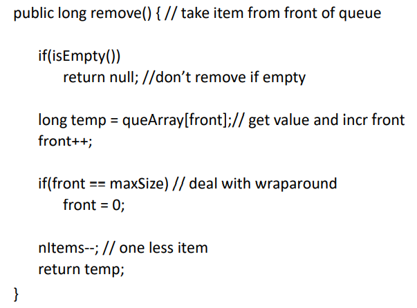

<blockquote>

</blockquote></th>
<th>
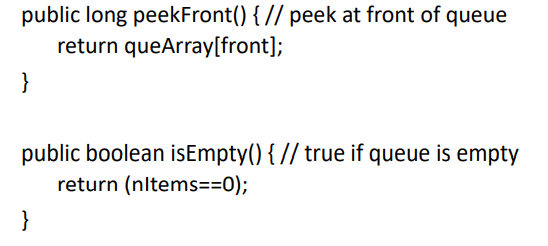

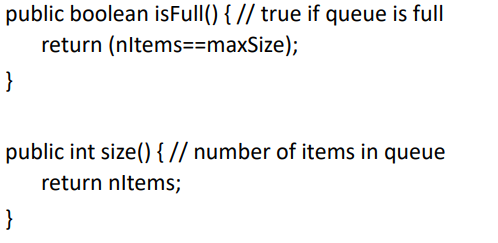
</th>
</tr>
</thead>
<tbody>
</tbody>
</table>

案例
| **Operation** | **Output** | **front ç Q ç rear** |
|---------------|------------|-----------------------|
| insert(5)    | \-         | 5                     |
| insert(3)    | \-         | 5,3                   |
| remove()      | 5          | 3                     |
| insert(7)    | \-         | 3,7                   |
| remove()      | 3          | 7                     |
| front()      | 7          | 7                     |
| remove()      | 7          |                      |
| remove()      | error      |                      |
| isEmpty()     | true       |                      |
| insert(9)     | \-         | 9                     |
| insert(7)     | \-         | 9,7                   |
| size()        | 2          | 9,7                   |
| insert(3)     | \-         | 9,7,3                 |
| insert(5)     | \-         | 9,7,3,5               |
| remove()      | 9          | 735                   |

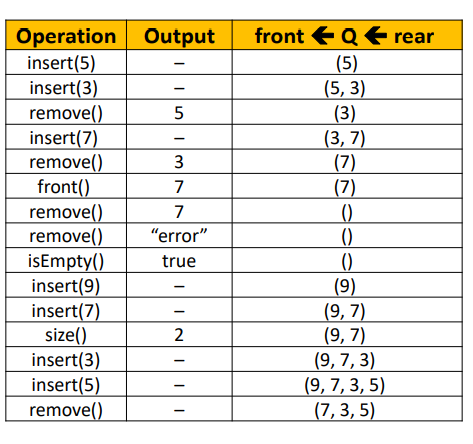
5，Performance
• Let 𝒏 be the **number of elements** in the queue
• The space used is 𝑶(𝒏)
• Each operation runs in time 𝑶(𝟏)

6，• Limitations for **array-based queues**
• The maximum size of the queue must be defined a priori and cannot be changed
• Trying to insert a new element into a full queue causes an implementation-specific exception

三、Deque
1,• A deque is a **double-ended** queue 双端队列；双队列
insert items at either end and delete them at either end
**no longer a front and rear, simply two ends**

2,操作
<table>
<colgroup>
<col style="width: 19%" />
<col style="width: 80%" />
</colgroup>
<thead>
<tr class="header">
<th>• insertLeft( )</th>
<th>
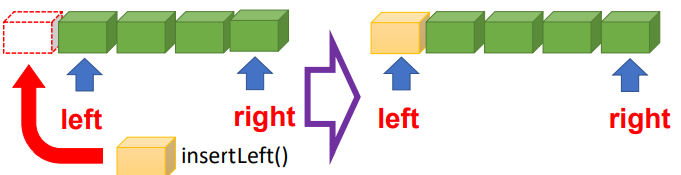

</th>
</tr>
</thead>
<tbody>
<tr class="odd">
<td>• insertRight( )</td>
<td>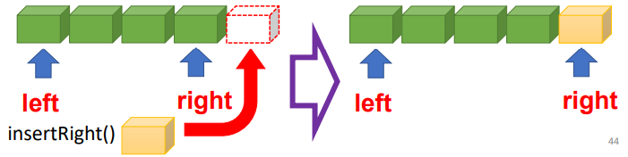</td>
</tr>
<tr class="even">
<td>• removeLeft( )</td>
<td>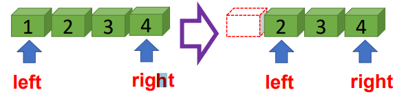</td>
</tr>
<tr class="odd">
<td>• removeRight( )</td>
<td>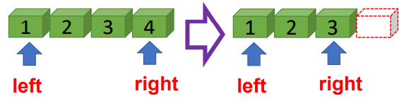</td>
</tr>
</tbody>
</table>

3，
<table>
<colgroup>
<col style="width: 64%" />
<col style="width: 35%" />
</colgroup>
<thead>
<tr class="header">
<th>
• A stack is actually a deque with only the methods

• insertRight( ) • removeRight( )
</th>
<th>
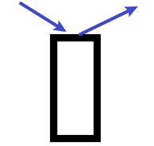

</th>
</tr>
</thead>
<tbody>
<tr class="odd">
<td>
• A queue is a deque with only the methods

• insertRight( ) • removeLeft( )
</td>
<td>
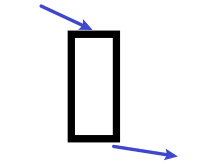

</td>
</tr>
</tbody>
</table>

四、Priority Queue
1，A priority queue is a queue where items **don’t just join at the rear**, they are slotted into the queue according to their priority
其中的项目不只是在后面加入，而是根据它们的优先级插入队列
2，操作
不需要front和rear，总是停留在**索引0**
only need to track the top

• Insert method has a for loop that shifts elements up 【shift elements up to make space rather 】

• Remove method simply removes the top (highest priority) element

是queue结构，但是类似栈，把最优先的放在“栈里的top”

<table>
<colgroup>
<col style="width: 53%" />
<col style="width: 46%" />
</colgroup>
<thead>
<tr class="header">
<th>

</th>
<th>
假设越小的数权重越大

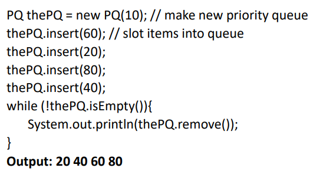

</th>
</tr>
</thead>
<tbody>
</tbody>
</table>

