叶子结点 就是出度为0的结点 就是没有子结点的结点
近二叉树：不能满的二叉树
一、binary tree
1，binary tree
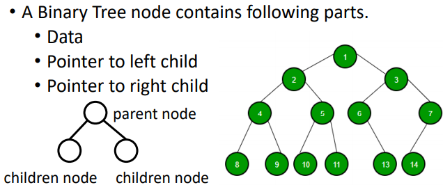

2，Complete Binary Tree
定义：完备二叉树是指除了最后一层之外的每一层都是满的，并且所有节点都在尽可能远的左边的二叉树

堆：完全二叉树+父节点\>子节点（父节点\<子节点）
| max heap | 父\>子 |
|----------|--------|
| Min heap | 父\<子 |
. The heap can be represented by a binary tree or array.

3，Heap Property
3.1 a nearly complete binary tree with “heap property”:父节点\>两个子节点
注意序号
3.2
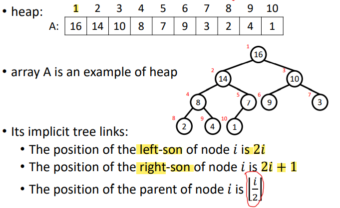
从一开始

4，Tree
height：从下往上；
depth：从上往下
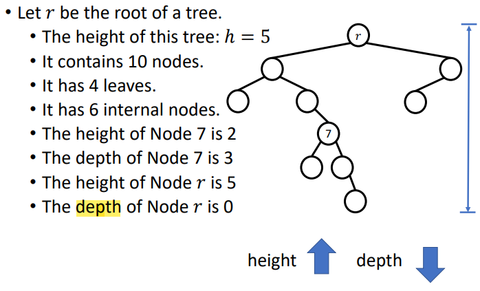

5，binary tree facts
<table>
<colgroup>
<col style="width: 100%" />
</colgroup>
<thead>
<tr class="header">
<th>

</th>
</tr>
</thead>
<tbody>
<tr class="odd">
<td>

</td>
</tr>
</tbody>
</table>

<table>
<colgroup>
<col style="width: 100%" />
</colgroup>
<thead>
<tr class="header">
<th>
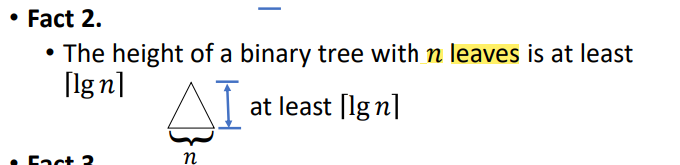

</th>
</tr>
</thead>
<tbody>
<tr class="odd">
<td>
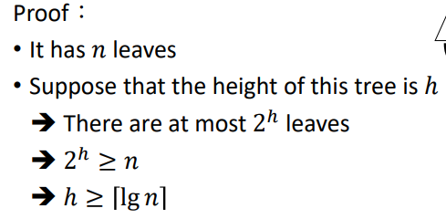

</td>
</tr>
</tbody>
</table>

<table>
<colgroup>
<col style="width: 100%" />
</colgroup>
<thead>
<tr class="header">
<th>
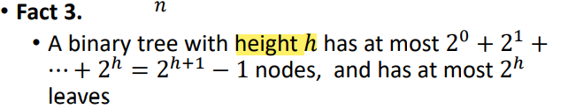

</th>
</tr>
</thead>
<tbody>
<tr class="odd">
<td>
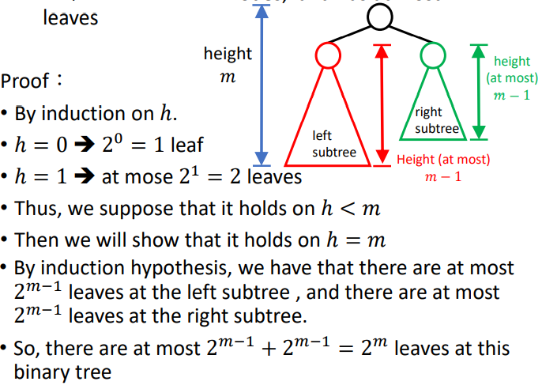

</td>
</tr>
</tbody>
</table>

<table>
<colgroup>
<col style="width: 100%" />
</colgroup>
<thead>
<tr class="header">
<th>
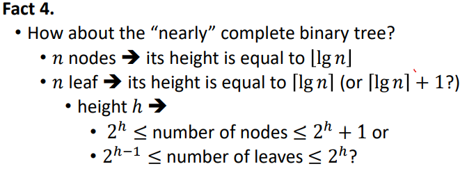

</th>
</tr>
</thead>
<tbody>
<tr class="odd">
<td></td>
</tr>
</tbody>
</table>

<table>
<colgroup>
<col style="width: 100%" />
</colgroup>
<thead>
<tr class="header">
<th>
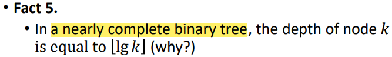

</th>
</tr>
</thead>
<tbody>
<tr class="odd">
<td></td>
</tr>
</tbody>
</table>

数学公式
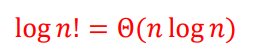

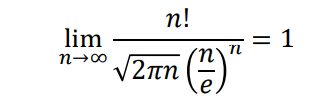

二、Heap Sort  
1，
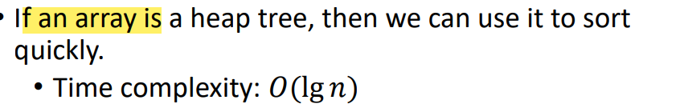

2，HEAPIFY\[调整为heap tree\]
<table>
<colgroup>
<col style="width: 34%" />
<col style="width: 33%" />
<col style="width: 31%" />
</colgroup>
<thead>
<tr class="header">
<th>
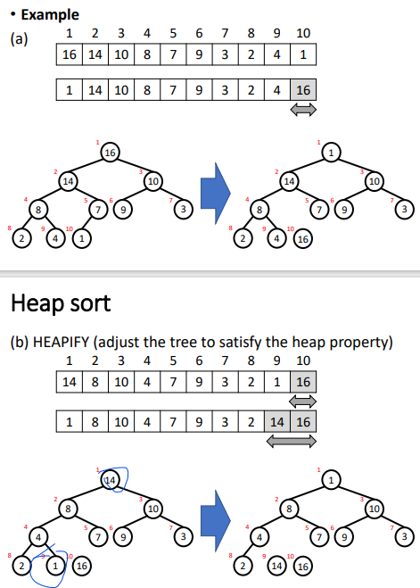

</th>
<th>
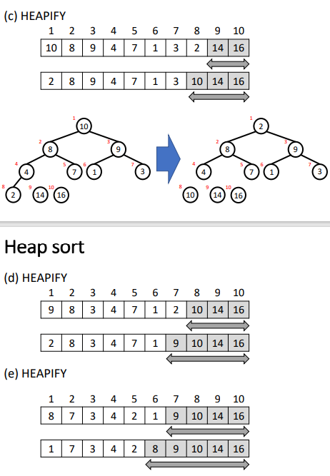

</th>
<th>
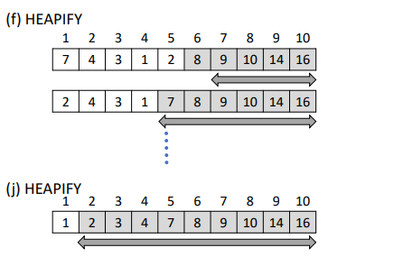

</th>
</tr>
</thead>
<tbody>
</tbody>
</table>

步骤
A is a heap
1，把A中最大的放到B
2，把最小的放到A\[1\]
3，调整剩余的node，【除了当前最大的】，直到满足heap 性质
4，重复1-3步直到A空
5，B就是从大到小排列好的数组

3，两个缺点
1，need a lot of extra space=O(1)

2,移动元素后的tree很可能不满足堆性质

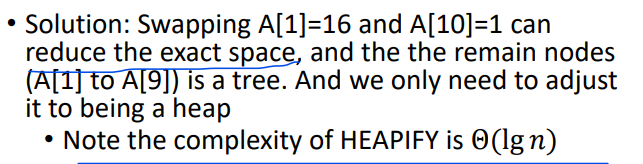
4，heapify例子
<table>
<colgroup>
<col style="width: 32%" />
<col style="width: 33%" />
<col style="width: 33%" />
</colgroup>
<thead>
<tr class="header">
<th>
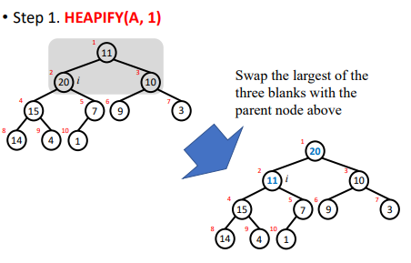

</th>
<th>
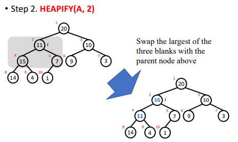

</th>
<th>
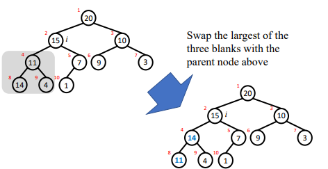

</th>
</tr>
</thead>
<tbody>
</tbody>
</table>

5，时间复杂度
<table>
<colgroup>
<col style="width: 41%" />
<col style="width: 58%" />
</colgroup>
<thead>
<tr class="header">
<th>
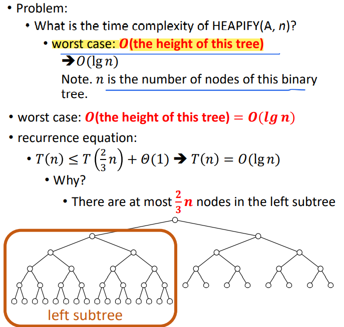

</th>
<th>
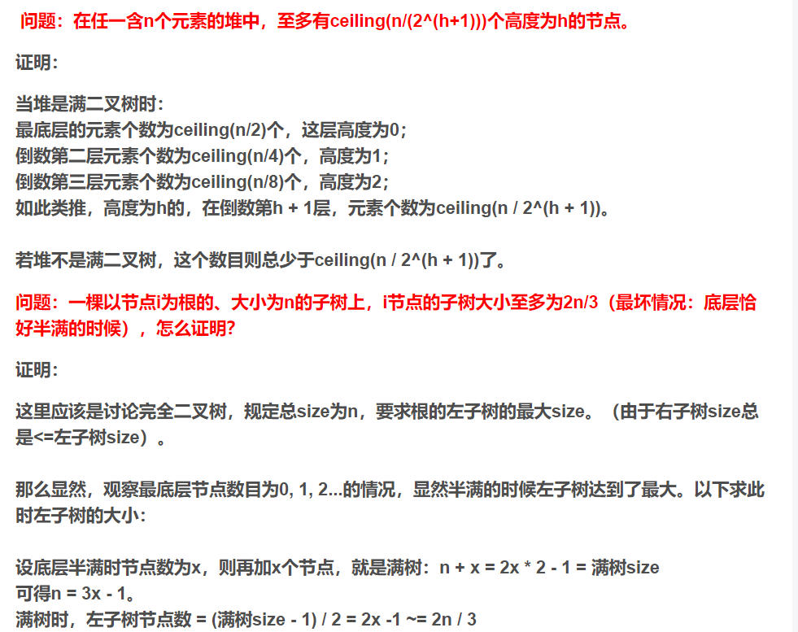

</th>
</tr>
</thead>
<tbody>
</tbody>
</table>
6，construct a heap tree
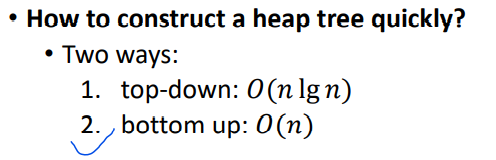
方法1：top-down O(nlgn)
Extend the heap tree by add nodes one by one
从上至下,从左到右，一边加点一边调整结构
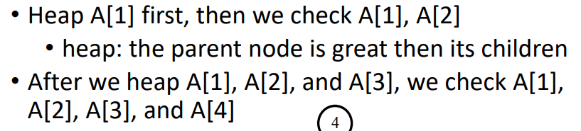
Then we add A\[X\] to this tree and do "floating up"

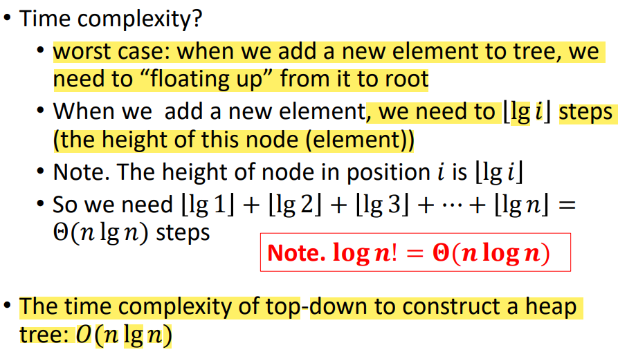

方法2：bottom up O(n)
从下往上，从右到左，开始构建
Use bottom up to construct heap ➔ 𝑂(𝑛)
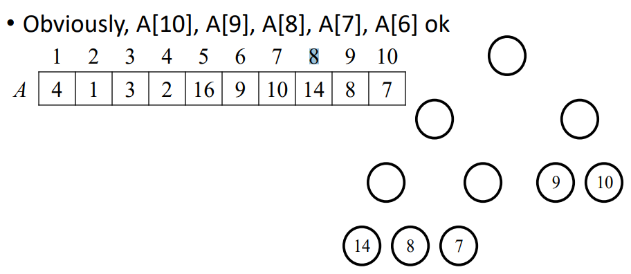

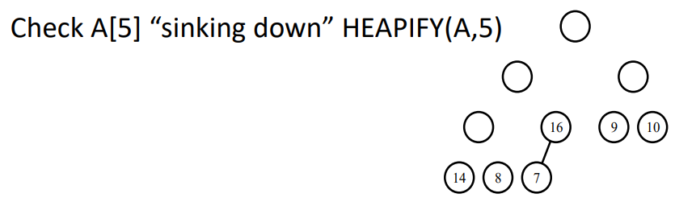

时间复杂度：  

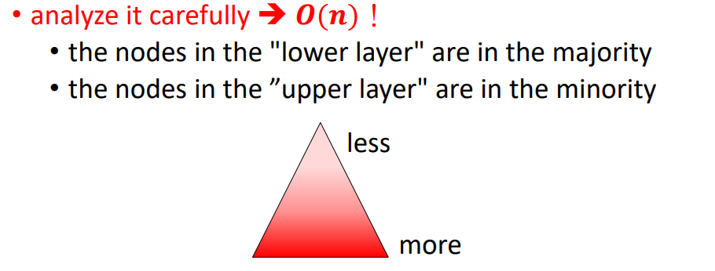

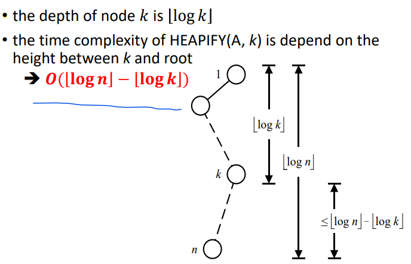

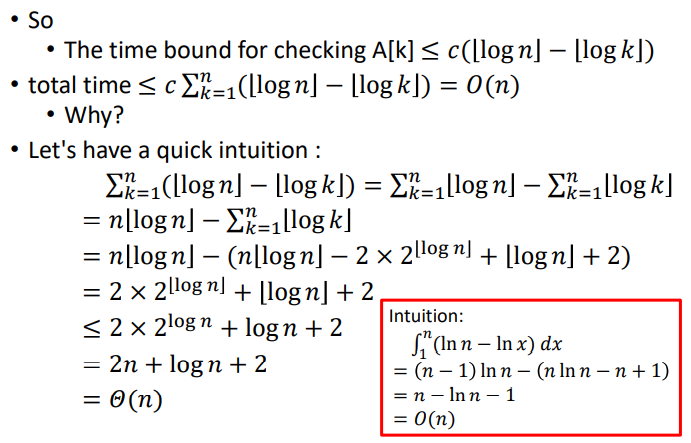

7，堆排序时间复杂度
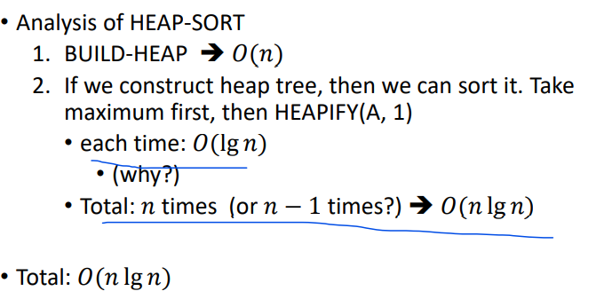

三、Priority queue
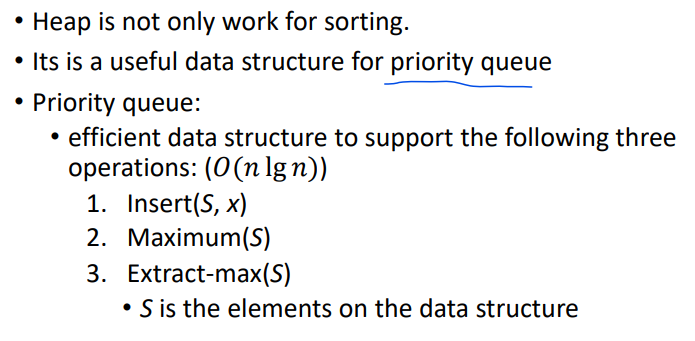

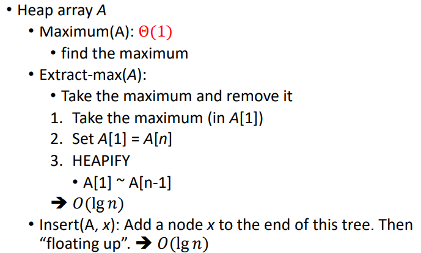

