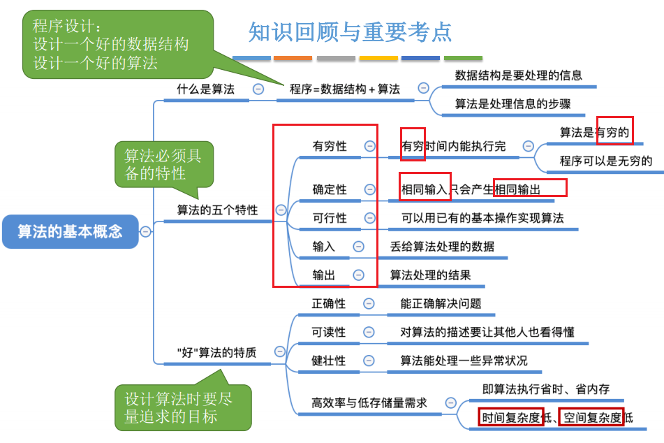
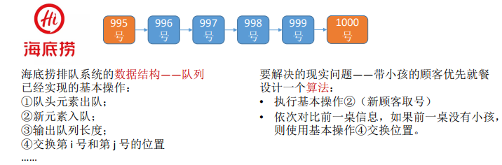

0，目录

1，程序 = 数据结构 + 算法
解决问题，如

2，算法的特性

| 有穷性 | 一个算法必须总在执行有穷步之后结束，且每一步都可在有穷时间内完成。                                                                                                                                           |
|--------|--------------------------------------------------------------------------------------------------------------------------------------------------------------------------------------------------------------|
| 确定性 | 。算法中每条指令必须有确切的含义，对于相同的输入只能得出相同的输出。                                                                                                                                         |
| 可行性 | 。算法中描述的操作都可以通过已经实现的基本运算执行有限次来实现。 输入。一个算法有零个或多个输入，这些输入取自于某个特定的对象的集合。 输出。一个算法有一个或多个输出，这些输出是与输入有着某种特定关系的量。 |

注意：  
1），**算法**必须是**有穷**的【有限步】，而**程序**可以是**无穷**的

3，总结

