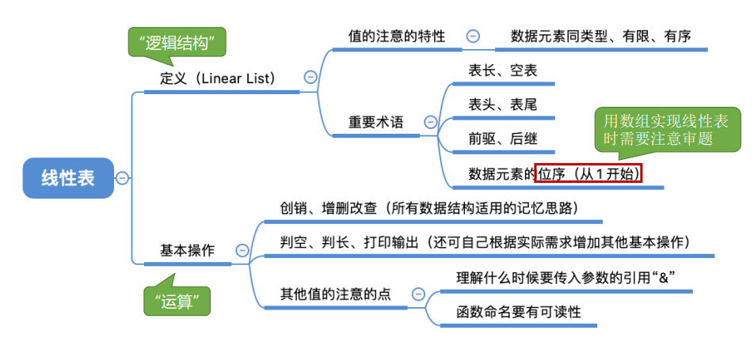

0，目录

1，线性表定义
1）线性表：线性表是具有**相同数据类型【**每个数据元素所 占空间一样大**】**的n（n≥0）个数据元素的**有限 序列**，其中n为表长，
当n = 0时线 性表是一个空表。
若用L命名线性表，则其一般表示为 L = (a1, a2, … , ai , ai+1, … , an)
概念：
ai是线性表中的“第i个”元素线性表中的位序 a1是表头元素；

an是表尾元素。 除第一个元素外，每个元素有且仅有一个直接前驱；除最后一个元素外，每个元素有且仅 有一个直接后继

问：
1）所有的整数按递增次 序排列，是线性表吗 --（×），有限系列！，题中是无序的

2，基本操作
| InitList(&L)        | 初始化表。构造一个空的线性表L，分配内存空间。               |
|---------------------|-------------------------------------------------------------|
| DestroyList(&L)     | 销毁操作。销毁线性表，并释放线性表L所占用的内存空间。       |
| ListInsert(&L,i,e)  | 插入操作。在表L中的第i个位置上插入指定元素e。               |
| ListDelete(&L,i,&e) | 删除操作。删除表L中第i个位置的元素，并用e返回删除元素的值。 |
| LocateElem(L,e)     | 按值查找操作。在表L中查找具有给定关键字值的元素。           |
| GetElem(L,i)        | 按位查找操作。获取表L中第i个位置的元素的值。                |

其他常用操作：
| Length(L)    | 求表长。返回线性表L的长度，即L中数据元素的个数。 |
|--------------|--------------------------------------------------|
| PrintList(L) | 输出操作。按前后顺序输出线性表L的所有元素值。    |
| Empty(L)     | 判空操作。若L为空表，则返回true，否则返回false。 |

Tips：
①对数据的操作（记忆思路） —— 创销、增删改查 【<u>增删改查</u>】
②C语言函数的定义 —— 函数名 ( 参数1， 参数2，……)
③实际开发中，可根据实际需求定义其他的基本操作
④函数名和参数的形式、命名都可改变（Reference：严蔚敏版《数据结构》）
**⑤什么时候要传入引用“&” —— 对参数的修改结果需要“带回来”**

