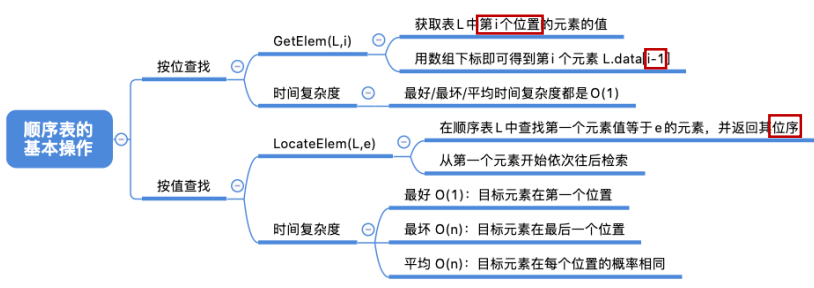
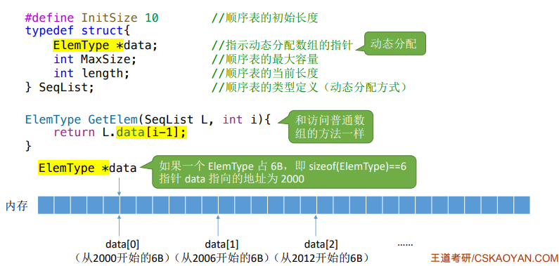
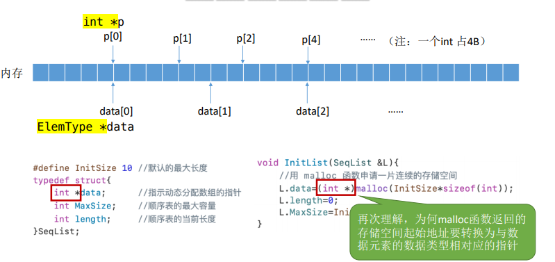
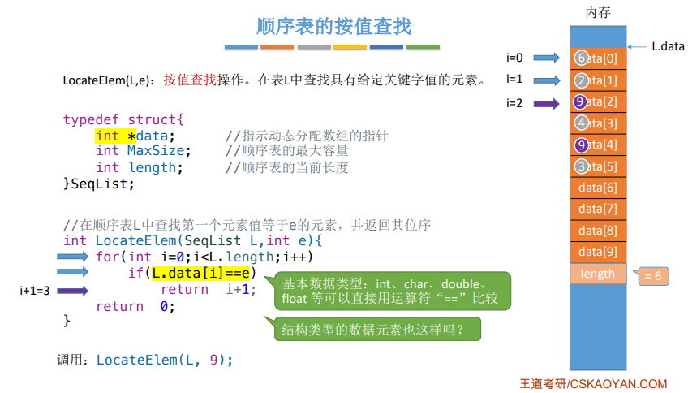
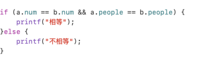
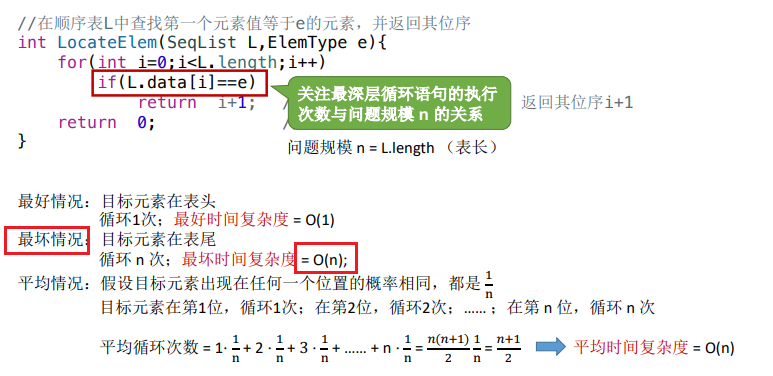

0，

1，查找--按位查找
| GetElem(L,i) | 按位查找操作。获取表L中第i个位置的元素的值 |
|--------------|--------------------------------------------|

1）分析
| 数组下标   | 0,1,2,3，…; |
|------------|-------------|
| 顺序表下标 | 1,2,3…      |

2）时间复杂度O(1)
由于顺序表的各个数据元素在内存中连续存放， 因此可以根据起始地址和数据元素大小立即找到 第 i 个元素——“随机存取”特性

2，查找--按值查找
| LocateElem(L,e) | 按值查找操作。在表L中查找具有给定关键字值的元素 |
|-----------------|-------------------------------------------------|

注意，C语言中，结构体不能直接用“==”比较
正确方式

时间复杂度

