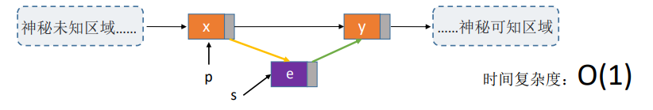

0，

1，插入
内存示意图

1）按位序插入
（1）（带头结点）

（2）（不带头结点）

2）指定结点的后插操作

<table>
<colgroup>
<col style="width: 46%" />
<col style="width: 53%" />
</colgroup>
<thead>
<tr class="header">
<th>

</th>
<th>

</th>
</tr>
</thead>
<tbody>
</tbody>
</table>

3）指定结点的前插操作
方法1

方法2，技巧--交换值

3，删除
1）按位序删除（带头结点）

2)指定结点删除

