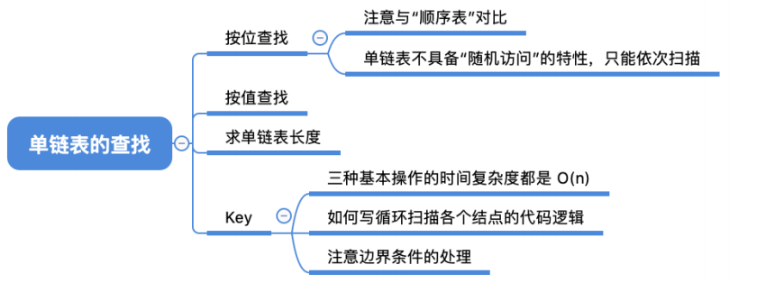
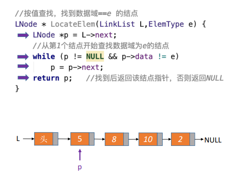
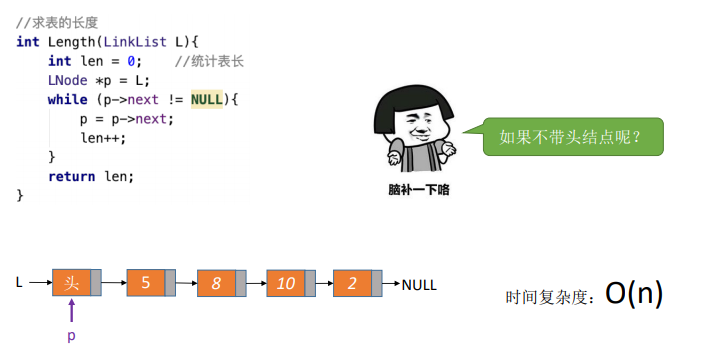

0，

1，按位查找操作，O(n)
| GetElem(L,i) | 按位查找操作。获取表L中第i个位置的元素的值。 |
|--------------|----------------------------------------------|
平均时间复杂度O(n)

2,按值查找操作
| LocateElem(L,e) | 按值查找操作。在表L中查找具有给定关键字值的元素。 |
|-----------------|---------------------------------------------------|
平均时间复杂度：O(n)

3，求表的长度

