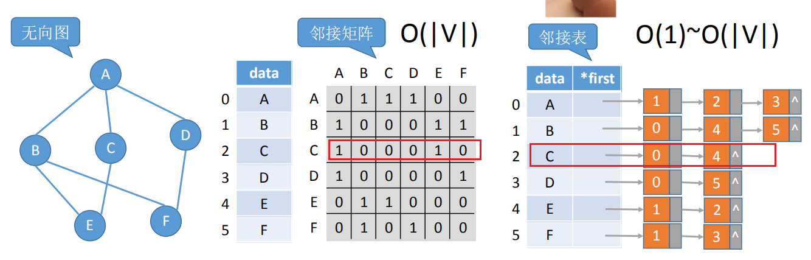

| Adjacent(G,x,y)：         | 判断图G是否存在边\<x, y\>或(x, y)。                                                                         |
|---------------------------|-------------------------------------------------------------------------------------------------------------|
| Neighbors(G,x)            | ：列出图G中与结点x邻接的边。                                                                                |
| InsertVertex(G,x)         | ：在图G中插入顶点x。                                                                                        |
| DeleteVertex(G,x)：       | 从图G中删除顶点x。                                                                                          |
| AddEdge(G,x,y)：          | 若无向边(x, y)或有向边\<x, y\>不存在，则向图G中添加该边。                                                   |
| RemoveEdge(G,x,y)：       | 若无向边(x, y)或有向边\<x, y\>存在，则从图G中删除该边。                                                     |
| FirstNeighbor(G,x)：      | 求图G中顶点x的第一个邻接点，若有则返回顶点号。若x没有邻接点或图中不存在x，则返回-1。                        |
| NextNeighbor(G,x,y)：     | 假设图G中顶点y是顶点x的一个邻接点，返回除y之外顶点x的下一个邻接点的顶点号，若y是x的最后一个邻接点，则返回-1 |
| Get_edge_value(G,x,y)：   | 获取图G中边(x, y)或\<x, y\>对应的权值。                                                                     |
| Set_edge_value(G,x,y,v)： | 设置图G中边(x, y)或\<x, y\>对应的权值为v。                                                                  |

| Adjacent(G,x,y)： | 判断图G是否存在边\<x, y\>或(x, y)。 |
|-------------------|-------------------------------------|

| Neighbors(G,x) | ：列出图G中与结点x邻接的边。 |
|----------------|------------------------------|

| InsertVertex(G,x) | ：在图G中插入顶点x。 |
|-------------------|----------------------|

| DeleteVertex(G,x)： | 从图G中删除顶点x。 |
|---------------------|--------------------|

| AddEdge(G,x,y)： | 若无向边(x, y)或有向边\<x, y\>不存在，则向图G中添加该边。 |
|------------------|-----------------------------------------------------------|

| RemoveEdge(G,x,y)： | 若无向边(x, y)或有向边\<x, y\>存在，则从图G中删除该边。 |
|---------------------|---------------------------------------------------------|

| FirstNeighbor(G,x)： | 求图G中顶点x的第一个邻接点，若有则返回顶点号。若x没有邻接点或图中不存在x，则返回-1。 |
|----------------------|--------------------------------------------------------------------------------------|

| NextNeighbor(G,x,y)： | 假设图G中顶点y是顶点x的一个邻接点，返回除y之外顶点x的下一个邻接点的顶点号，若y是x的最后一个邻接点，则返回-1 |
|-----------------------|-------------------------------------------------------------------------------------------------------------|

| Get_edge_value(G,x,y)： | 获取图G中边(x, y)或\<x, y\>对应的权值。 |
|-------------------------|-----------------------------------------|

| Set_edge_value(G,x,y,v)： | 设置图G中边(x, y)或\<x, y\>对应的权值为v。 |
|---------------------------|--------------------------------------------|
