1，树的深度优先遍历

树的深度优先遍历（先根、后根）：
从根节点出发，能往更深处⾛就尽量往深处⾛。每当访问⼀个结点的时候，要
检查是否还有与当前结点相邻的且没有被访问过的结点，如果有的话就往下⼀
层钻。
**图的深度优先遍历类似于树的先根遍历。**

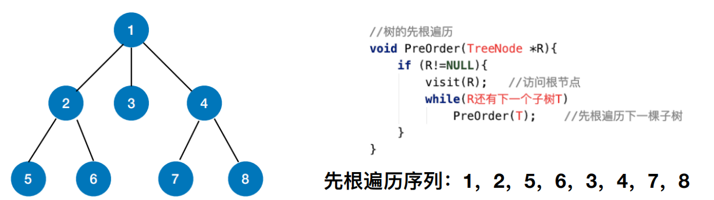

2，图的深度优先遍历
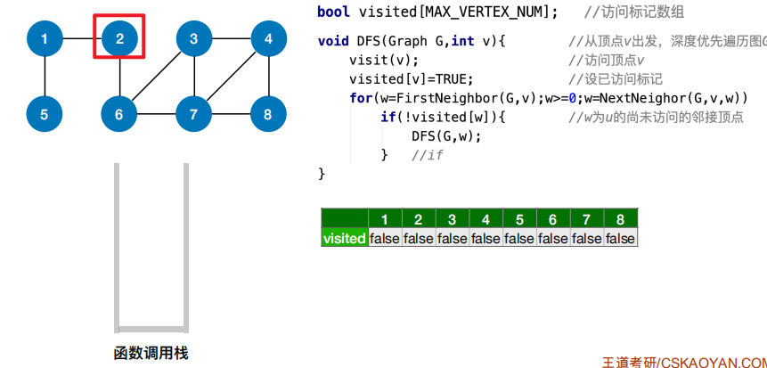
……
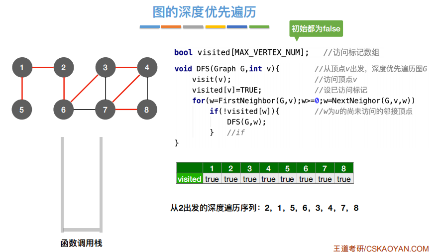

存在的问题

解决：类似DFS的解决方法
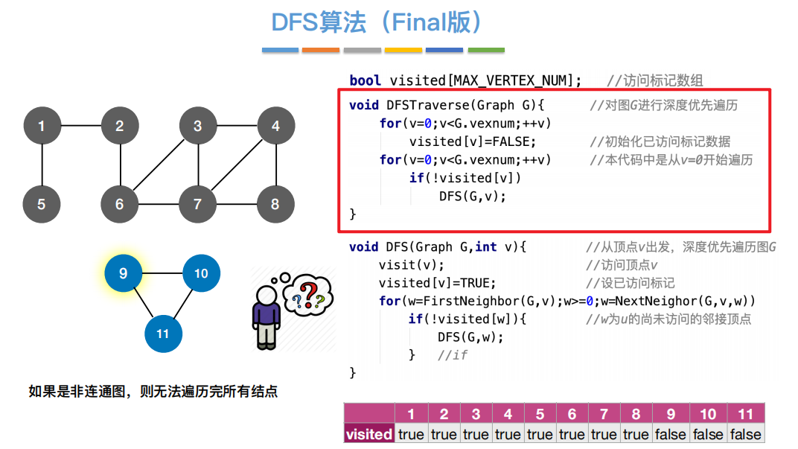

3，时间复杂度
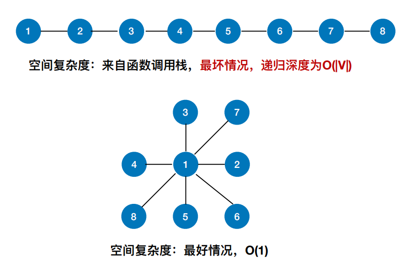

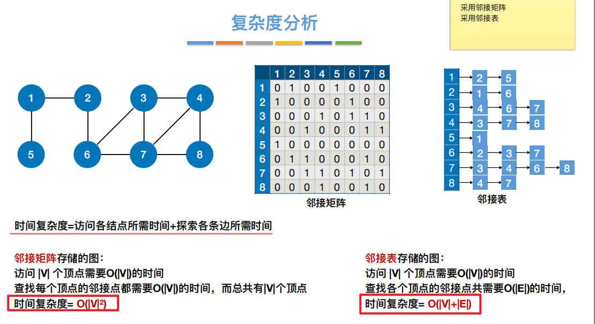

4，深度优先遍历序列

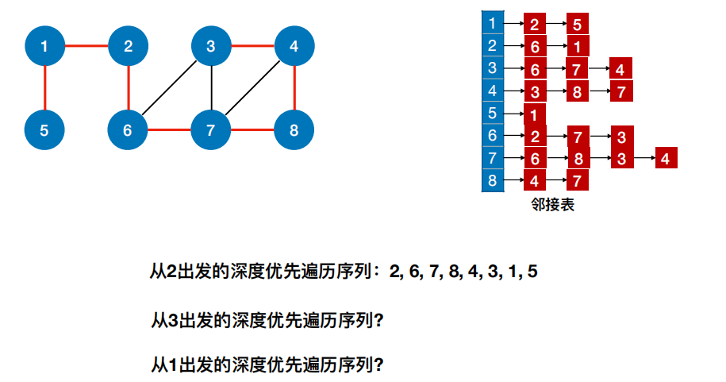

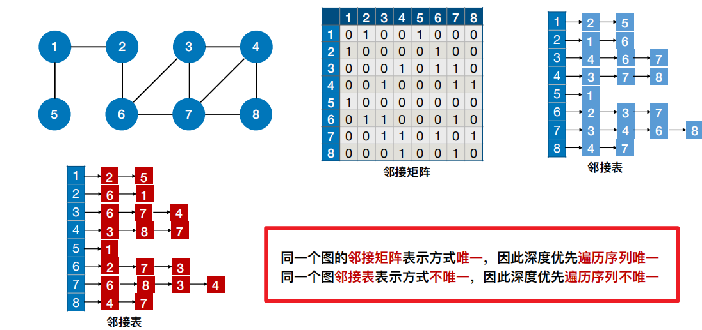

5，深度优先⽣成树
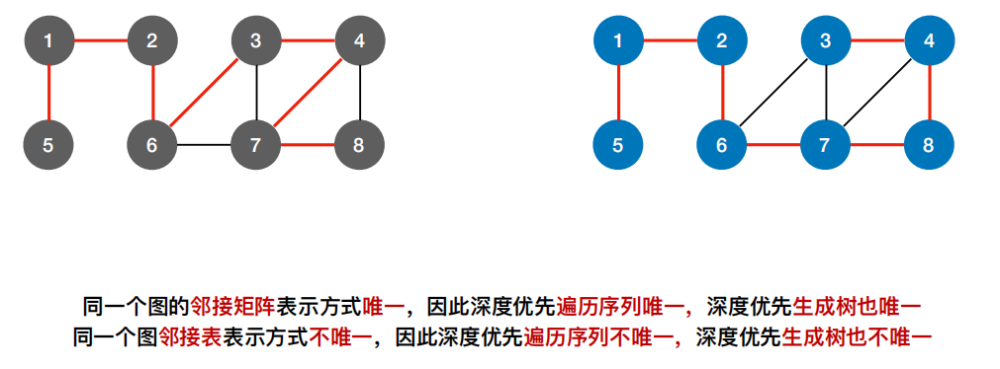

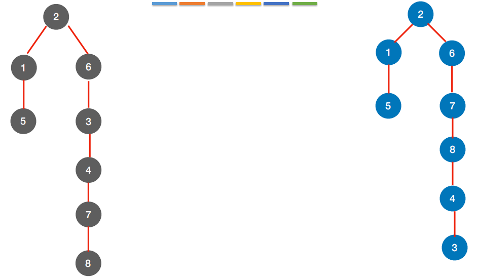

6，深度优先⽣成森林
<table>
<colgroup>
<col style="width: 54%" />
<col style="width: 45%" />
</colgroup>
<thead>
<tr class="header">
<th>
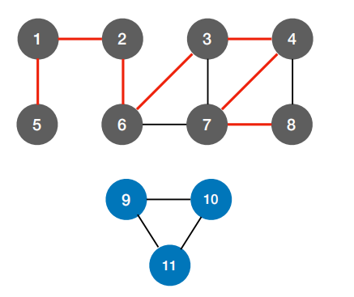

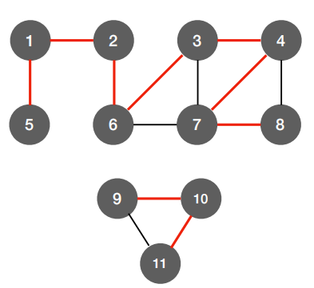

</th>
<th>
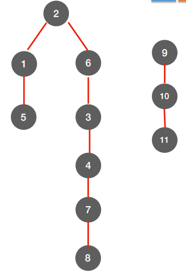

</th>
</tr>
</thead>
<tbody>
</tbody>
</table>

7，图的遍历与图的连通性

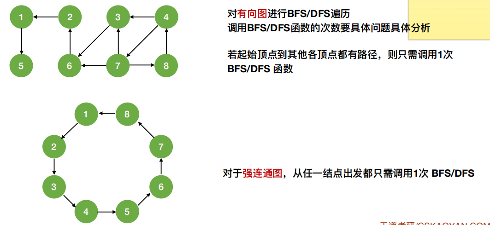

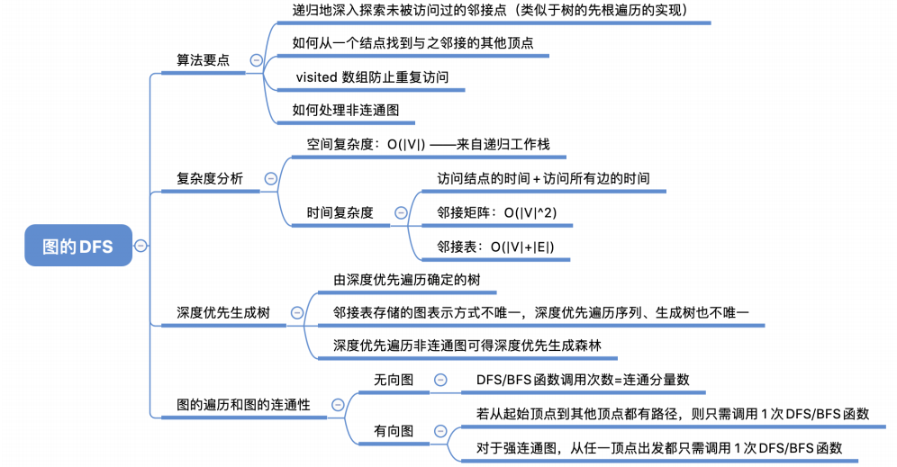

