1，树的⼴度优先遍历

树的⼴度优先遍历：
通过根节点，可以找到下⼀层的结点
2，3，4.通过234⼜可以找到再下⼀层
的结点5678

横向遍历

2，图的⼴度优先遍历

从2入手，找到相连的1,6；
1找到5,2找到6；
6找到3,7；
3找到4，7找到8

3，图VS树
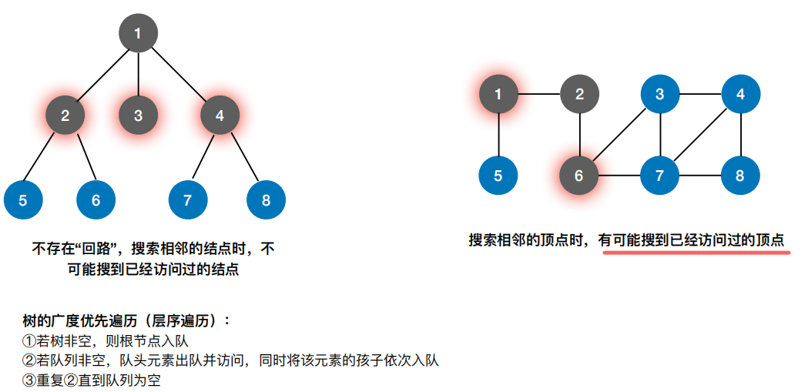

3，代码
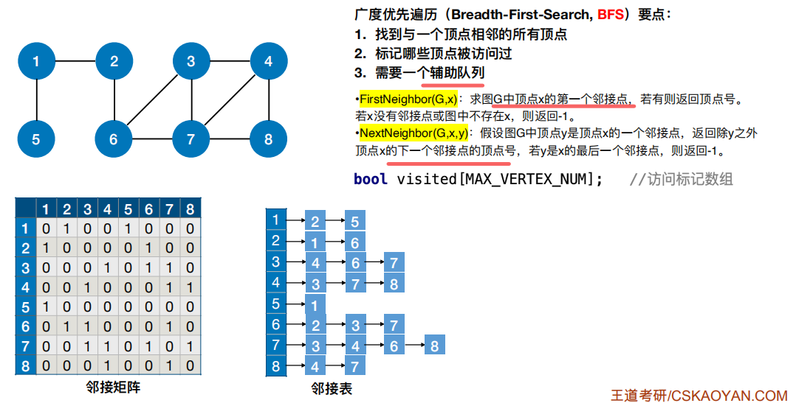
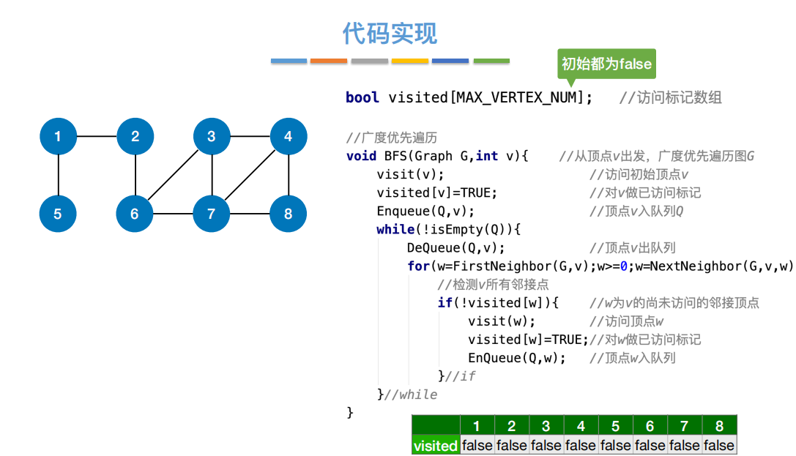
得到

【按照小到大排每一次找到的】
可变性
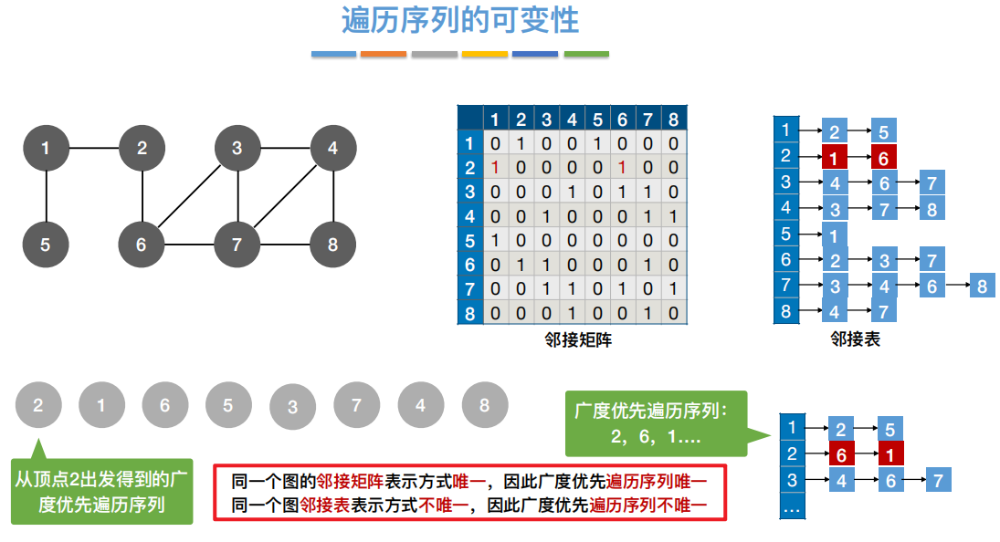
疑问

解决方法：

从false的点再bfs

完整代码
**结论：对于⽆向图，调⽤BFS函数的次数=连通分量数**
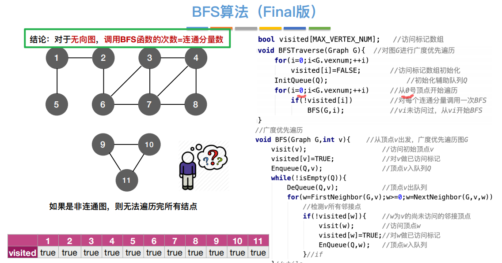

4，时间复杂度分析
4.1
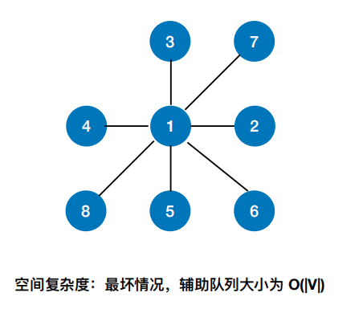
4.2
拆开分析：访问顶点+访问边
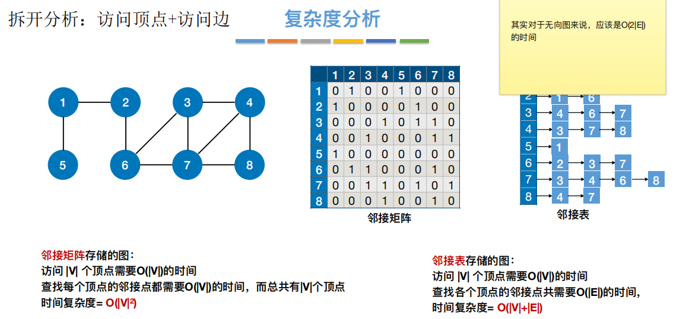

5，⼴度优先⽣成树
标红第一次访问的边，则n个顶点有n-1边
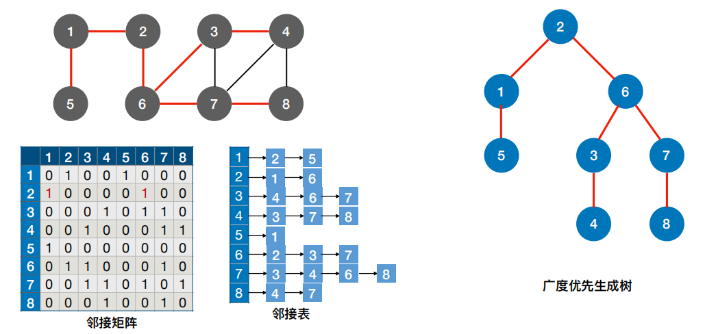

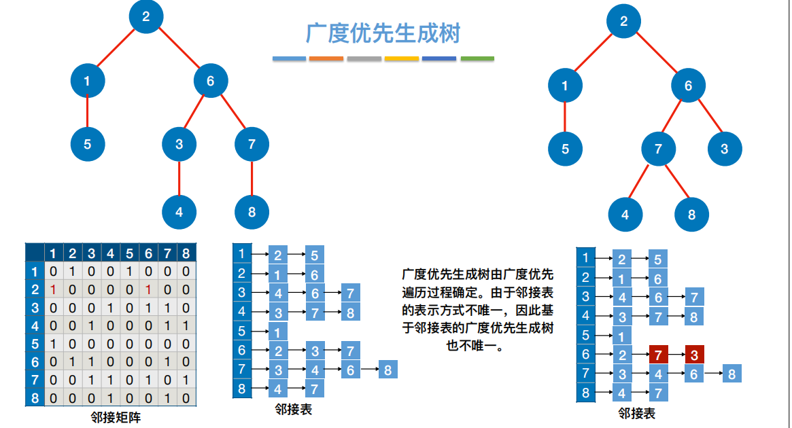
6，⼴度优先⽣成森林
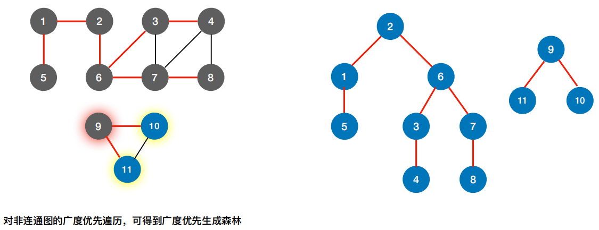
7，
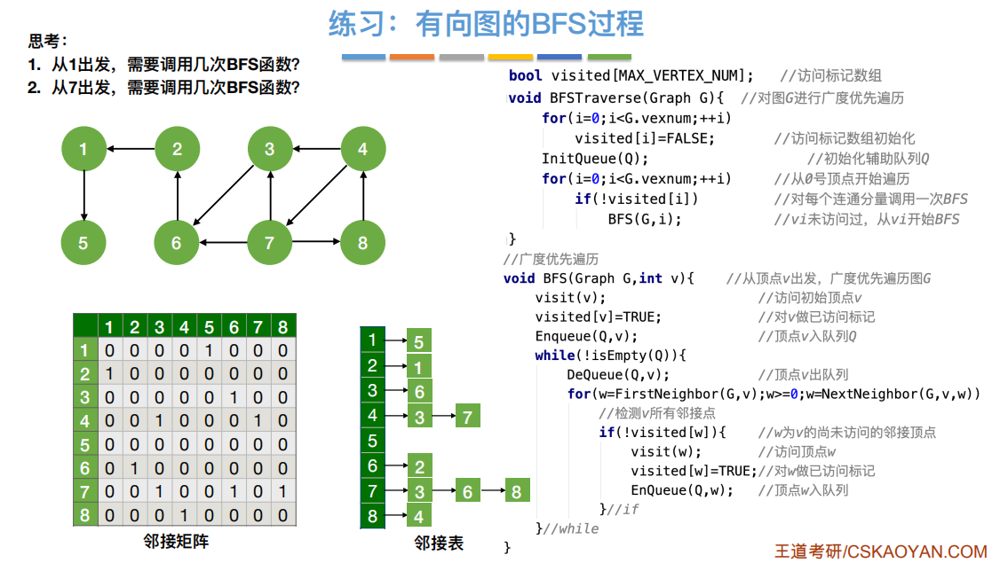

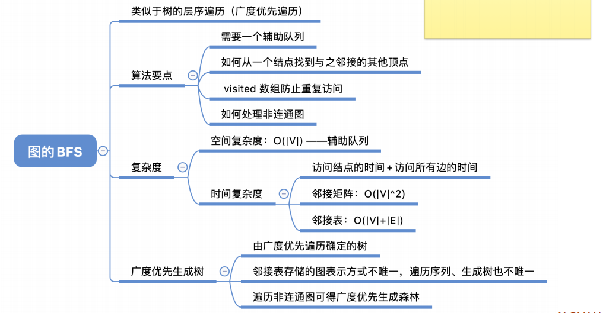

