有向⽆环图 --描述表达式

1，有向⽆环图：若⼀个**有向图中不存在环**，则称为有向⽆环图，简称DAG图（Directed Acyclic Graph）
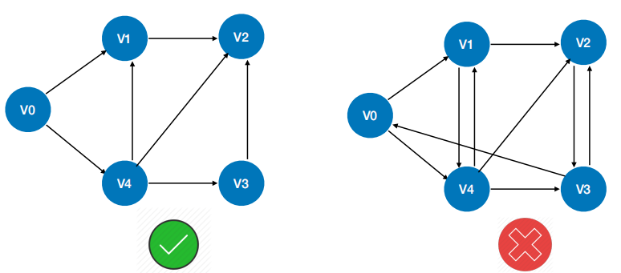
案例：DAG描述表达式
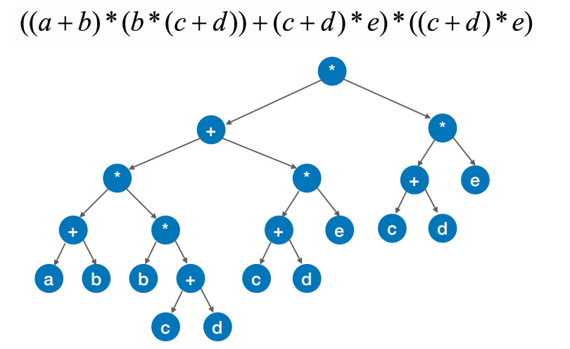

合并
<table>
<colgroup>
<col style="width: 31%" />
<col style="width: 23%" />
<col style="width: 23%" />
<col style="width: 21%" />
</colgroup>
<thead>
<tr class="header">
<th>
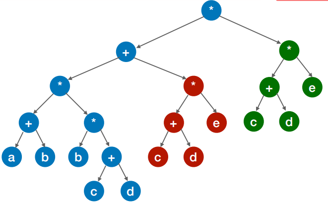

</th>
<th>
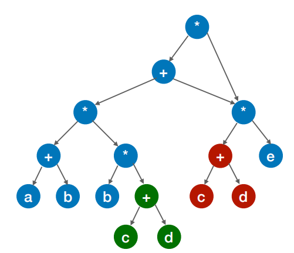

</th>
<th>
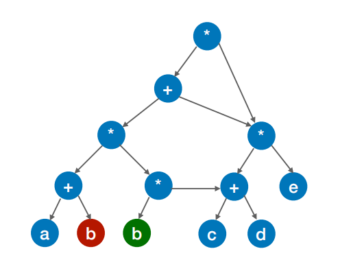

</th>
<th>
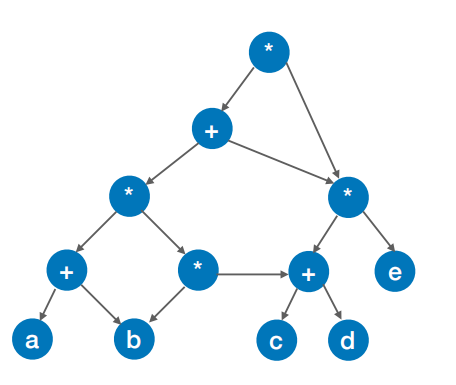

</th>
</tr>
</thead>
<tbody>
</tbody>
</table>

案例
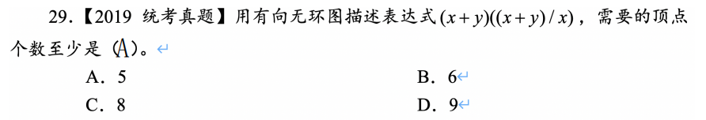
<table>
<colgroup>
<col style="width: 30%" />
<col style="width: 38%" />
<col style="width: 31%" />
</colgroup>
<thead>
<tr class="header">
<th>
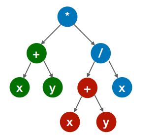

</th>
<th>
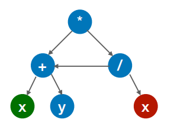

</th>
<th>
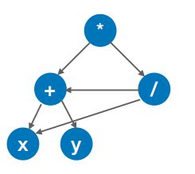

</th>
</tr>
</thead>
<tbody>
</tbody>
</table>

解题技巧：顶点中不可能出现重复的操作数
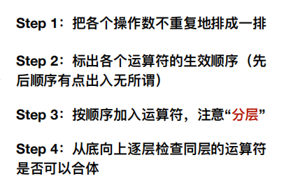

案例

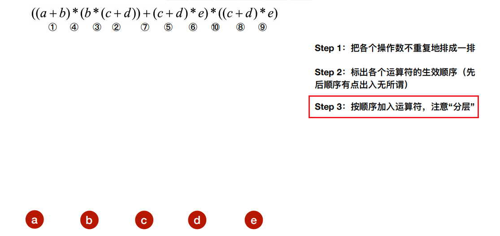

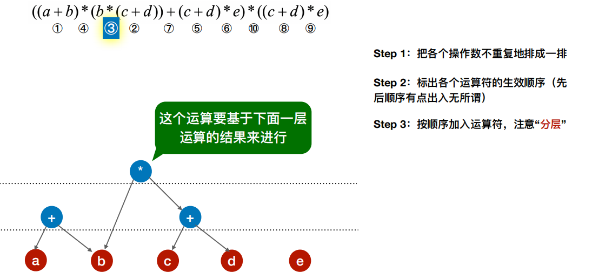

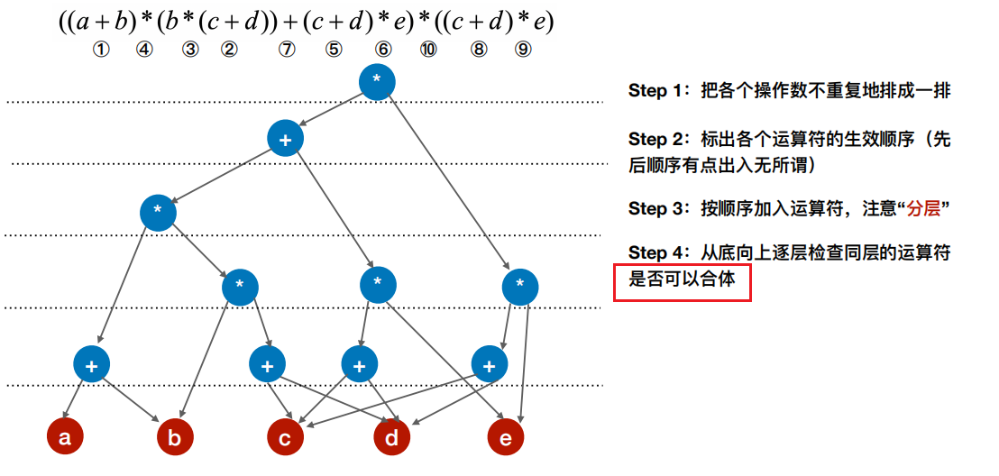

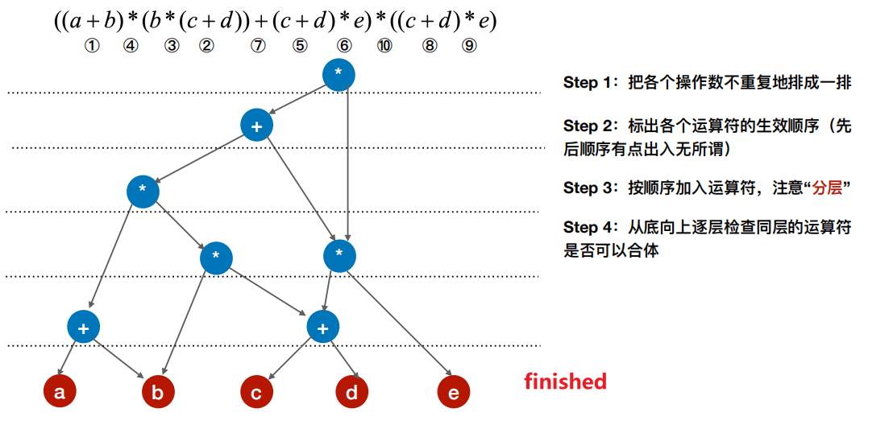

案例
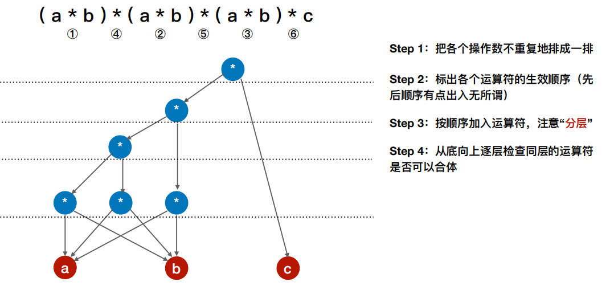

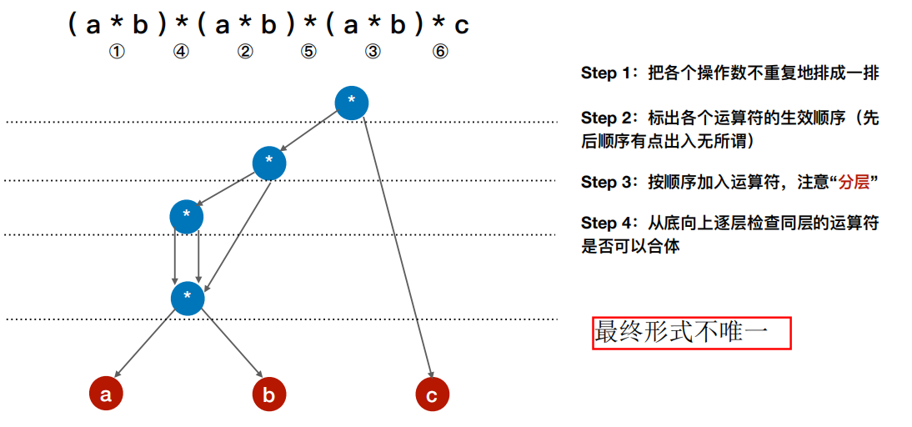

