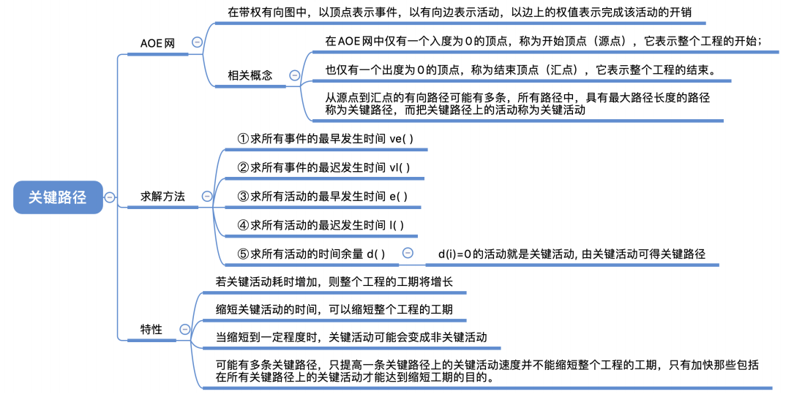
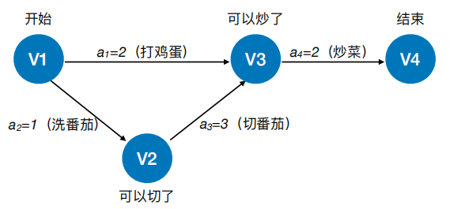
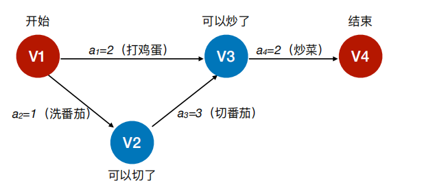
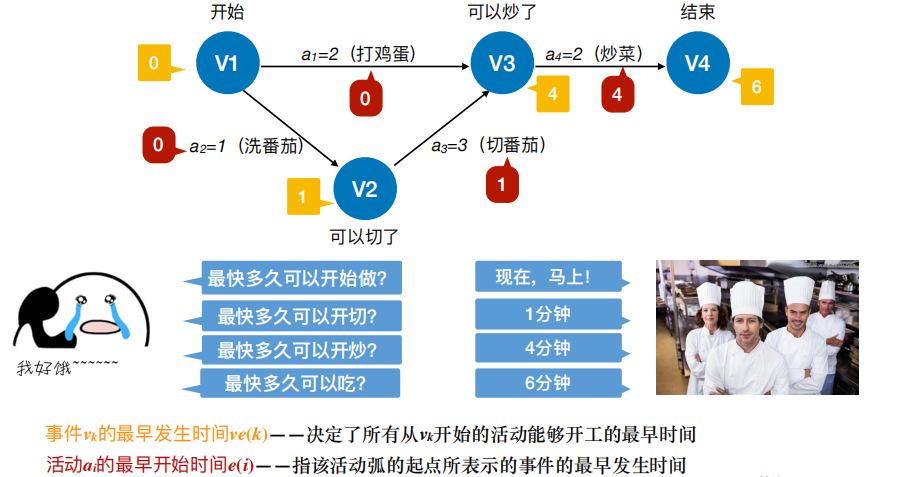
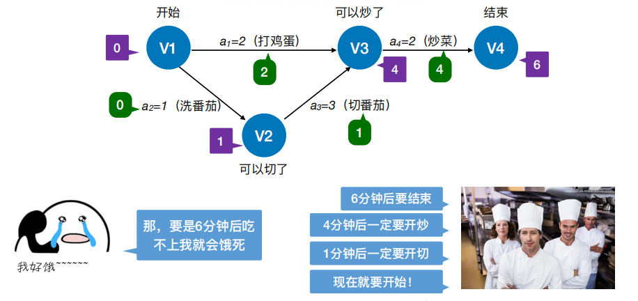

1，AOE网
在**带权有向图**中，以**顶点表示事件**，以**有向边表示活动**，以边上的权值表示完成该活动的开销（如
完成活动所需的时间），称之为⽤边表示活动的⽹络，简称AOE⽹ (Activity On Edge NetWork)

AOE⽹具有以下两个性质：
① 只有在某顶点所代表的事件发⽣后，从该**顶点出发的各有向边所代表的活动才能开始**；
② 只有在进⼊某顶点的各有向边所代表的活动都已结束时，该顶点所代表的事件才能发⽣。
另外，有些活动是可以并⾏进⾏的

2，基本概念

1）在AOE⽹中**仅有⼀个⼊度为0的顶点**，称为**开始顶点**（源点），它表示整个⼯程的开始；
也**仅有⼀个出度为0的顶点**，称为**结束顶点**（汇点），它表示整个⼯程的结束

2）
从源点到汇点的有向路径可能有多条，所有路径中，
**具有最⼤路径⻓度的路径称为关键路径**，⽽把**关键路径上的活动称为关键活动**
**完成整个⼯程的最短时间就是关键路径的⻓度，若关键活动不能按时完成，则整个**
**⼯程的完成时间就会延⻓**

**3）**
<table>
<colgroup>
<col style="width: 32%" />
<col style="width: 67%" />
</colgroup>
<thead>
<tr class="header">
<th><strong>事件vk的最早发⽣时间ve(k)</strong></th>
<th><strong>决定了所有从vk开始的活动能够开⼯的最早时间</strong></th>
</tr>
</thead>
<tbody>
<tr class="odd">
<td><strong>活动ai的最早开始时间e(i)</strong></td>
<td><strong>指该活动弧的起点所表⽰的事件的最早发⽣时间</strong></td>
</tr>
<tr class="even">
<td><strong>事件vk的最迟发⽣时间vl(k)</strong></td>
<td><strong>它是指在不推迟整个⼯程完成的前提下，该事件最迟必须发⽣的时间。</strong></td>
</tr>
<tr class="odd">
<td><strong>活动ai的最迟开始时间l(i)</strong></td>
<td><strong>它是指该活动弧的终点所表示事件的最迟发⽣时间与该活动所需时间之差。</strong></td>
</tr>
<tr class="even">
<td><strong>活动ai的时间余量d(i)=l(i)-e(i)</strong></td>
<td>
<strong>表⽰在不增加完成整个⼯程所需总时间的情况下，活动ai可以拖延的时间</strong>

<strong>若⼀个活动的时间余量为零，则说明该活动必须要如期完成，</strong>

<strong>d(i)=0即l(i) = e(i)的活动ai是关键活动</strong>

<strong>由关键活动组成的路径就是关键路径</strong>
</td>
</tr>
</tbody>
</table>

**关键活动、关键路径的特性**

**若关键活动耗时增加，则整个⼯程的⼯期将增⻓**
**缩短关键活动的时间，可以缩短整个⼯程的⼯期**
**当缩短到⼀定程度时，关键活动可能会变成⾮关键活动**

**可能有多条关键路径，只提⾼⼀条关键路径上的关键活动速度并不能缩短整个⼯程的⼯**
**期，只有加快那些包括在所有关键路径上的关键活动才能达到缩短⼯期的⽬的。**
