利用集合中项目相互存储位置的信息来对搜索算法进行改进
探索如何在时间复杂度为O(1)的情况下搜索--》hashing.可以做到

回顾
| \(a\) This Data Structure is an ordered array   | O(lgn) |
|-------------------------------------------------|--------|
| \(b\) This Data Structure is an unordered array | O(n2)  |
| \(c\) This Data Structure is a linked list      | O(n)   |

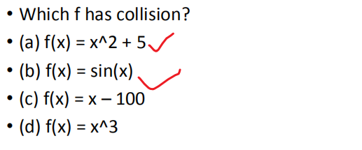

## 一、基本概念
1，Hash function
Hash function is a function that maps key into value (array index)
时间复杂度O(1)
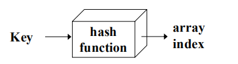

2，Hash Table
哈希表是一组item的集合，这些item以一种==便于以后查找的方式存储。==
哈希表的每个位置，通常称为slot，可以保存一个item，并由从0开始的整数值命名
案例
例如，我们将有一个名为0的槽、一个名为1的槽、一个名为2的槽，等等。
Initially, the hash table contains an entry - 1 so every slot is -1.
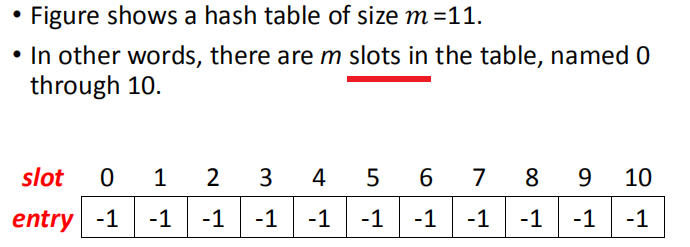

3，Hash
1）定义： 哈希是一种用于从一组相似对象中唯一标识特定对象的技术。

假设您有一个对象，并且您希望为它分配一个键，以使搜索更容易。要存储键/值对，可以使用简单数组，如数据结构，例如，其中键（整数）可以直接用作索引存储值。但是，如果键较大且不能直接用作索引，则应该使用哈希
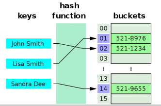

2）在哈希过程中，通过使用hash functions将大键转换为小键。
然后，将这些值存储在一个称为hash table的数据结构中。

3）实现过程-2步
1.通过使用哈希函数将元素转换为整数。此元素可以用作索引来存储原始元素，该元素位于哈希表中

2.元素存储在哈希表中，可以使用哈希键快速检索

案例
在此方法中，散列与数组大小无关，然后通过使用模运算符（%）将其缩减为索引（介于0和array_size−1之间的数字）。
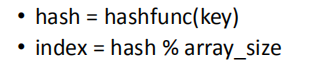

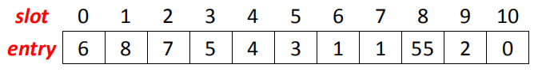
## 
## 二、Hash function
1，取余法remainder method
定义：简单地取一个项并将其除以表大小，返回余数作为其哈希值
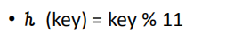

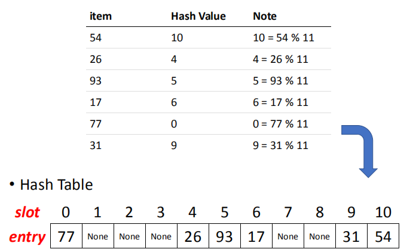

2，load factor
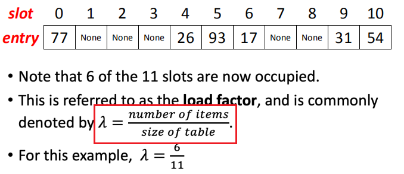

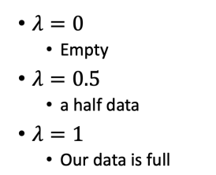
3，collision/clash
当每个项映射到哈希表中的唯一位置时，此技术才会工作

但是，会可能发生冲突，要解决冲突
不管哈希函数有多好，碰撞都必然会发生。因此，为了保持哈希表的性能，通过各种碰撞解决技术来管理碰撞是很重要的
4，一个良好的散列表需要
<table>
<colgroup>
<col style="width: 75%" />
<col style="width: 24%" />
</colgroup>
<thead>
<tr class="header">
<th>
• Easy to compute

• Uniform distribution

• Less collisions
</th>
<th></th>
</tr>
</thead>
<tbody>
</tbody>
</table>

## 三、设计好的散列函数案例--》No collisions
1，案例
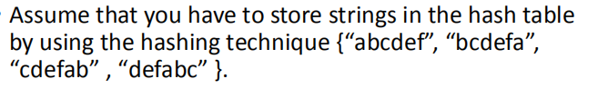
让我们尝试一个不同的哈希函数。特定字符串的索引将等于字符的ASCII值乘以字符串中各自的顺序，之后模为2069（素数）。
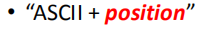
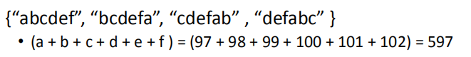

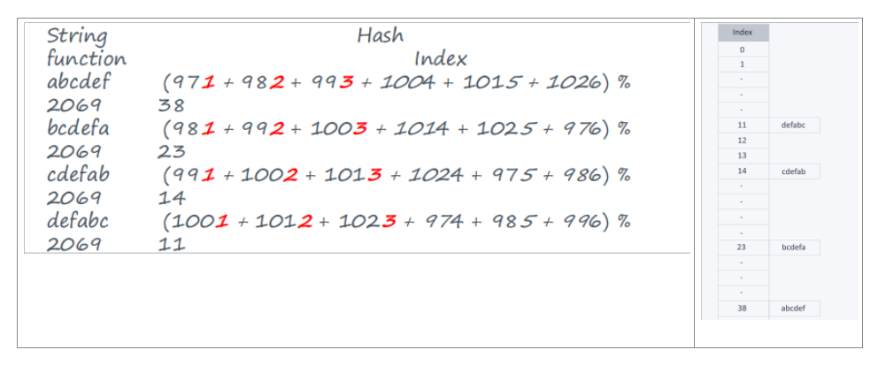

## 四、Some Hash fucntions
<table>
<colgroup>
<col style="width: 100%" />
</colgroup>
<thead>
<tr class="header">
<th>
• <strong>Division (</strong>remainder method ): h(key) = key % D

• <strong>Mid-square</strong> : square + choose some mid digits

• <strong>Folding addition</strong> :

• <strong>Shift</strong>

• <strong>Boundary</strong>

• <strong>Digit analysis</strong> :
</th>
</tr>
</thead>
<tbody>
</tbody>
</table>

### • Division (remainder method ):
h(key) = key % D
取余法：上面说过了
补充
<table>
<colgroup>
<col style="width: 100%" />
</colgroup>
<thead>
<tr class="header">
<th>
<strong>2，除留取余法</strong>

方法：<strong>Hash(key)=key%p</strong>

假定散列表<strong>表长为m</strong>，取一个<strong>不大于m但最接近或对于m的质数p</strong>

重点：选好p是关键，可以减少冲突的可能

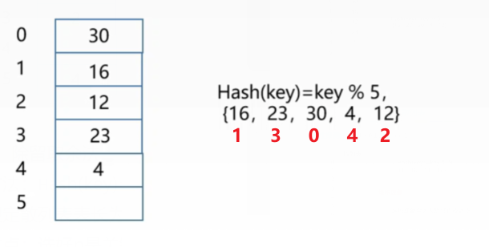

</th>
</tr>
</thead>
<tbody>
</tbody>
</table>
### • Mid-square :
square + choose some mid digits

步骤1。取种子值，它为平方。
步骤2.从中间提取一些数字作为新种子。
第3步。此过程（步骤1和2）重复次数尽可能关键。

请注意。如果采用了足够大的种子值，这种技术可以产生具有高随机性的密钥
补充
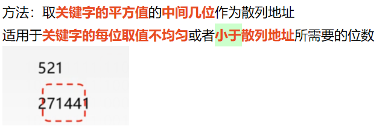
案例
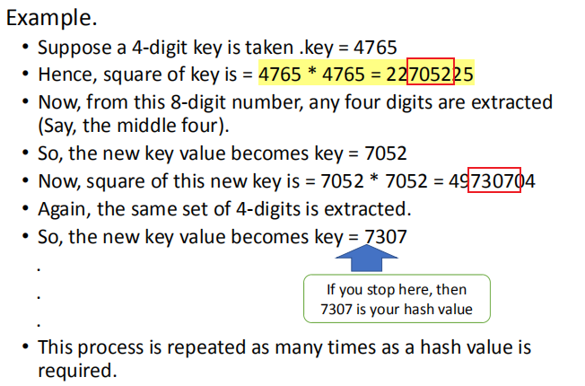

此过程重复需要哈希值的次数。

• Folding addition :
• Shift

• Boundary
• Digit analysis

## 五、Collision resolution techniques
<table>
<colgroup>
<col style="width: 100%" />
</colgroup>
<thead>
<tr class="header">
<th>
• Separate chaining (open hashing)

• linear probing

• quadratic probing

• double hashing
</th>
</tr>
</thead>
<tbody>
</tbody>
</table>

### • Separate chaining (open hashing)
1，定义
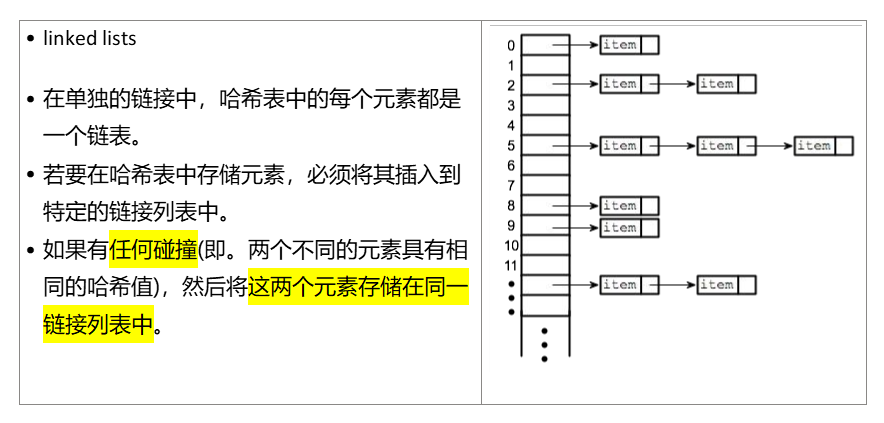
2，案例
Let us consider a simple hash function as “key mod 7” and sequence of keys
as 50, 700, 76, 85, 92, 73, 101.
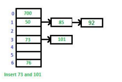
3，优缺点
• Advantages:
<table>
<colgroup>
<col style="width: 100%" />
</colgroup>
<thead>
<tr class="header">
<th>
•1)易于实现。

•2)哈希表永远不会填满，我们总是可以添加更多的元素到链。

•3)对散列函数或负载因子不太敏感。

•4)它主要用于不知道插入或删除键的次数和频率的情况。
</th>
</tr>
</thead>
<tbody>
</tbody>
</table>

• Disadvantages:
<table>
<colgroup>
<col style="width: 100%" />
</colgroup>
<thead>
<tr class="header">
<th>
•1)链式缓存的性能不是很好，因为键是用链表存储的。

开放寻址提供更好的缓存性能，因为所有内容都存储在同一个表中。

•2)空间的浪费(哈希表的一些部分从不使用)

•3)如果链变长，那么在最坏情况下搜索时间可以变成O(n)。

•4)为链接使用额外的空间。
</th>
</tr>
</thead>
<tbody>
</tbody>
</table>

### • linear probing 
1，定义
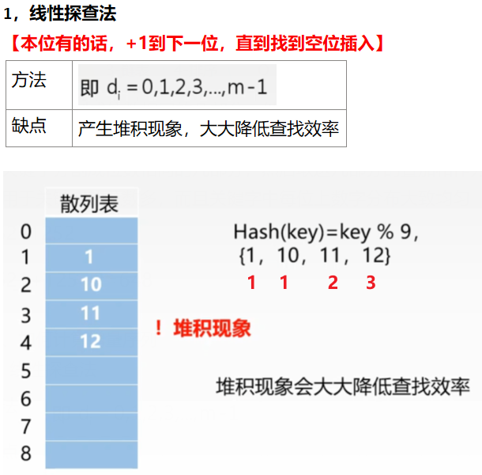

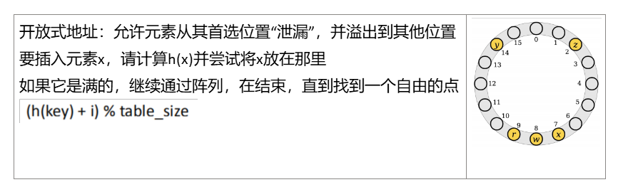

删除比链式哈希删除要棘手一些。

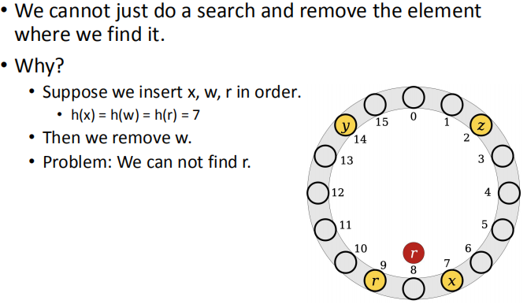

删除通常是使用墓碑来实现的
删除元素时，标记单元格为空，并且已被占用
在进行查找时，不要停在墓碑前。Instead, keep the search going

当插入时，请随时替换您遇到的任何墓碑

2，优缺点
优点
•低内存开销:只需要一个数组和一个哈希函数。
•优秀的局部性:当冲突发生时，我们只搜索数组中相邻的位置。
•出色的缓存性能:以上两个因素的结合

•缺点:
•线性探测在负载因子高时表现出严重的性能退化。
•碰撞的数量会随着现有碰撞数量的增加而增加。
•这被称为主集群

### • quadratic probing 
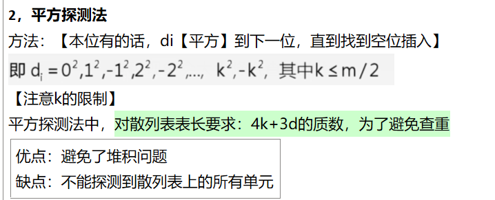

• similar to Linear probing
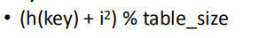

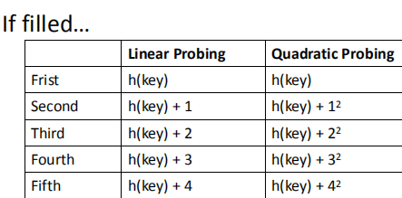
案例
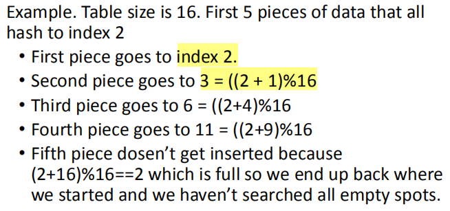
第五个项目无法插入，因为（2+16）%16==2已满，所以我们最终回到开始的地方，而且我们没有搜索所有空白点。

注意为了保证二次探测器最终会击中每个可用的点，您的表大小必须满足一个素数

### • double hashing
1，Double Hashing is 其原理与线性和二次探测类似
这里的区别是，不是选择下一个开口，而是使用第二个哈希函数来确定下一个地点的位置。
2，方法
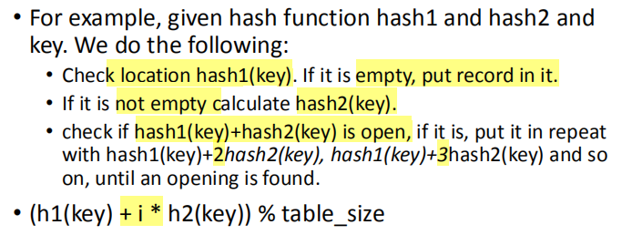
三个方法对比
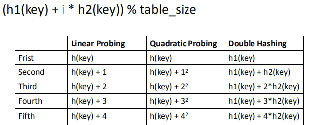

### Rehashing
•像数组列表一样，我们必须猜测需要插入到哈希表中的元素数量
•无论我们的冲突策略是什么，当加载因子过高时，哈希表变得低效。

• To alleviate load, rehash:
• create larger table, scan current table, insert items into new table using new hash function
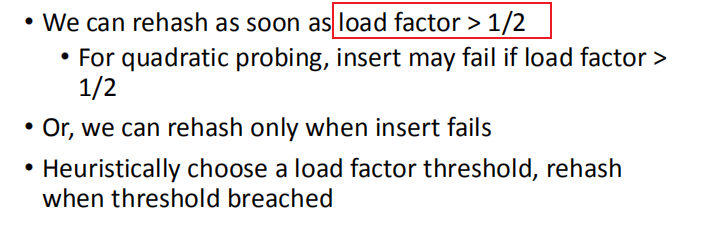
案例
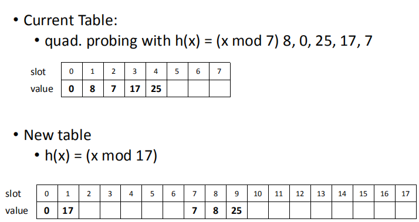

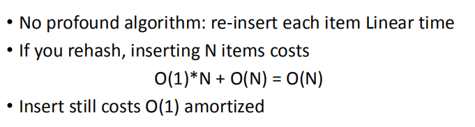

