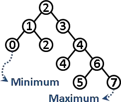
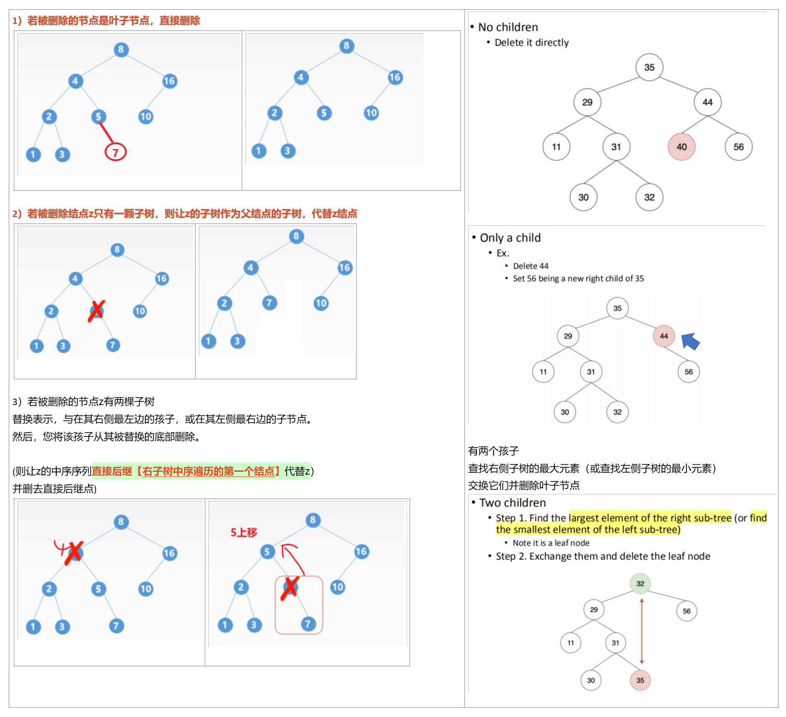

12-Binary Search Tree
2021年6月5日
9:59

## 一、认识二叉树

1，二叉树和二叉搜索树
二叉树是一种递归数据结构，其中每个节点最多可以有两个子级。
==binary search tree：节点的值≥左子节点，节点的值≤右子节点，左小右大==

案例

2，Binary Search Tree
| 最大的值 | 最右边的节点 |
|----------|--------------|
| 最小的值 | 最左边的节点 |

3，搜索的时间复杂度

## 二、增删操作

准备
a.排列

b.节点

c.创建树并加入root【add the starting node of our tree】

### 1，Inserting Elements 
A.步骤
1），我们必须找到要添加新节点的位置，以保持树的排序
2），插入规则
如果新节点的值==低于当前节点的值==，则转到==左子节点==
如果新节点的值==大于当前节点的值==，则将转==到右子节点==
==当前节点为空时==，我们已到达一个叶节点，我们可以在该位置插入新节点

B.代码
案例：请自己画一遍

案例

### 2，Finding an Element 
A.步骤
在这里，我们通过将其==与当前节点中的值进行比较==，如果小于当前值，向左子树搜索，如果大于当前值，向其右子树搜索
B.代码

### 3，Deleting an Element 
步骤
先找到它,再删除它,再调整它
注意
一旦找到要删除的节点，主要有3种不同的情况：
<table>
<colgroup>
<col style="width: 100%" />
</colgroup>
<thead>
<tr class="header">
<th>
1. 节点没有子节点，这是最简单的情况；我们只需要用空的父节点替换该节点

2. 节点正好有一个子节点—在父节点中，我们用其唯一的子节点替换该节点。

3. 一个节点有两个子节点——这是最复杂的情况，因为它需要重组树
</th>
</tr>
</thead>
<tbody>
</tbody>
</table>

4，implementation的时间复杂度

三、遍历操作
• Tree Traversal
前序遍历是：==根==、左、右

中序遍历是：左、==根==、右

后序遍历是：左、右、==根==

==• In-order Traversal 当前节点中间==
步骤
步骤1−递归遍历左子树。
步骤2−访问根节点。
步骤3−递归遍历右子树。

案例

代码

==• Pre-order Traversal 当前节点先==
步骤1−访问根节点。
步骤2−递归遍历左子树。
步骤3−递归遍历右子树。

案例

代码

==• Post-order Traversal当前节点最后==
• Note. Data structure: stack
步骤
步骤1−递归遍历左子树。
步骤2−递归遍历右子树。
步骤3：−访问根节点。

案例

代码

==Level-Order Traversal==
1，uses a queue to keep track of nodes to visit
级别顺序遍历使用队列来跟踪要访问的节点。访问节点后，其子节点将被放入队列中。要历一个新节点，我们从队列中取出元素。
,2，算法步骤

案例

代码

