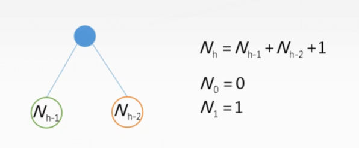

为了解决：我们观察到，BST的最坏情况下的性能最接近线性搜索算法，即Ο(n)的问题而产生AVL

## 一、AVL Tree 
1，Balanced Binary Tree
具有n个节点的二元搜索树的缺点是，它的高度可以高达n-1。

2，AVL
1）概念
平衡二叉树AVL=平衡二叉树+（平衡因子\<=1）
**AVL树是带有==平衡条件==的==二叉查找树==**
特点：**任意结点的平衡因子的绝对值不超过1**
<u>平衡因子=左子树高度-右子树高度</u>
<u>BF =height(left subtree) – height(right subtree)</u>

案例

案例

目的

利弊
<table>
<colgroup>
<col style="width: 100%" />
</colgroup>
<thead>
<tr class="header">
<th>
• Pros and Cons of AVL Trees

1. 搜索，插入和删除是O(log n)。

2. 高度平衡增加不超过一个恒定因素的插入速度。

1. Search, insertion and deletions are O(log n).

2. The height balancing adds no more than a constant factor to the speed of insertion.

• Arguments against using AVL trees:

1. 难以编程和调试;

需要更多的空间来平衡因子。

2. 渐近更快，但再平衡需要时间。

3.大多数大型搜索是在磁盘上的数据库系统中完成的，并使用其他结构(例如b -树)。

4. 如果多个连续操作的总运行时间很快(例如展开树)，那么单个操作的运行时间为O(N)是可以的。

1. Difficult to program and debug; need more space for balance factor.

2. Asymptotically faster but rebalancing costs time.

3. Most large searches are done in database systems on disk and useother structures (e.g. B-trees).

4. May be OK to have O(N) for a single operation if total run time for many consecutive operations is fast (e.g. Splay trees).
</th>
</tr>
</thead>
<tbody>
</tbody>
</table>

## 二、Rotation 
插入node
如果==左右子树的高度差大于1==，则使用一些==旋转技术对树进行平衡==。
为了平衡自身，AVL树可以执行以下四种旋转−

### 1，Left rotation
**LL平衡旋转（右单旋转）**
原因：在结点A的**左孩子的左子树**上插入新结点
调整方法：右旋操作：将A的左孩子B代替A，将A结点称为B的右子树的根节点，而B的原右子树作为A的左子树【把B拎起来，A下去，B的右子树称为A的左子树】

案例

### 2， Right rotation 
**RR平衡旋转（左单旋转）**
原因：在结点A的右孩子的右子树上插入了新结点
调整方法：左旋操作：将A的右孩子B代替A，将A结点称为B的左子树根节点，而B的原左子树作为A的右子树【把B拎起来，A左边放下去，把B的左子树给A的右子树】

如何定位A,B?
A就是==距离插入点最近==，且==平衡因子不平衡==的那个点

案例

不，要LR选择

### 3，Left-Right rotation 
**LR平衡旋转（先左后右双旋转）【先对B左旋，C领上来，再对C右旋】**
原因：在结点A的左孩子的右子树上插入新的节点
调整方法：先左旋转在右旋转：将A的左孩子B的右孩子C代替B，再将C向上代替A

案例

### 4，Right-Left rotation
**RL平衡旋转（先右后左双旋转）**
原因：在结点A的右孩子的左子树上插入了新结点【对B右旋转，把C提上来，再对C左旋转，把C上来】
调整方法：先右旋转再左旋转，将A的右孩子B的左孩子结点C代替B，再将C结点上调至A的位置

## 三、在操作时，调整平衡因子
### 1，插入
• Insert
新节点总是作为叶节点插入，平衡因子等于0。

插入步骤
1，转到相应的叶节点，以使用以下递归步骤插入新节点。比较当前树的newKey和当前树的rootKey。
1）如果newKey\<rootKey，在当前节点左子树上调用插入算法，直到到达叶节点。
2）否则，如果是newKey\>根键，则在当前节点的右子树上调用插
入算法，直到到达叶节点。
3）Else, return leafNode
4）更新平衡因子，做调整

### 2，删除
• Delete
==先按照BST要求删除节点，在调整平衡因子==
一个节点始终作为一个叶节点被删除。删除节点后，节点的平衡系数会发生更改。为了重新平衡平衡因子，我们进行了适当的旋转。

三种情况
1，如果没有删除是叶节点。没有任何子级)，然后删除未删除。
2，如果未删除有一个子项，则将未删除的内容替换为子项的内容。删除该子项。
3，如果没有被删除的人有两个子级，请找到没有被删除的人的顺序继承者w。在右侧子树中具有最小键值的节点）。
用未删除的内容替换为w的内容。

删除叶子节点w

4，更新节点的平衡系数。

5，

• Max and Min
1，最小--》最左边

• Complexities of Different Operations【重点】

## 四、计算高度和点数

一个高度为h的AVL
| 最少放 |     |
|--------|-------------------------------------------------------------------------------------------------------------------------|
| 最多放 |  |
补充斐波那契数列

案例

<table>
<colgroup>
<col style="width: 17%" />
<col style="width: 82%" />
</colgroup>
<thead>
<tr class="header">
<th>最少放</th>
<th>
F5-1=5-1=4

</th>
</tr>
</thead>
<tbody>
<tr class="odd">
<td>最多放</td>
<td></td>
</tr>
</tbody>
</table>

案例
| 高度是4的avl数，有可能放50个点吗                                                                                        |
|-------------------------------------------------------------------------------------------------------------------------|
|  |

补充：
高度为h的最小平衡二叉树的结点数Nh (最小--》结点最少)

分析过程
- 为什么左子树Nh-1?---\>保证树的高度为h
- 右子树分析

