• Red Black Tree
• Search
• Insertion and Deletion
• Recoloring and Rotation

• Insertion • Deletion

## 一、Red Black Tree 
1，
大多数BST操作（例如，搜索、最大、最小、插入、删除等）将花费O(h)时间，其中h为BST的高度
如果我们确保在每次插入和删除后，树的高度都保持O(logn)，那么我们可以保证所有这些操作的O(logn)的上限。
==红黑树的高度始终为O(logn)，其中n是树中的节点数。==
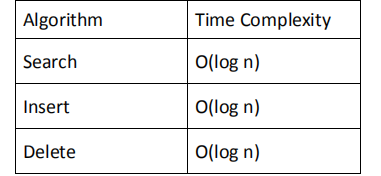

2，
红黑树是一种自平衡的二叉搜索树，其中每个节点都有一个额外的位，而这个位通常被解释为颜色（红色或黑色）。
这些颜色用于确保树在插入和删除期间保持平衡。
虽然树的平衡并不完美，但要减少搜索时间并在o(logn)时间左右保持它已经足够好了，其中n是树中元素的总数。

必须注意，由于每个节点只需要1位空间来存储颜色信息，因此这些类型的树显示与经典（未彩色）二元搜索树相同的内存足迹

3，
一种自平衡二叉查找树【**黑色自平衡**】，处理满足二叉查找树的特点，还满足
<table>
<colgroup>
<col style="width: 100%" />
</colgroup>
<thead>
<tr class="header">
<th>
1.节点是红色或黑色。

2.<strong>根节点是黑色</strong>。

3.<strong>每个叶子节点都是黑色的空节点（NIL节点）</strong>。

4 <strong>每个红色</strong>节点的<strong>两个子</strong>节点都是<strong>黑</strong>色。(从每个叶子到根的所有路径上<strong>不能有两个连续的红</strong>色节点)

5.从任一节点到其每个叶子的所有路径都包含<strong>相同数目的黑</strong>色节点。
</th>
</tr>
</thead>
<tbody>
</tbody>
</table>

4，与AVL相比
与红黑树相比，AVL树更平衡，但它们可能会在插入和删除过程中导致更多的旋转。
因此，如果您的应用程序涉及频繁的插入和删除，那么首选是红黑树。
如果插入和删除的频率较少，而且搜索操作更频繁，那么AVL树应该首选红黑树

5，红黑的树如何确保平衡
理解平衡的一个简单例子是，红黑树中不可能有3个节点的链
我们可以尝试任何颜色的组合，看到它们都违反了红黑树的属性
A chain of 3 nodes is nodes is not possible in Red-Black Trees.

6，关于红黑树的有趣观点
<table>
<colgroup>
<col style="width: 100%" />
</colgroup>
<thead>
<tr class="header">
<th>
1.红黑的树的黑的高度

黑色高度是指从节点到叶的路径上的黑色节点的数目。叶节点也被算数为黑色节点。从上面的属性3和4，我们可以推导出，<mark>一个高度h的节点具有黑色高度的&gt;=h/2</mark>。

2.具有n个节点的红黑树的高度为<mark>h&lt;=2log2(n+1)。</mark>

3.All leaves (NIL) are black

4.节点的黑色深度被定义为从根节点到该节点的黑人节点的数量，即<mark>黑人祖先的数量</mark>。

5.是二叉树的一种特殊情况
</th>
</tr>
</thead>
<tbody>
</tbody>
</table>

1）红黑的树的黑的高度
黑色高度是指从根到叶的路径上的黑色节点数。叶节点也被算数为黑色节点。
从上述属性3和4，我们可以推导出，高度为h的红黑树有黑高度的\>=h/2。
红黑树从根到叶子的**最长路径不会超过最短路径的2倍**

2）具有n个节点的红黑树的高度为h\<=2log2(n+1)
<table>
<colgroup>
<col style="width: 100%" />
</colgroup>
<thead>
<tr class="header">
<th>
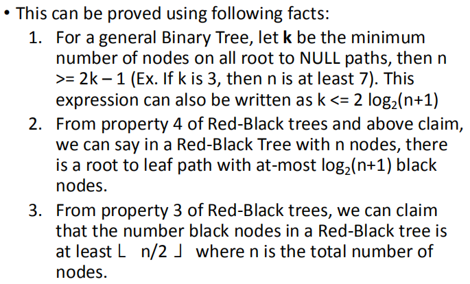

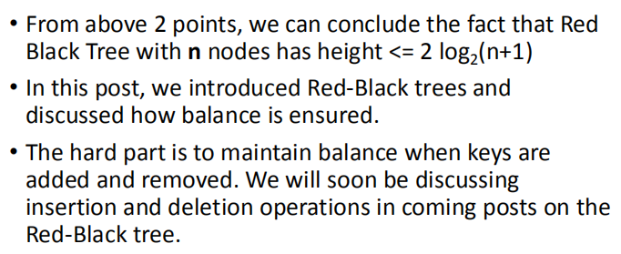
</th>
</tr>
</thead>
<tbody>
</tbody>
</table>

7，
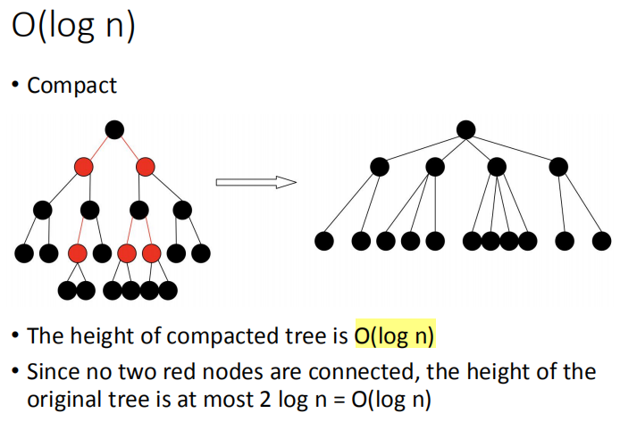

## 二、 Search 
方法
1，从root开始
2，比较插入元素与根元素，如果小于根元素，则将向左递归，否则将向右递归。
3，如果在任何地方找到要搜索的元素，则返回true，否则返回false。

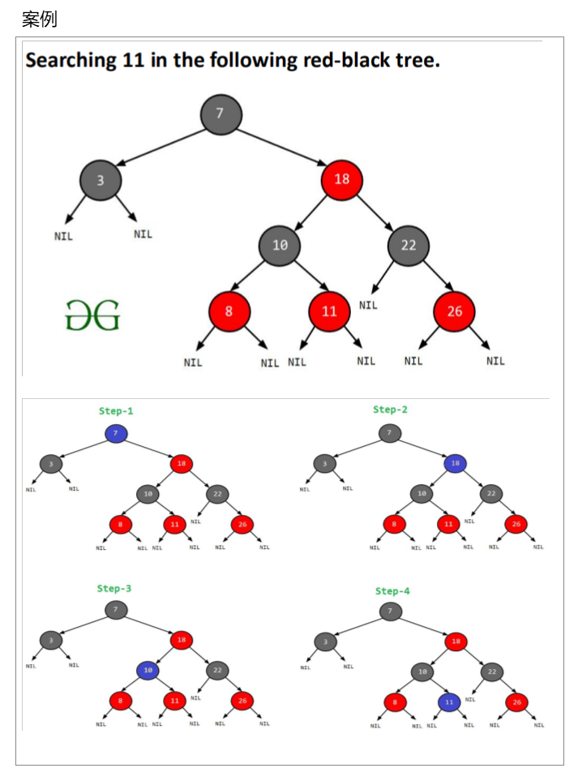

| 有可能在红黑树上有所有的黑节点吗？--可以                          |
|-------------------------------------------------------------------|
| Draw a Red-Black Tree that is not an AVL tree structure-wise?--？ |

## 三、Insertion and Deletion 

### • Recoloring and Rotation
1，Balance
在红黑树中，我们使用两种工具来进行平衡。
1）重新着色

2）旋转
重新着色是指节点颜色的变化，即。如果它是红色的，则将它更改为黑色，反之亦然。
必须注意，空节点的颜色始终为黑色。

我们==优先尝试“重新着色”，如果没有作用，再考虑旋转==

2，Recoloring重新着色
红色节点的红色父节点的同级节点为红色，重新着色
【红色的爸爸和叔叔都是红色，祖父是黑色，则祖父变黑色，爸爸和叔叔变黑色】
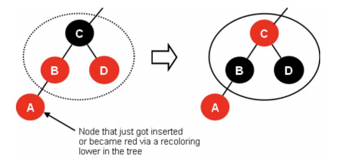

3，Rotation (Restructuring)
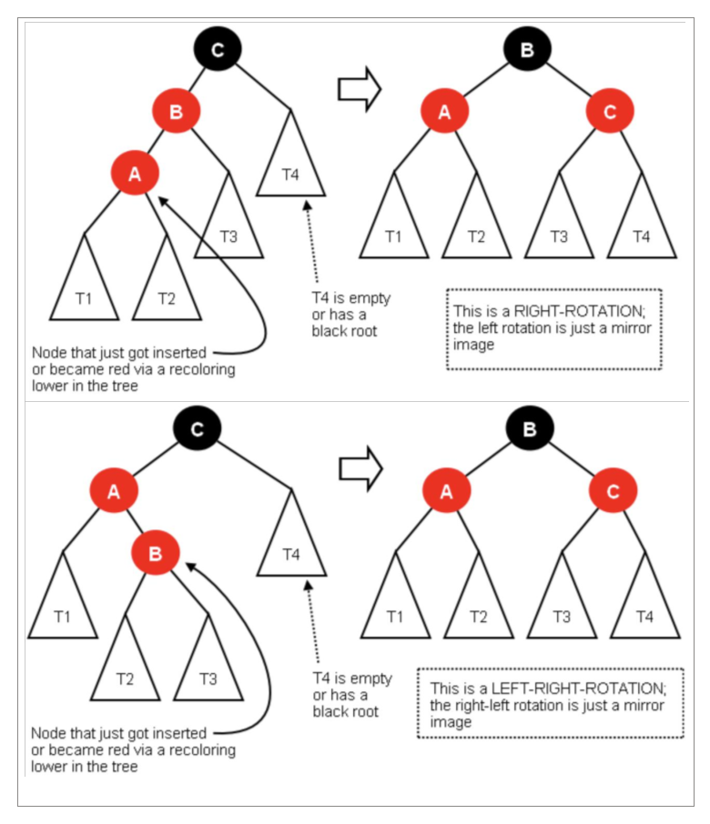
4，常见的问题
一个常见的问题及其解决方案如下
局部有，爸爸红色，祖父和叔叔是黑色，则爷爷变红，叔叔爸爸变黑，然后右旋转
<u>double black两黑</u>
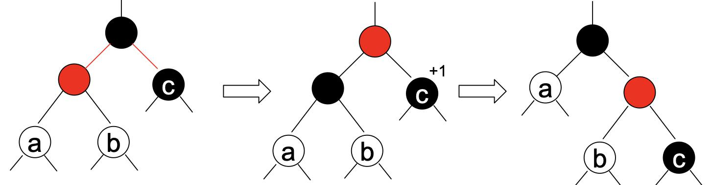

### • Insertion 
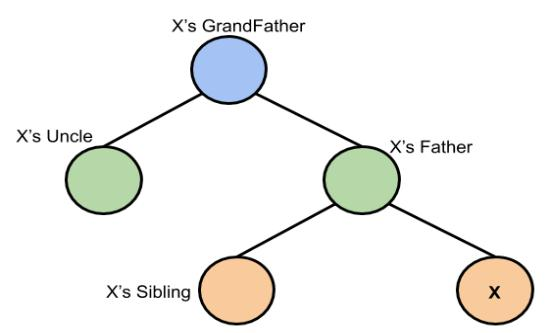

1，insert
首先，必须在二叉树中==插入节点，并为其分配红色==。

如果该节点是==一个根节点==，则将其颜色更改为==黑色==
如果不是，则检查父节点的颜色
如果==父节点为黑色==，则==不要更改颜色==

如果==父节点是红色==，则检查==叔叔节点==的颜色
- 如果==叔叔节点是红==色，  
  a.将父节点和叔节点设为黑色;
- b.将祖父节点设为红色;
- c.==将祖父节点设为当前节点==，并继续对新当前节点进行操作
如果==叔叔节点是黑色==，则有4种情况：把祖父设为A

当前节点是父亲的左孩子，父亲是祖父的左孩子（Left-Left），处理思路：a.将祖父节点右旋;b.交==换父节点和祖父节点的颜色==

当前节点是父亲的右孩子，父亲是祖父的左孩子（Right-Left），处理思路：a.将父节点左旋，并将父节点作为当前节点; b.然后再使用Left Left情形

当前节点是父亲的右孩子，父亲是祖父的右孩子（Right-Right），处理思路：a.将祖父节点左旋;b.交==换父节点和祖父节点的颜色==

当前节点是父亲的左孩子，父亲是祖父的右孩子（Left-Right），处理思路：a.将父节点右旋，并将父节点作为当前节点; b.然后再使用Right Right情形

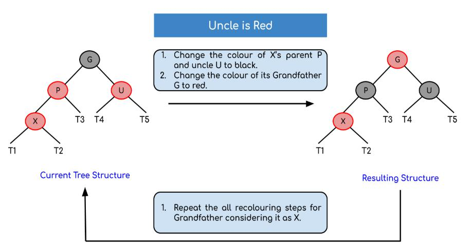

==A是祖父，交换祖父和爸爸颜色==
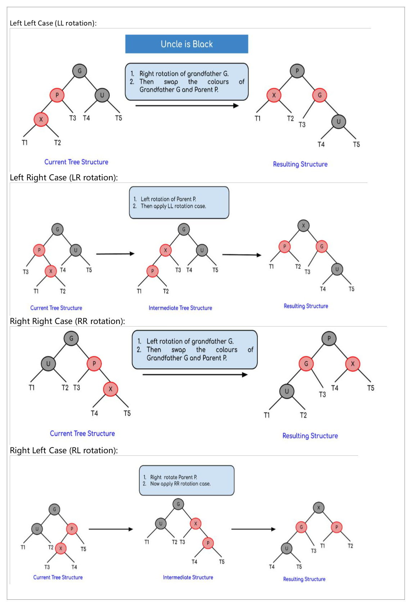
现在，在这些旋转之后，如果节点的颜色不匹配，那么就重新着色

案例
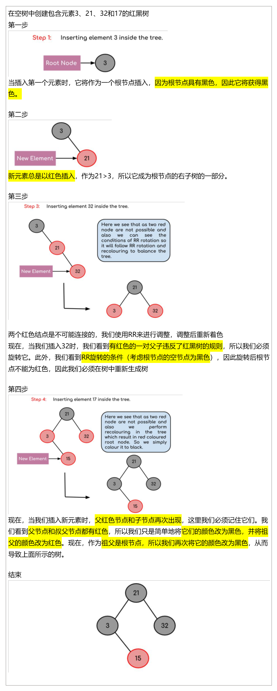
案例2
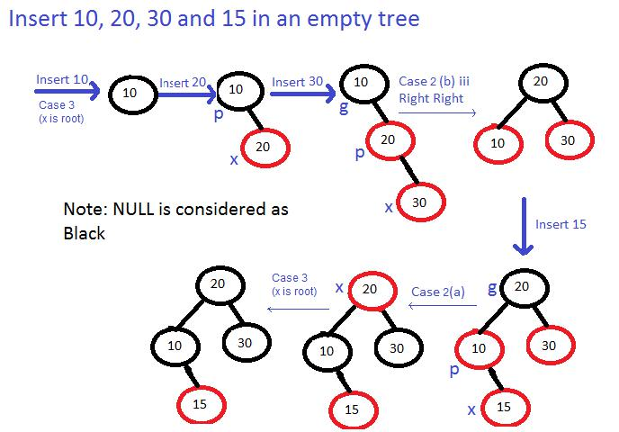

## • Deletion
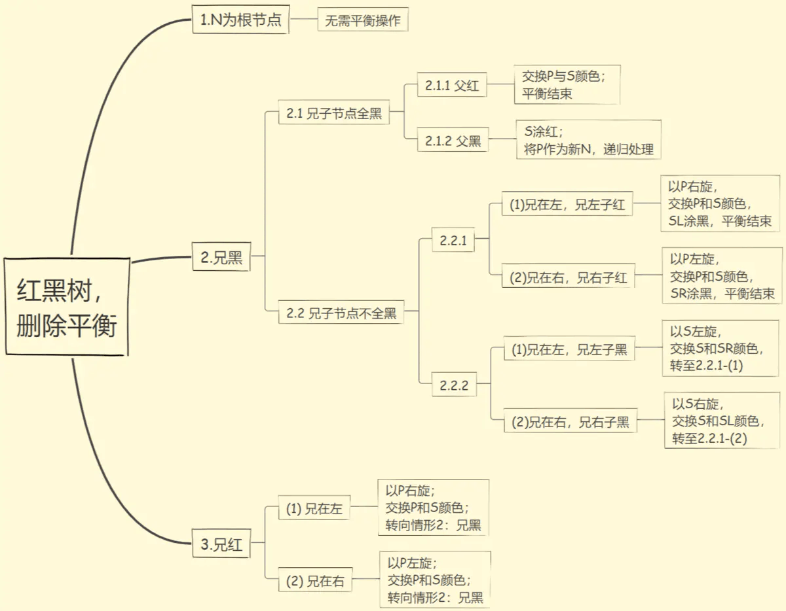
1，Insertion Vs Deletion:
像插入一样，重色和旋转被用来维护红黑的属性。
在==插入==操作中，我们检查==叔叔==的颜色，以确定适当的情况。
在==删除==操作中，我们==检查兄弟姐妹==的颜色，以决定适当的情况。

==插入==后违反的主要属性是==两个连续的红色。==
在==删除==时，主要违反的属性是，如果==删除黑色节点，可能会导致一个根到叶路径的黑色高度降低。==

2，double black
为了理解删除操作，我们使用了双黑色的概念
删除黑色节点并替换为黑色子节点时，子节点被标记为双黑色。
现在的主要任务是将这个双黑色转换为单黑色。

3，回顾BST
当我们在BST中执行标准删除操作时，我们==总是删除一个叶子或只有一个子节点==（对于内部节点，我们复制后继节点，然后递归地调用delete，后继节点总是一个叶节点或具有一个子节点的节点）
所以我们只需要处理一个节点是叶节点或有一个子节点的情况。

4，删除操作
**一、从树中删除节点X（以寻找后继节点的方式进行删除）**

情况①：如果X==没有孩子==，且如果==X是红色，直接删除X==；
如果X是黑色，则==以X为当前节点进行旋转调色，最后删掉X==

情况②：如果X只有一个孩子C，交换X和C的数值，再对新X进行删除。根据红黑树特性，此时X不可能为红色，因为红色节点要么没有孩子，要么有两个黑孩子。此时以新X为当前节点进行情况①的判断

情况③：如果X有两个孩子，则从后继中找到最小节点D，交换X和D的数值，再对新X进行删除。此时以新X为当前节点进行情况①或②的判断

**二、旋转调色（N=旋转调色的当前节点\[等于情况①中的X\]，P=N的父亲，W=N的兄弟，Nf=N的远侄子，Nn=N的近侄子）**

情况1：N是根或者N是红色，则：直接将N设为黑色

情况2：N不是根且==N是黑色，且W为红色==，则：将W设为黑色，P设为红色，对P进行旋转(N为P的**左子时进行左旋**，N为P的**右子时进行右旋**)，将情况转化为情况1、2、3、4、5

情况3：N不是根且==N是黑色，且W为黑色==，且==W的左右子均为黑色==，则：将**W设为红色**，将P设为当前节点进行旋转调色，将情况转化为情况1、2、3、4、5

情况4：N不是根且==N是黑色，且W为黑色，且Nf为黑色==，Nn为红色，则：交换W与Nn的颜色，并对W进行旋转(N为P的左子进行右旋，N为P的右子进行左旋)，旋转后N的新兄弟W有一个红色WR，则转换为情况5

情况5：N不是根且==N是黑色，且W为黑色，且Nf为红色==，Nn为==黑色==，则：将W设为P的颜色，P和Nf设为黑色，并对P进行旋转(N为P的左子进行左旋，N为P的右子进行右旋)，N设为根

**一、从树中删除节点我（以寻找后继节点的方式进行删除）**

情况①：如果我==没有孩子==，且如果==我是红色，直接删除我==；
如果我是黑色，则==以我为当前节点进行旋转调色，最后删掉我==

情况②：如果我只有一个孩子C，交换我和我的孩子C的数值，再对新我进行删除。根据红黑树特性，此时我不可能为红色，因为红色节点要么没有孩子，要么有两个黑孩子。此时以新X我为当前节点进行情况①的判断

情况③：如果我有两个孩子，则从后继中找到最小节点D，交换我X和D提神的数值，再对新X我进行删除。此时以新X为当前节点进行情况①或②的判断

**二、旋转调色（我N=旋转调色的当前节点\[等于情况①中的X\]，P=N的父亲，W=N的兄弟，Nf=N的远侄子，Nn=N的近侄子）**

情况1：我N是根或者我N是红色，则：直接将我N设为黑色

情况2：我N不是根且我==N是黑色，且兄弟W为红色==，则：将兄弟W设为黑色，爸爸P设为红色，对P进行旋转(N为P的**左子时进行左旋**，N为P的**右子时进行右旋**)，将情况转化为情况1、2、3、4、5

情况3：N不是根且==N我是黑色，且W兄弟为黑色==，且==W的左右子均为黑色==，则：将**W设为红色**，将P设为当前节点进行旋转调色，将情况转化为情况1、2、3、4、5

情况4：N不是根且==N是黑色，且W为黑色，且远侄子Nf为黑色==，Nn为红色，则：==交换W与Nn的颜色==，并对W进行旋转**(N为P的左子进行右旋，N为P的右子进行左旋)**，旋转后N的新兄弟W有一个红色WR，则转换为情况5【有卧底，反着旋转】

情况5：N不是根且==N我是黑色，且W兄弟为黑色，且Nf远侄子为红色==，Nn近侄子为==黑色==，则：将W兄弟设为P爸爸的颜色，爸爸P和远侄子Nf设为黑色，并对P爸爸进行旋转(N为P的左子进行左旋，N为P的右子进行右旋)，N设为根

