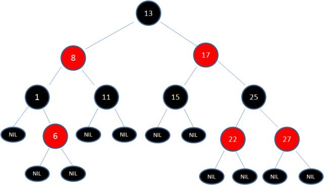
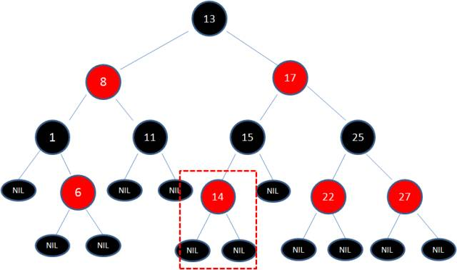
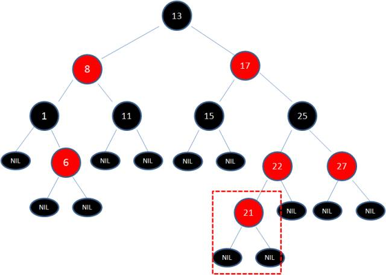
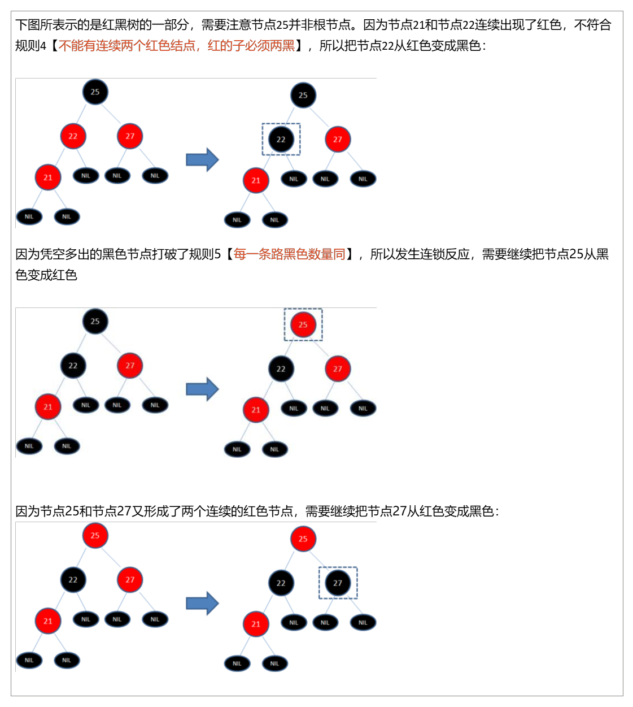
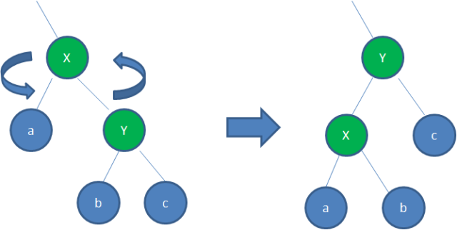
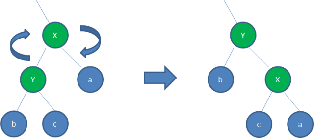

14-红黑树补充
2021年6月8日
9:02

## 一，为什么有红黑树
二叉查找树（BST）具备什么特性呢？

## 为了解决BST多次插入新节点导致的不平衡，产生红黑树

二、红黑树
1，一种自平衡二叉查找树【**黑色自平衡**】，处理满足二叉查找树的特点，还满足
<table>
<colgroup>
<col style="width: 100%" />
</colgroup>
<thead>
<tr class="header">
<th>
1.节点是红色或黑色。

2.<strong>根节点是黑色</strong>。

3.<strong>每个叶子节点都是黑色的空节点（NIL节点）</strong>。

4 <strong>每个红色</strong>节点的<strong>两个子</strong>节点都是<strong>黑</strong>色。(从每个叶子到根的所有路径上<strong>不能有两个连续的红</strong>色节点)

5.从任一节点到其每个叶子的所有路径都包含<strong>相同数目的黑</strong>色节点。
</th>
</tr>
</thead>
<tbody>
</tbody>
</table>

补充
1）红黑树从根到叶子的**最长路径不会超过最短路径的2倍**
2）红黑树是一种弱平衡二叉树（由于是弱平衡，可以看到，在相同的节点情况下，AVL树的高度低于红黑树），相对于要求严格的AVL树来说，它的旋转次数少，
所以对于**搜索，插入，删除操作较多**的情况下，我们就用红黑树。

2，增删节点
1）不被影响【猜测：在黑色叶子节点下加入红色新节点】

2）被影响--》需要调整
由于父节点22是红色节点，因此这种情况打破了红黑树的规则4（每个红色节点的两个子节点都是黑色），必须进行调整，使之重新符合红黑树的规则。

三，增删节点时红黑树的调整
调整的方法：变色+旋转【左+右】

**方法：变色 -\> 左旋转 -\> 变色 -\> 右旋转 -\> 变色**

1，变色
为了重新符合红黑树的规则，尝试把红色节点变为黑色，或者把黑色节点变为红色。

2，旋转

1）左旋转：

逆时针旋转红黑树的两个节点，使得父节点被自己的右孩子取代，而自己成为自己的左孩子。说起来很怪异，大家看下图

身为右孩子的Y取代了X的位置，而X变成了自己的左孩子。此为左旋转。

2）右旋转：

顺时针旋转红黑树的两个节点，使得父节点被自己的左孩子取代，而自己成为自己的右孩子。大家看下图：

身为左孩子的Y取代了X的位置，而X变成了自己的右孩子。此为右旋转。

案例
