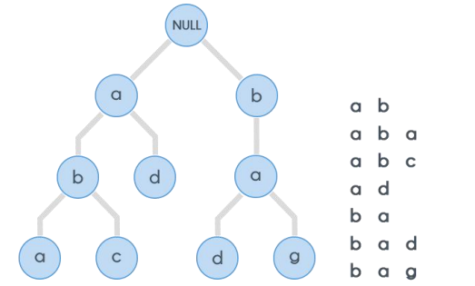
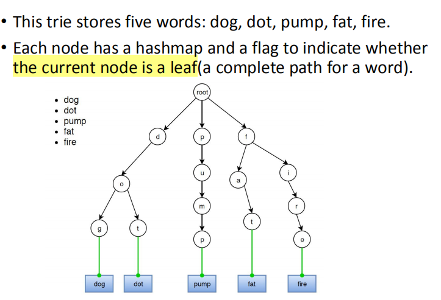
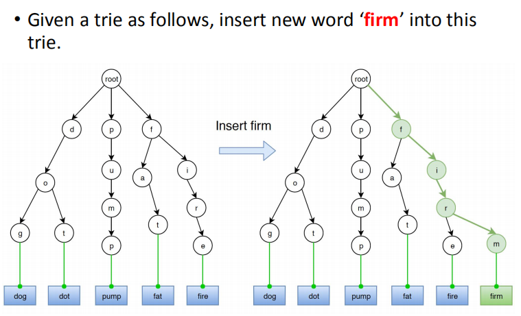
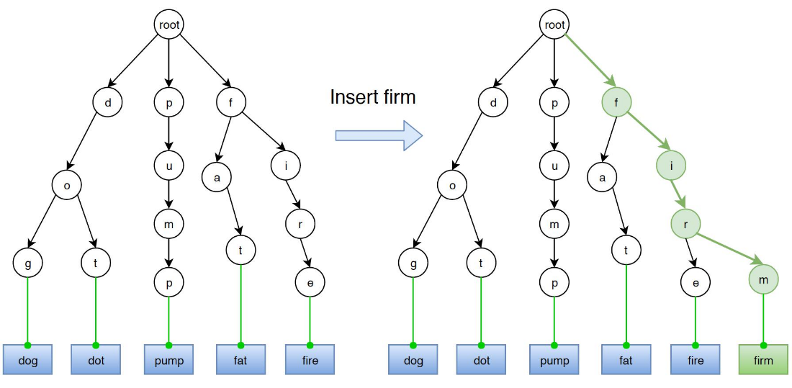
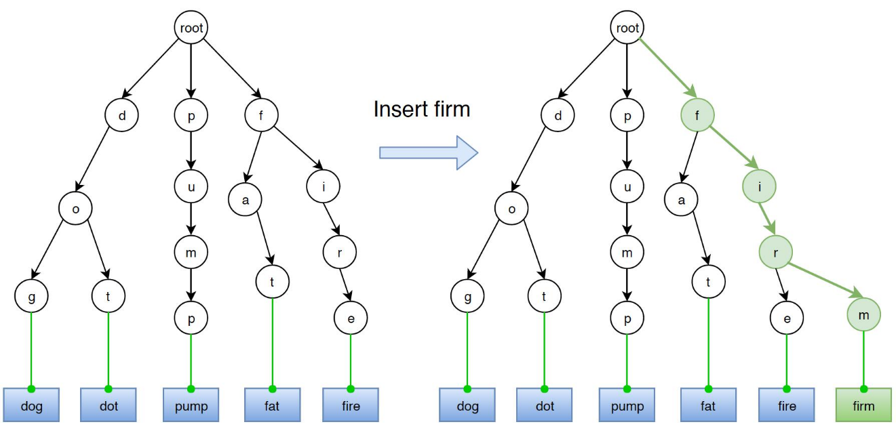
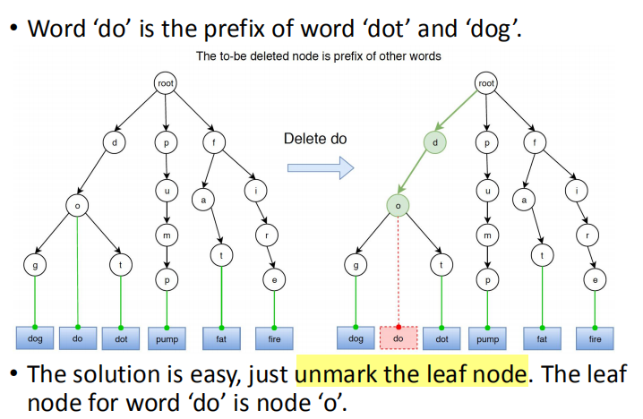
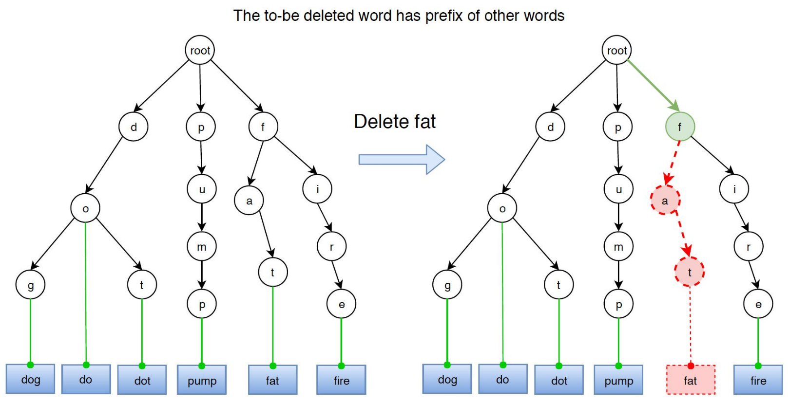
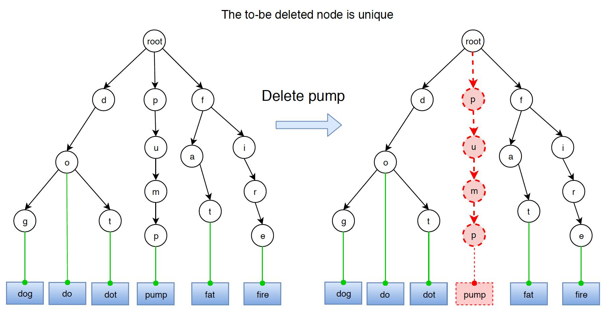

字典树
• Trie
• Finding Elements
• Inserting Elements
• Deleting an Element

一、Trie
1，prefix
字符串从上往下，根据它们的前缀，存储在字典树中

2，Trie (prefix tree)
1）
字典树，是一个有序的，每一个字符都存在各个结点的。
每一条从上向下的路径都可能代表一个Word。

The maximum number of children of a node is equal to the size of the alphabet

==支持搜索，新增，删除这三个操作的时间复杂度为O(L), L是key的长度==
2）
通常，字典树用来存放单词，方便快速查找前缀，效率很高

虽然哈希表可以快速查找字符串是否为有效单词，但它不能告诉我们字符串是否是任何有效单词的前缀。

案例

3）比较
字典树是一个用来存储字符串的树
• O(L) time where L is the length of the key
Hashing
在哈希过程中，我们将键转换为一个小值，该值用于索引数据。哈希平均支持在O(L)时间内的搜索、插入和删除操作。

Self Balancing BST :
在自平衡的二进制搜索树(BST)(如红黑树、AVL树、Splay树等)中，搜索、插入和删除操作的时间复杂度是O(L\*Logn)，其中n是总数单词，L是单词的长度。自平衡BSTs的优点是它们保持秩序，使最小、最大、最接近（地板或天花板）和k最大的操作更快。

3，优缺点
<table>
<colgroup>
<col style="width: 100%" />
</colgroup>
<thead>
<tr class="header">
<th>
优点

使用Trie，我们可以在O(L)时间内插入和找到字符串，其中L表示单个单词的长度。

比BST和hashing快，因为它的实现方式。我们不需要计算任何哈希函数，不需要进行碰撞处理

Trie的另一个优点是，我们可以很容易地按字母顺序打印所有单词，哈希做不到。

我们可以有效地使用Trie完成前缀搜索（或自动完成）。

缺点

速度更快，但需要巨大的内存来存储字符串
</th>
</tr>
</thead>
<tbody>
</tbody>
</table>

二、Finding Elements
1，有两种方法
1，查看给的单词，是否存在

2，查看所有以某一前缀开头的单词

这两种方法都有相似的搜索模式。
1，要在Trie中搜索一个给定的单词，我们首先将这个词转换为字符

2，然后开始将它们与字典树的根节点开始比较

3，如果当前的字符存在与node中，则移动到下一个子孩子

4，重复以上步奏，直到所有字符找到

2，三类搜索问题
- 搜索前缀

- 搜索整个Word
  - 与搜索前缀类似，另外加一个，检查node是不是leaf(到结尾

- 搜索相似前缀的Word
  - 返回所有的Word，以给定的前缀开头的，检查node是不是leaf

三、Inserting Elements
案例，新增firm节点

1，思路
开始，我们从root，搜索给定的Word，直到我们无法找到一个特定的字符。
然后，我们为其余的字符递归地构造新的trie节点
最后，把最后一个节点设为leaf set the leaf attribute of the last node to true.

2，有一个地方要注意
如果这是一个新的单词。（比如“do”)，是其他单词的前缀(单词“do”是单词“dot”的前缀)，我们只需要标记最后一个节点(例如。节点“o”）的新单词作为叶子，而不创建任何新节点。

3，具体步骤
1，将当前节点设置为根节点
2，将当前字母设置为单词的第一个字母
3，如果当前节点已经有对当前字母的现有引用（通过“子”字段中的一个元素），则将当前节点设置为所引用的节点。否则，创建一个新节点，将字母设置为等于当前字母，并将当前节点初始化为此新节点
4，重复步骤3，直到the key is traversed

四、Deleting an Element
三种情况
1\. Word is prefix of other words.

2\. Word has prefix of other words.

3\. Word is unique.

1，Word是其他单词的前缀 Word Is Prefix of Other Words
只需取消标记叶节点

2，Word上有其他单词的前缀Word Has Prefix of Other Words
fat和fire有相同的前缀，以f开头

如果单词有其他单词的前缀，则将从前缀删除到词尾的节点。

3，Word是唯一
如果单词既不是其他单词的前缀，也没有其他单词的前缀，那么只需删除所有节点。

