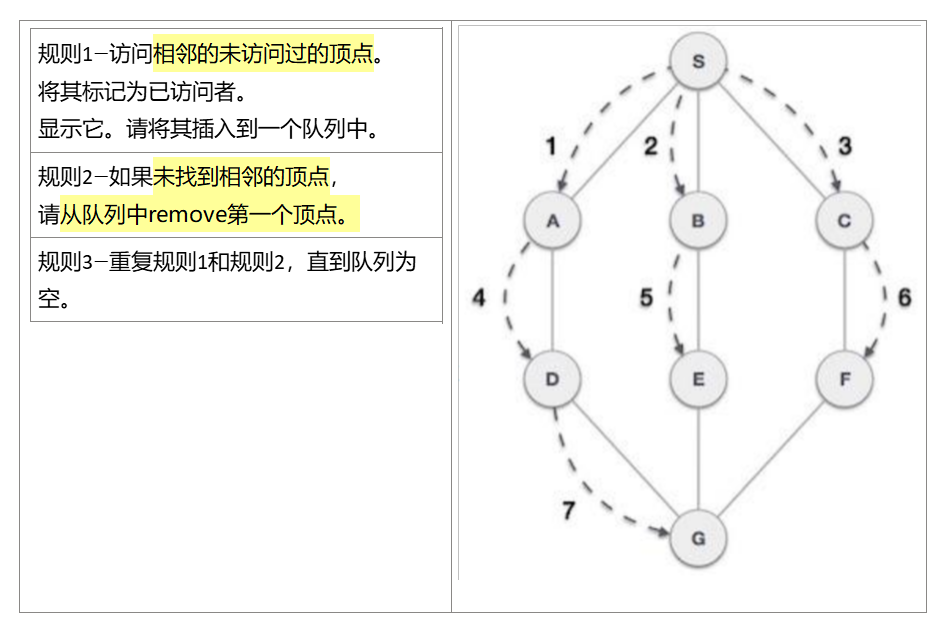
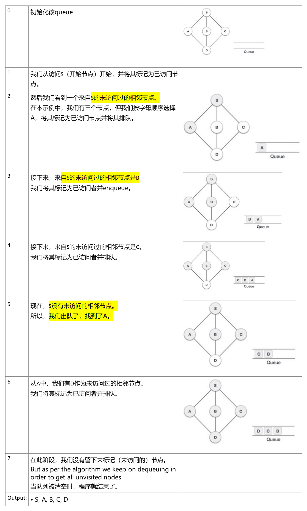
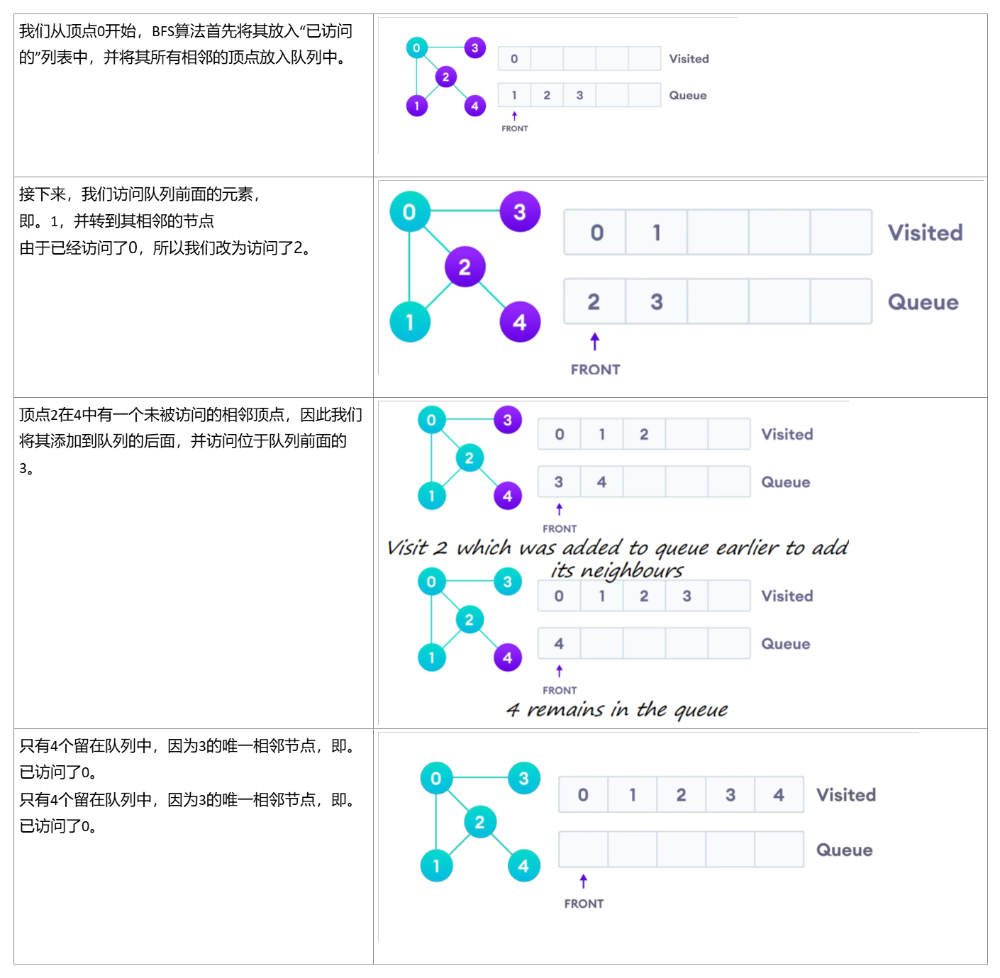

## • Breadth First Search 

1，定义：(BFS)算法在BFS中遍历图形，并在任何迭代中出现死胡同时，使用队列记住让下一个顶点开始搜索
队列**First-In-First-Out system (FIFO)**

<table>
<colgroup>
<col style="width: 100%" />
</colgroup>
<thead>
<tr class="header">
<th><h2 id="算法">算法</h2>

标准的BFS实现将图的每个顶点放为两类之一

• Visited

• Not Visited

<h2 id="section"></h2>

该算法的目的是将每个顶点标记为已访问的，同时避免循环

<table>
<colgroup>
<col style="width: 100%" />
</colgroup>
<thead>
<tr class="header">
<th>
1.首先，将图的任何一个顶点放在队列的后面。

2.获取队列前面项目，并将其添加到访问列表中

3.创建该顶点的相邻节点的列表。将不在已访问列表中的那些列表添加到队列的后面。

4.继续重复步骤2和步骤3，直到队列为空
</th>
</tr>
</thead>
<tbody>
</tbody>
</table></th>
</tr>
</thead>
<tbody>
</tbody>
</table>
## 

案例

## 
## 
## 案例

## 

## 
## 时间复杂度
BFS算法的时间复杂度以O(V+E)的形式表示，其中V是节点数，E是边数。
该算法的空间复杂度为O(V)。
## 
## 

