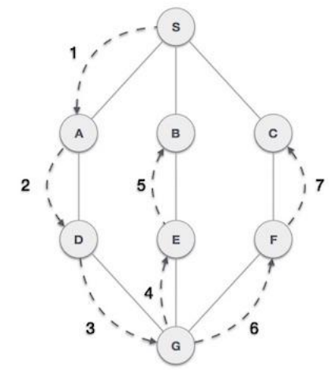
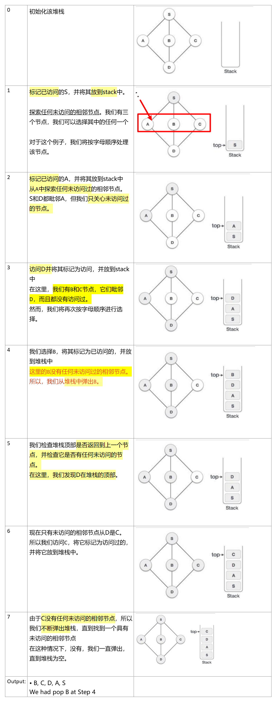
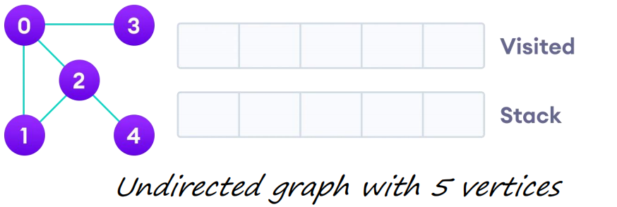
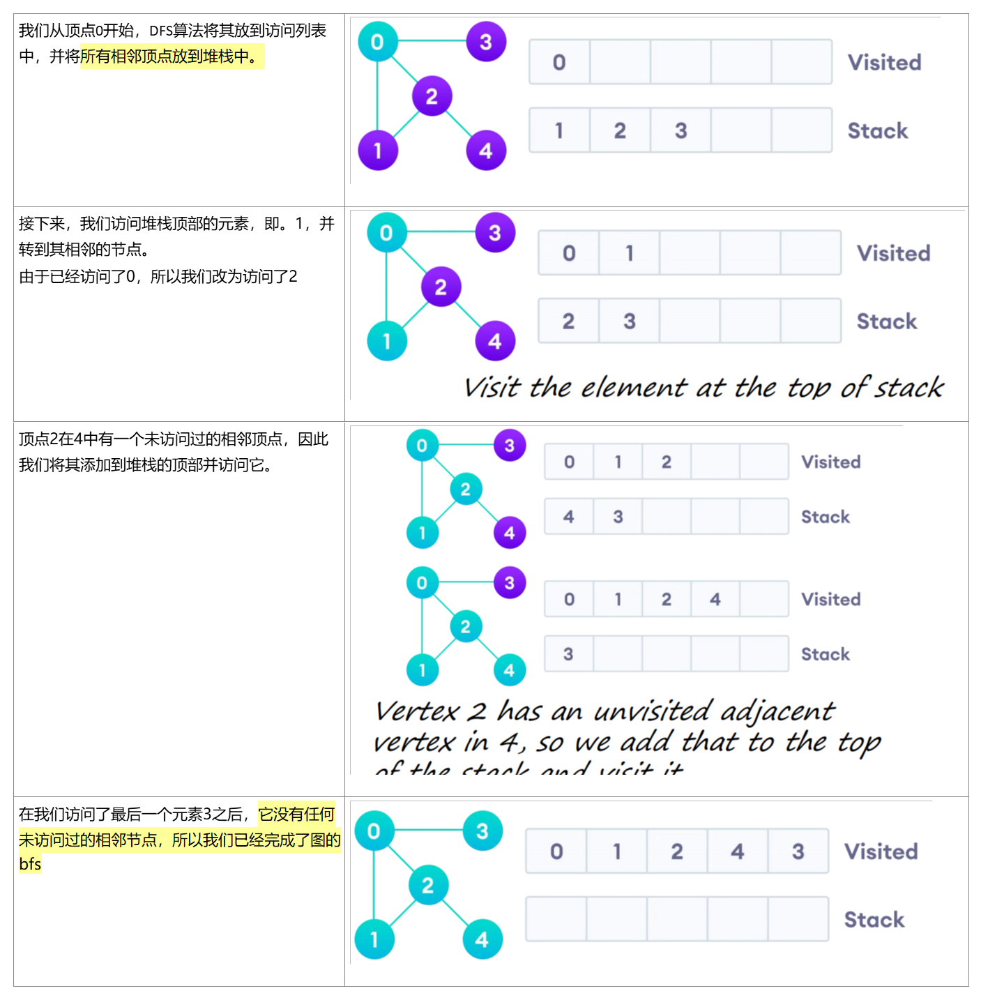

## • Depth First Search 
1，定义：深度优先(DFS)算法在==深度方向运动中遍历一个图==，并在任何迭代中==出现死角==时，使用stack记住让下一个顶点开始搜索。

在示例中，DFS算法首先从S到A到D到G到E到B，然后到F，最后到C

2，规则
1）访问相邻的未访问过的顶点。将其标记为已访问者。显示它。把它堆叠起来。
2）如果找不到相邻的顶点，请从==堆栈中弹出一个顶点==。（它将弹出堆栈中没有相邻顶点的所有顶点。
3）−重复规则1和规则2，直到堆栈为空。
<table>
<colgroup>
<col style="width: 100%" />
</colgroup>
<thead>
<tr class="header">
<th>
标准DFS实现将图的每个顶点分为两类之一：

• Visited

• Not Visited

该算法的目的是将每个顶点标记为已访问的，同时避免循环

DFS算法工作如下：

1.首先，将图的任何一个顶点放在堆栈的顶部。

2.获取堆栈的顶部项目，并将其添加到已访问的列表中。

3.创建该顶点的相邻节点的列表。将不在已访问列表中的那些项添加到堆栈的顶部。

4.继续重复步骤2和3，直到堆栈为空。
</th>
</tr>
</thead>
<tbody>
</tbody>
</table>
详细步骤

案例2

DFS的时间复杂度
DFS算法的时间复杂度以O(V+E)的形式表示，其中V为节点数，E为边数。
该算法的空间复杂度为O(V)

