## 
## • Topological Sorting
====
1，概述
拓扑排序主要用于从作业之间的给定依赖关系中调度作业【==找到做事情的顺序==】

**有向无环图的拓扑排序(DAG)是顶点的线性排序**，对于每一条有向边uv，顶点u在顺序在v之前。

如果图不是DAG，则不能对图进行拓扑排序。
**拓扑排序当且仅当图是一==个有向无环图时==才可以排序**。

2，有向图
有向图可以用来表示**一组事件中的优先级**

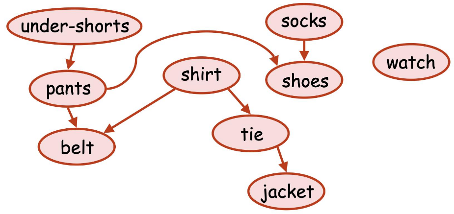

**fact：**
如果G包含一个循环，则无法找到所需的顺序•（通过矛盾来证明）
然而，如果G是无环的（不包含循环），我们将给出两种算法，它们总是能找到所需的排序
案例

有向无环图directed acyclic graph.
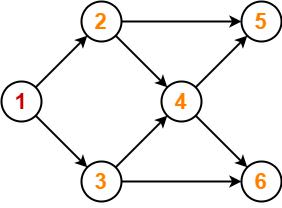

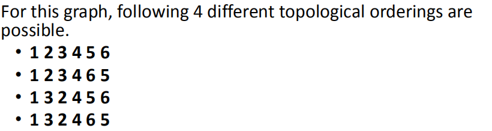

**寻找拓扑排序数量**
| 1，写入每个顶点的入度，删除当前入度最小的点，更新各点入度 |
|-----------------------------------------------------------|

**Problem01**
找到给定图可能的不同拓扑顺序的数量
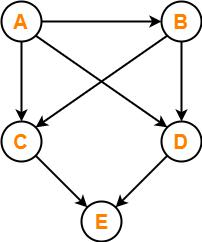

**上图的拓扑顺序的步骤如下。**
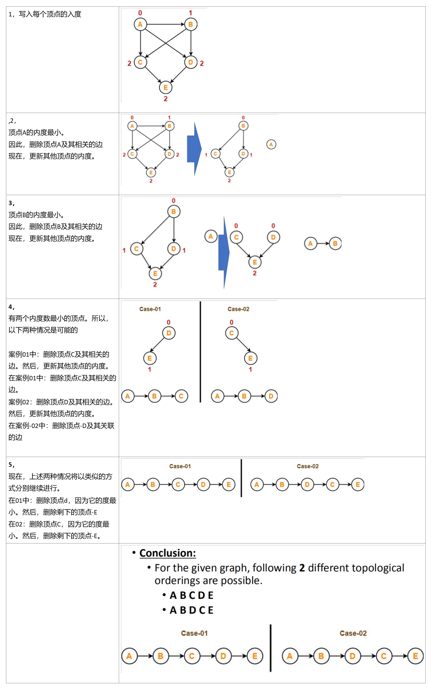

**案例2**
**考虑一下下面给出的有向图。以下哪些说法为真**
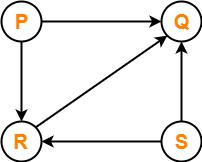
1.该图没有任何拓扑顺序。【错，】
2.PQRS和SRPQ都是拓扑顺序。【】
3.PSRQ和SPRQ都是拓扑顺序。
4.PSRQ是唯一的拓扑顺序。
**解决：3正确**
**1，**给定的图是一个有向无环图。因此，拓扑顺序的存在。
**2，**根据拓扑排序的定义，P和S必须以拓扑顺序出现在R和Q之前。
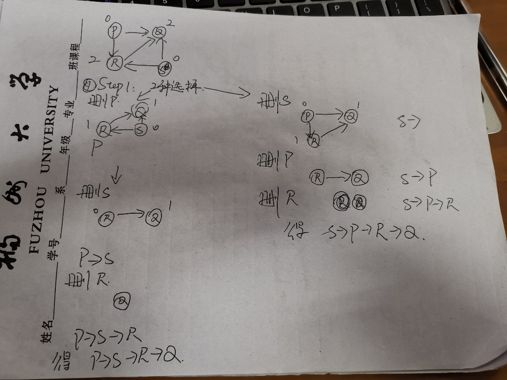

**案例3**
**请考虑下面的有向图。**
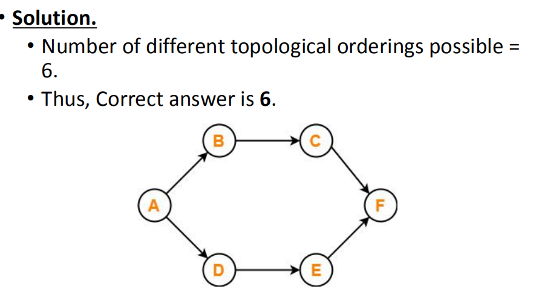
**先删去A，有B,D两种情况，**
**从B入手，删B，有C,D两种情况，删C，得到==结果1==，删D，有C,E两种情况，得到结果2,结果3**
**从D入手，删D，有B,E两种情况，删E，得到结果4，删B，有C,E两种情况，得到结果5,结果6**

**我们介绍了有向无环图(DAG)上的拓扑排序问题**

我们给出了两种线性时间算法：
• (1) Using Queue
• (2) Using Stack

**1，Using Queue**
**Example of Topological Sort (with Queue)**
**思路：存入度=0的**

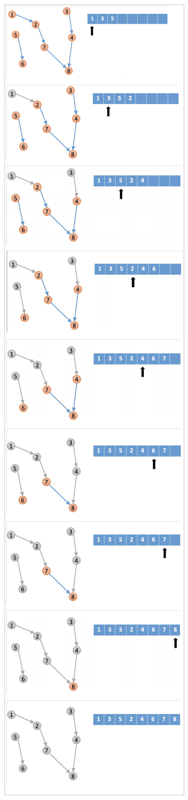

**Example of Topological Sort - 2**

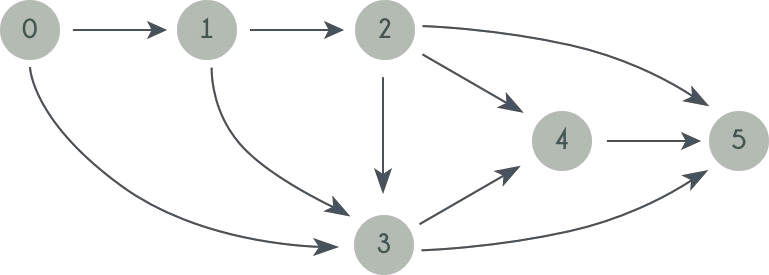

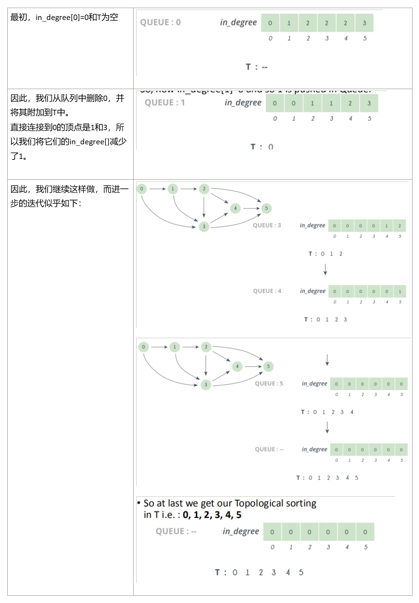
**4，Topological Sort (with Queue)**
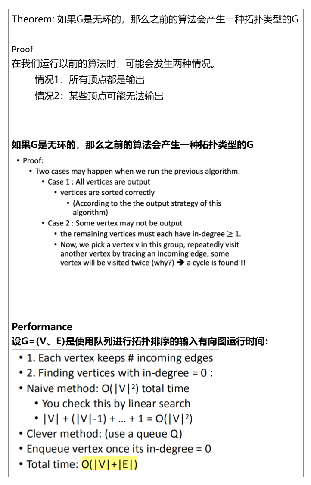
**Topological Sort (Example)**
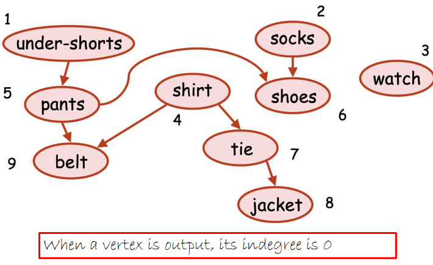
**二、Topological Sort (with Stack)**
**1，Topological Sort (with Stack)**
1.在图上使用==DFS==

2.按顶点结束时间的递减顺序排列的输出顶点；==（其完成时间的递减顺序==）
**2，**
**• (check time, finishing time)**
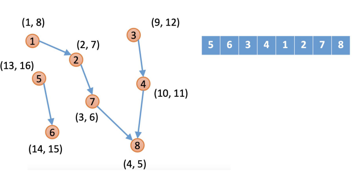

**Topological Sort (with Stack)**

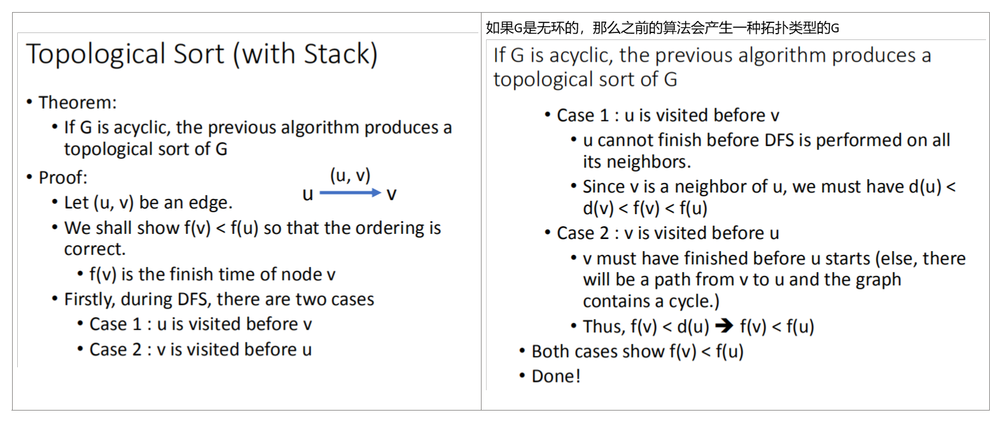

Topological Sort (Example)
在可能的DFS后的发现和完成时间
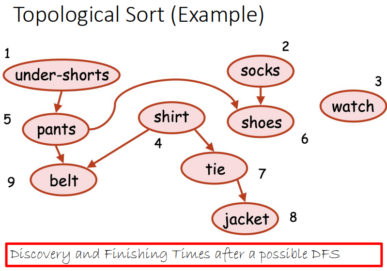

时间完成时间（按降序排列）
如果我们从左到右排序事件，边缘方向有什么特别之处吗？

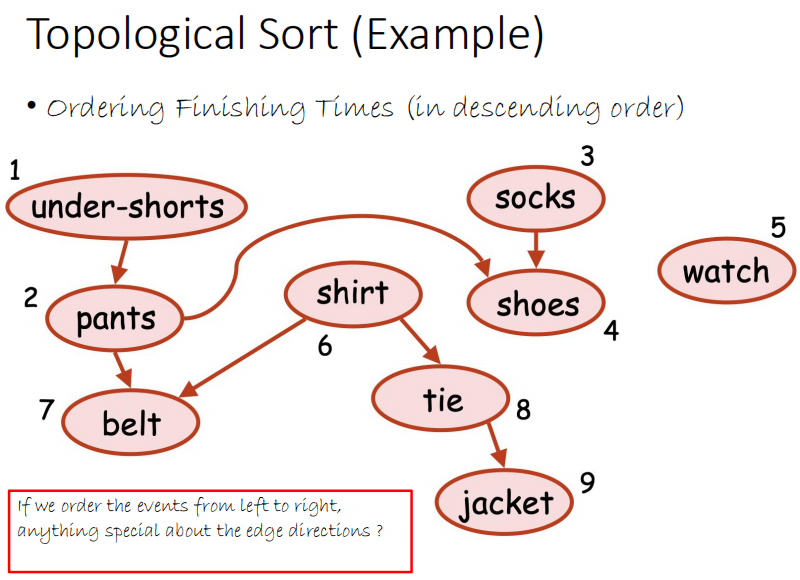

Performance
设G=（V、E）为输入有向图
拓扑排序的运行时间：
1.执行DFS：O(\|V\|+\|E\|)时间

2.排序完成时间

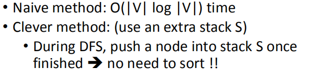

Total time: O(\|V\|+\|E\|)

案例
<table>
<colgroup>
<col style="width: 100%" />
</colgroup>
<thead>
<tr class="header">
<th>
然后我们按节点顺序遍历这个图

0-5这个顺序

首先dfs的是0这个点

dfs进去发现他没有子节点

也就是没有从0这个点出发可以到达的点

然后把0添加到栈里面

然后dfs的是1这个点

1这个点和0同理，没有子节点，然后把1添加到栈里面

然后遍历2

2有一个子节点3

所以我们先把visit2设为true，然后dfs 3这个节点

visit代表这个点已经访问过了

3到1

但是1已经访问过了，所以结束当前的dfs

同时把3放进栈里面

再把2放进栈里

这样我们栈里面，就是 0 1 3 2

0在栈底

这样2这个节点就算是深搜完了

然后深搜3

但是3已经访问过了，直接跳过

然后4，发现4的两个子节点0和1也已经访问过了

然后栈是后进先出的原理

倒过来正好就是拓扑的顺序

</th>
</tr>
</thead>
<tbody>
</tbody>
</table>
<table>
<colgroup>
<col style="width: 100%" />
</colgroup>
<thead>
<tr class="header">
<th>
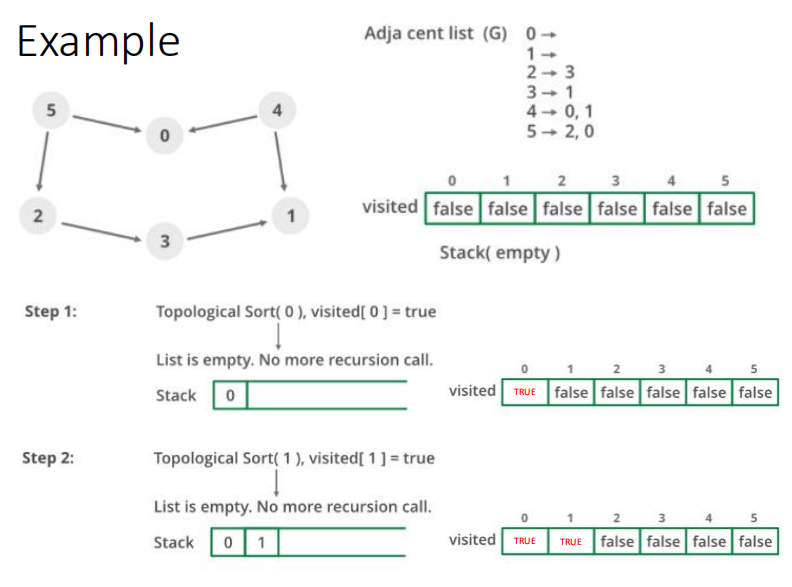

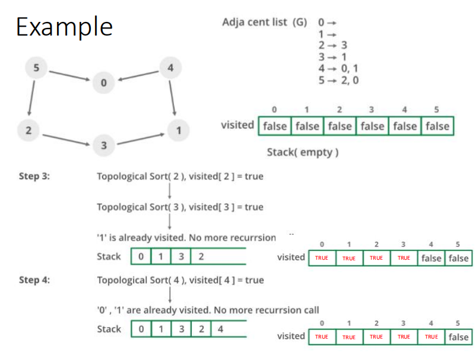

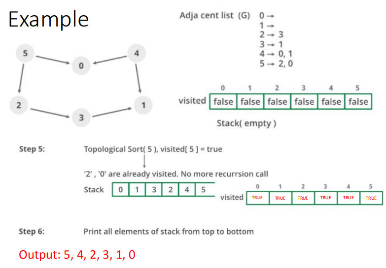

</th>
</tr>
</thead>
<tbody>
</tbody>
</table>

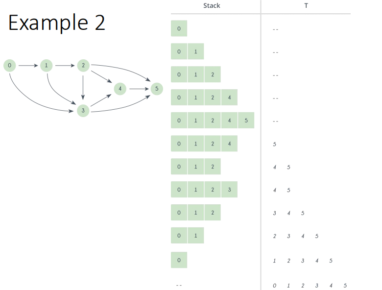

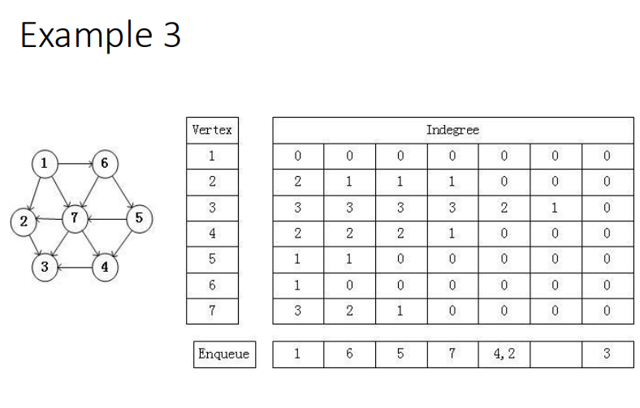

|    |
|-----|
