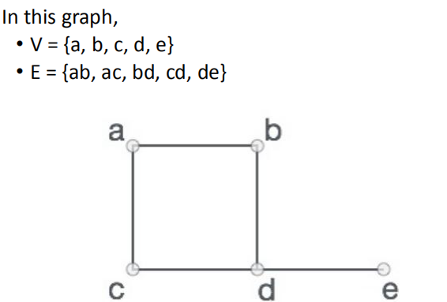
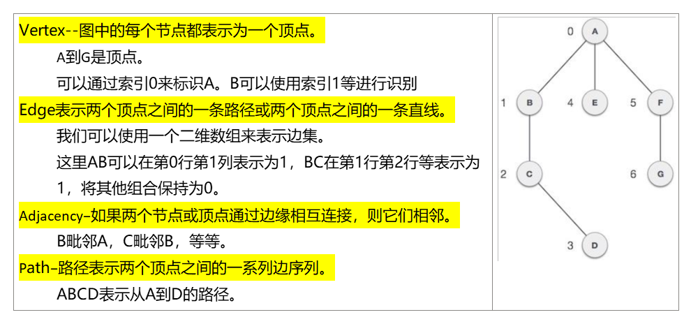
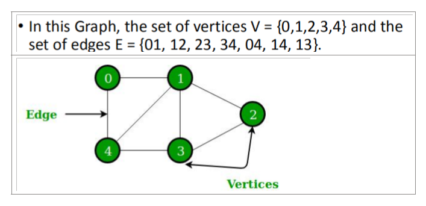
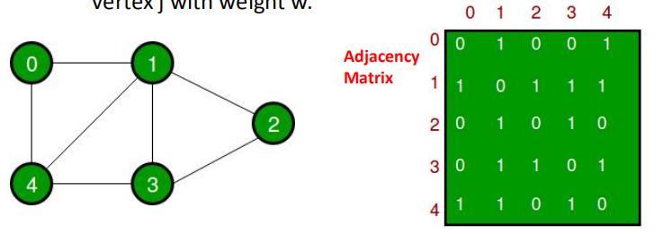
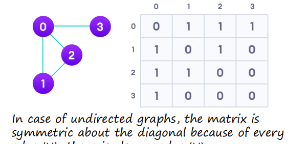
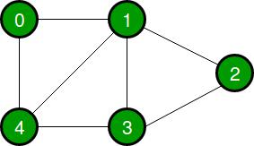
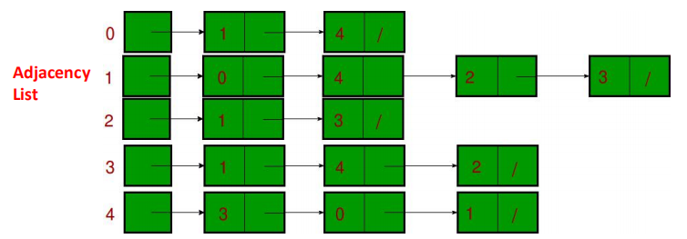
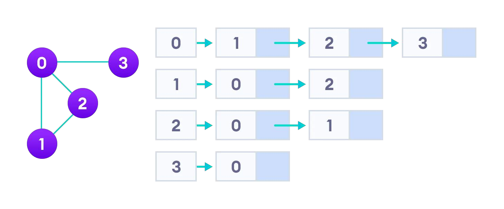

16-图
2021年6月12日
9:36

## 一、Graph 
1，图的定义：图是一组对象的图形表示，其中几对对象通过链接连接。

相互连接的对象由称为顶点的vertices表示，
连接顶点的链接称为边edges。

2，Formally, a graph is a pair of sets **(V, E)**, 其中V是顶点的集合，E是连接顶点对的边的集合。

3，图的内部

## 
## 4，基本操作
加点加边显示
• Add Vertex − Adds a vertex to the graph.
• Add Edge − Adds an edge between the two vertices of the graph.
• Display Vertex − Displays a vertex of the graph.
## 
## 
## 
## 
## 二、Graph Data Structure 
1，边和顶点的详细内容
图是一种由节点和edge边组成的非线性数据结构。
这些节点有时也被称为vertices，而edge是连接图中任意两个节点的线或弧线。
更正式地说，一个图可以被定义为，
图形由一组有限的顶点（或节点）和连接一对节点的边集组成。

图是一种由以下两个组件组成的数据结构：
1.一个有限的顶点集，也被称为节点

2.有序的形式（u、v）的有限集合，称为边缘。
下面是一个具有5个顶点的无向图的示例。
两种表示方式
1\. Adjacency Matrix邻接矩阵

2\. Adjacency List邻接表
## 

## 
## 2，邻接矩阵
1）定义
它是一个\|V\|x\|V\|数组
二维数组 adj\[\]\[\], a slot ==adj\[i\]\[j\] = 1== indicates从顶点i到顶点j都有一条边。

无向图的邻接矩阵始终是对称的。

邻接矩阵也被用于表示加权图。如果adj\[i\]\[j\] = w，那么就有一条从顶点i到顶点j的边，其权值为w

## 
## 
## 2）优缺点
## 优点：
表示法更容易实现和遵循。删除一个边需要O（1）的时间。像是否有从顶点“u”到顶点“v”的边这样的查询是有效的，可以通过（1）来完成。
缺点
消耗更多的空间O（V2）。即使该图是稀疏的（包含的边数较少），它也会占用相同的空间。添加一个顶点是O（V2）时间。
## 
## 3）表示方法,
邻接矩阵是将图G={V，E}表示为布尔值矩阵的一种方法。
矩阵的大小是VxV，其中V是图中的顶点数，条目Aij的值是1或0，这取决于从顶点i到顶点j是否有边。

3， 邻接表
1）概念
An array of lists is used.
将该数组设为一个数组。条目数组表示与第i个顶点相邻的顶点列表。
这种表示法也可以用来表示一个加权图。边的权重可以表示为对的列表。

## 
## 
2）邻接位置列表表示法
邻接列表将图形表示为链接列表的数组

邻接列表在存储方面是有效的，因为我们只需要存储边的值。
对于一个具有数百万顶点和边的稀疏图，这意味着大量节省空间。

## 
## 
## 
## 
## 
## 

