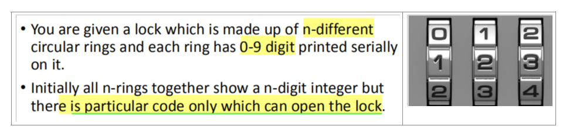
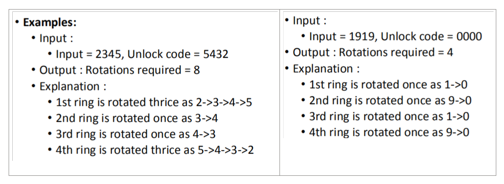
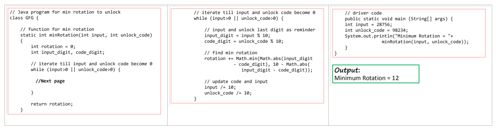
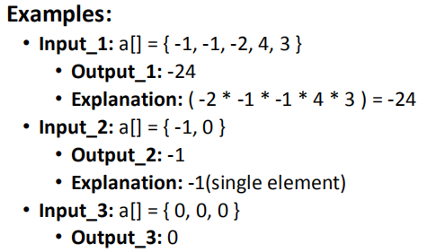
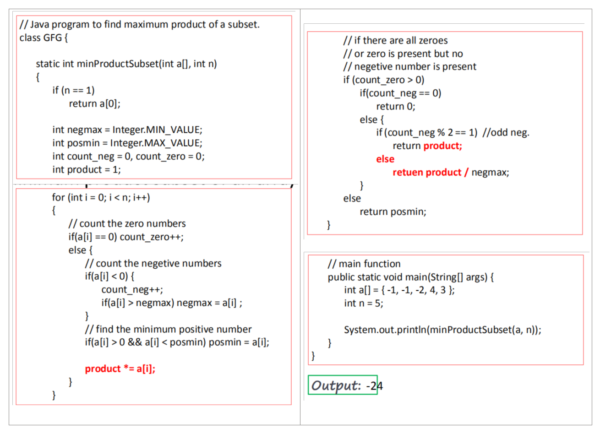
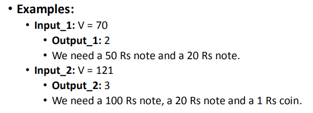
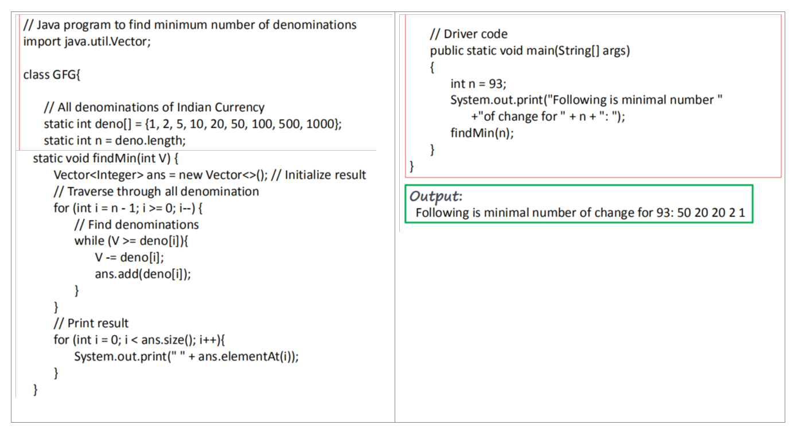
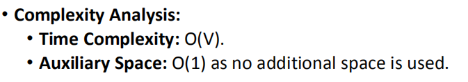

17-贪心算法
2021年6月12日
9:05

## • Greedy Algorithm 
一、概念
1，定义：贪婪算法是一种通过选择**当前现有的最佳选项**来解决问题的方法，而不用担心它未来会带来的结果。
换而言之，本地最佳的选择的目标是产生全球最佳的结果

注意
此算法可能==不是解决所有问题的最佳选择==，它在某些情况下可能会==产生错误的结果==
这个算法永远不会回来推翻所做出的决定。该算法采用自上而下的方法。
2，优点
该算法更容易被描述

该算法比其他算法性能更好（但并非在所有情况下）

3，一个可行的解是提供了这个问题的最优解。
4，三个经典问题
• **Minimum rotations to unlock a circular lock**
• **Minimum product subset of an array**
• **Find minimum number of coins**

## 二、Minimum rotations to unlock a circular lock 
解锁循环锁的最小旋转次数
问题背景：
你会得到一个由n个不同的圆环组成的锁，每个圆环上都有0-9个数字的数字连续打印出来。最初，所有的n位环一起显示一个n位整数，但只有特定的代码才能打开锁。您必须找到在锁环上完成的最小旋转次数才能打开锁。

最小需要转几圈到答案
案例

注意
对于一个环，我们可以沿向前或后退方向旋转，如：
• 0-\>1-\>2….-\>9-\>0
• 9-\>8-\>….0-\>9

但我们关心的是所需的最小旋转次数，所以我们应该选择Min（abs(a-b)，10-abs(a-b)）作为a-b指向前旋转的次数，10-abs(a-b)指从a到b旋转的环向后旋转的次数

此外，我们必须找到针对每个数字的每个环的最小数字

所以从右开始，我们可以很容易地找到每个环所需的最小旋转数，最后到达左最大数字。

代码

## 三、 Minimum product subset of an array 
1,目的：Given an array a, we have to find minimum product possible with the subset of elements present in the array.
给定一个数组a，我们必须找到数组中元素子集的最小乘积。
例子

2,方法
一个简单的解决方案是生成所有子集，找到每个子集的乘积并返回最小乘积
更好的方法
1，如果有**偶数个负数并且没有0**，结果是**除了最大的负数的所有数的乘积**

2，如果有**奇数个负数并且没有0**，结果是**所有的数的乘积**

3，如果**有0和整数，没有负数**，结果是**0**

4，如果**全是正数**（没有0和负数），结果是**最小的正数**

代码

## 四、Find minimum number of coins
给定值V，如果我们想改变VRs，并且我们有印度货币的无限供应，即，我们有{1、2、5、10、20、50、100、500、1000}纸币的无限供应，那么改变所需的硬币和/或纸币的最小数量是多少？
案例

方法--》贪心算法
1，一种常见的方法是先取价值更大的硬币。这可以减少所需的硬币总数。
2，从最大的面额开始，并在剩余值大于0时继续增加面额。

算法
<table>
<colgroup>
<col style="width: 48%" />
<col style="width: 51%" />
</colgroup>
<thead>
<tr class="header">
<th>
1，按<strong>递减顺序</strong>对硬币数组进行排序。

2，将结果初始化为空。

<strong>3</strong>，找到小于当前金额的最大面额

<strong>4</strong>，添加找到的面额的结果。从金额中减去已找到的面额的值。

5、如果amount变成0，则打印result。

6. 否则重复步骤3和4的新值的V。
</th>
<th>
Algorithm:

1. Sort the array of coins in decreasing order.

2. Initialize result as empty.

3. Find the largest denomination that is smaller than current amount.

4. Add found denomination to result. Subtract value of found denomination from amount.

5. If amount becomes 0, then print result.

6. Else repeat steps 3 and 4 for new value of V.
</th>
</tr>
</thead>
<tbody>
</tbody>
</table>

代码

分析：

注意：
上述方法可能并不适用于所有的教派
例如，它不适用于面额{9、6、5、1}和V=11。
上述方法将打印9、1和1。
但我们可以使用2个面额，5个和6个
对于一般的输入，动态编程方法可以解决该问题。

