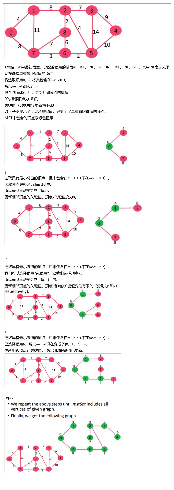

最小生成树

• Minimum Spanning Tree
• Kruskal’s algorithm
• Prim’s algorithm
• matrix representation

• adjacency list representation

## 一、Minimum Spanning Tree 
1，概念
给定一个连通的无向图，该图的==生成树==是一个作为树==并将所有顶点连接在一起的子图==。

单个图可以有许多不同的生成树

加权、连接和无向图的最小生成树(MST)或最小权重生成树是指权重小于或等于每个其他生成树的权重的生成树。

生成树的权重是表示生成树的每条边的权重的和。

2，一个最小的生成树有多少条边edge？
==最小生成树有（V-1）边edge，其中V是给定图中顶点的数量。==
A minimum spanning tree has ==(V – 1) edges== where V is the number of ==vertices== in the given graph.

3，

## 二、Kruskal’s algorithm 
==每次选择一条权值最小的边，使这条边的两头连通（原本已经连通的就不选）直到所有结点都连通==
，时间复杂度
==• O(\|E\|log \|E\|) or O(\|E\| log\|V\|).==

1，方法：
1，按边的重量的非递减顺序==对所有边进行排序==

2，选择最小的边edge。检查它是否形成了迄今为止与生成树==形成的循环==。如果未形成循环，请包括此边。否则，就丢弃它。

3，重复步骤2，直到生成树中有（V-1）边缘

\*步骤2使用联合查找算法来检测周期。

这是一种贪心算法Greedy Algorithm
贪婪的选择是选择迄今不会导致MST周期的最小重量边缘。

案例

初步分析

9 vertices and 14 edges
形成的最小生成树将具有（9-1）=8条边。

第一步：排序

第二步：找==未加入的==，==最小的==，==不会构成循环==的边

2，时间复杂度
==• O(\|E\|log \|E\|) or O(\|E\| log\|V\|).==

- 边的排序Sorting of edges：**O(\|E\| log \|E\|)** time.
  - 排序后，我们遍历所有边并应用find-union algorithm.
- find-union algorithm.消耗**O(\|E\|log \|V\|)** time

So overall complexity is O(\|E\|log\|E\| + \|E\|log\|V\|) time.
\|E\|的值最多可以为O(\|V\|2)，因此O(log\|V\|)与O(log\|E\|)相同。
因此，总体时间复杂度为O(\|E\|log\|E\|)或O(\|E\|log\|V\|)

3，Union–find data structure
1)A ==disjoint-set data structur==e, also called a ==union–find data structure== or ==merge–find set==是存储不相交（不重叠）集合的数据结构。

同样地，它将一个集合的分区存储为不相交的子集

2\)
Find:
确定特定元素所在的子集
这可用于确定两个元素是否在同一子集中。

Union
将两个子集合并到一个子集中
在本文中，我们将讨论不相交集数据结构的应用
检查给定的图是否包含一个循环。

3)联合查找算法可以用于检查无向图是否包含循环。
请注意，我们已经讨论了一种检测周期的算法
这是另一种基于“联合-查找”的方法
此方法假设该图不包含任何自循环

可以跟踪一维数组中的子集, let’s call it parent\[\].

4,代码(见课件

## 二、Prim’s algorithm 
• matrix representation

• adjacency list representation

<table>
<colgroup>
<col style="width: 100%" />
</colgroup>
<thead>
<tr class="header">
<th>
从某一个顶点开始构建生成树：每次将代价最小的顶点纳入生成树，直到所有顶点都纳入位置

时间复杂度：

适合用于边稠密图
</th>
</tr>
</thead>
<tbody>
</tbody>
</table>

## 第一部分：matrix representation 
1，
这个想法是maintain两组顶点
第一组是==包含MST中已经包含的顶点==，另一组包含未包含的顶点
在每一步，它考虑==连接两组的所有边==，并从这些边中选==择最小权重边==
在选择边后，它移动到边的另一个顶点继续构建最小生成树

2，如何操作
生成树表示必须连接所有顶点。
因此，顶点的两个不相交的子集（这是上面讨论过的）必须连接起来才能形成一个生成树。
而且它们必须与最小重量的边缘连接，以使其成为最小生成树

步骤
<table>
<colgroup>
<col style="width: 100%" />
</colgroup>
<thead>
<tr class="header">
<th>
第一步，创建一个跟踪最小生成树中已经<mark>包含的顶点的集合mst集</mark>

第二步，为输入图中的<mark>所有顶点</mark>指定一个key。将所有<mark>key初始化为 INFINITE</mark>。为<mark>第一个顶点的键值指定为0</mark>，以便首先选择它。

第三步，当mstSet并不包括所有的顶点时

<blockquote>

1）选取一个在mstSet中<mark>不存在</mark>且<mark>具有最小键值</mark>的顶点u。

2）包括u到mstSet。

3）<mark>更新u的所有相邻顶点的键值</mark>。要更新key，请<mark>迭代所有相邻的顶点</mark>。对于每个相邻的顶点v，如果边u-v的权值小于以前的键值v，则将键值更新为u-v的权值

</blockquote></th>
</tr>
</thead>
<tbody>
</tbody>
</table>

案例

3，如何实现上述算法
我们使用一==个boolean 数组mstSet\[\]==来表示==MST中包含的顶点集==。
如果值mstSet\[v\]为true，则顶点V包含在MST中，否则不包含
• ==Array key\[\]== is used to ==store key values of all vertices==.
==array parent\[\]== to ==store indexes of parent nodes in MST==
The parent array is the output array 显示所构造的MST的输出数组。

4，时间复杂度

## 第二部分adjacency list representation

1，方法
第一步，创建一个大小为V的最小堆，其中V是给定图中的顶点数。
最小堆的每个节点都包含==顶点数和顶点的键值==

第二步，将第一个顶点作为根值初始化最小堆（分配给第一个顶点的键值为0）。分配给所有其他顶点的键值为INF（无限大）。

第三步，如果最小堆不为空，请执行以下操作
1)从最小堆中提取==最小值节点。让提取的顶点为u==

2)对于u的==每个相邻顶点v==，检查v是==否在最小堆==中（==尚未包括在MST中==）。如果v在最小堆中，并且其键值大于u-v的重量，则将v的键值更新为u-v的重量值。

3，如何实现上述算法？
Prim的算法是使用BFS遍历图的所有顶点，并使用最小堆来存储MST中未包含的顶点
最小堆用作优先队列，从切割获得最小重量边缘。
最小堆用作操作的时间复杂度，如提取最小元素，并在最小堆中减少键值为O(log\|V\|)。

,4，时间复杂度

案例
Construct the ==minimum spanning tree (MST)== for the given graph using ==Prim’s Algorithm==

