## 一、Types of Shortest Path Problems 
1，什么是最短路径Shortest Path Problem
最短路径问题是在==给定图的顶点之间找到最短路径的问题。==
两个顶点之间的最短路径是指与所有其他现有路径相比，成本最低的路径。

2，应用
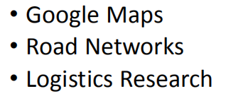

3，类型
• Single-pair shortest path problem
• Single-source shortest path problem
• Single-destination shortest path problem
• All pairs shortest path problem

**1）Single-pair shortest path problem**
计算==给定顶点之间==的最短路径。

**2） ==Single-source== shortest path problem**
计算从给==定源顶点到其他剩余顶点的最短路径。==

==Dijkstra’s Algorithm== and ==Bellman Ford Algorithm== are the famous algorithms used for solving single-source shortest path problem.
<table>
<colgroup>
<col style="width: 100%" />
</colgroup>
<thead>
<tr class="header">
<th>
两个算法都是跟求图的有源最短路径有关。

<mark>Dijkstra主要针对的是无负权值节点的图</mark>，而<mark>Bellman-Ford算法则是可以处理有负权值的有向图的最短路径问题</mark>。

两者都用到了一个“<mark>松弛计算</mark>”的方法，也就是在遍历图的顶点和边的过程中修改距离数组的值，从而来找出最短路径。

<mark>Dijkstra算法针对无负权值的图，求源点到某特定点的最短距离。</mark>大概的思路是：

将图的顶点分成两个集合S,V。S中开始时只有源点，而V中是剩下的点。有一个dis[n]（n为图的节点数）的数组来记录每一个点到源点的特殊距离，这个距离都是从源点只经过S中的点而到达所求点的距离。每次的操作需要用“松弛计算”更新dis，遍历完成即可得到最短距离。

而<mark>Bellman-Ford算法主要是针对有负权值的图。来判断该图中是否有负回路，或者存在最短路径的点。</mark>判断的思路，从源点出发，进行n - 1（n为顶点数）遍历，在每次的遍历过程中，对所有的边进行遍历判断，同样是利用松弛计算的思想，dis[v] &gt; dis[u] + w(u, v)不断更新dis数组的值，直到循环结束。然后就是这个算法最精彩的地方了，再对所有的边进行一次遍历，看是否存在dis[v] &gt; dis[u] + w(u, v)的边，若存在，则返回FALSE，说明图中存在负回路；若不存在，则返回TRUE，dis数组记录的就是每一个点到源点的最小值。
</th>
</tr>
</thead>
<tbody>
</tbody>
</table>
**3）==Single-destination== shortest path problem**
计算从==所有顶点到单个目标顶点==的最短路径

通过反转图中每条边的方向，这个问题可以简化为single-source shortest path problem
Dijkstra算法是解决单目标最短路径问题的著名算法

**4）All pairs shortest path problem**
计算==每对顶点之间的最短路径。==
**Floyd-Warshall Algorithm** and **Johnson’s Algorithm** are the famous algorithms used for solving All pairs shortest path problem

## 二、Relaxation 
1，最优的子结构性能
考虑G中顶点u和v之间的最短路径P。设z是P上的一个顶点。
u和z之间的P部分是u和z之间的最短路径。
z和v之间的P部分是z和v之间的最短路径。

2，运行周期和最短的路径
所有的边缘都具==有正的权重==：
最短的路径==不能包含循环==
所有的边都具==有非负值的权重。==
0-周期可以发生在最短的路径上，但可以被删除而不改变长度。
有些边有负权重
如果图中存在负权值循环，则未明确定义最短路径问题。

否则，我们将会回到上述两种情况之一。

总结：具有n个顶点的图中的最短路径最多有n-1个边。

3，最短路径的三角形不等式
Triangle Inequality for Shortest Paths

<table>
<colgroup>
<col style="width: 100%" />
</colgroup>
<thead>
<tr class="header">
<th>
Claim:

<blockquote>

δ(s,v) ≤ δ(s,u) + w(u,v) for all (u,v) ∈ E

Note. δ(s,v) 是s和v之间的最短路径的总权重

</blockquote>

证明

<blockquote>

从s到u的最短路径接着是从u到v的单边路径是从s到v的路径。

此路径的长度必须至少等于从s到v的最短路径的长度

</blockquote></th>
</tr>
</thead>
<tbody>
</tbody>
</table>

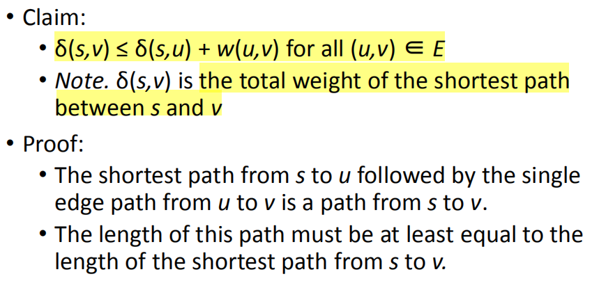

4，Shortest Path Algorithms
Intuition
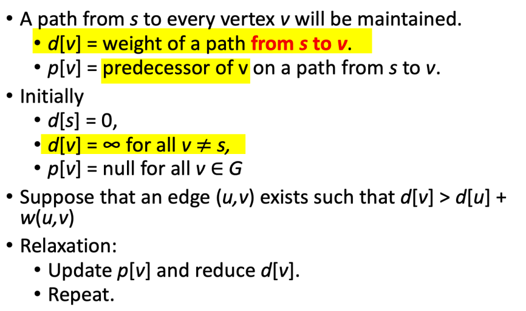
初始化单源
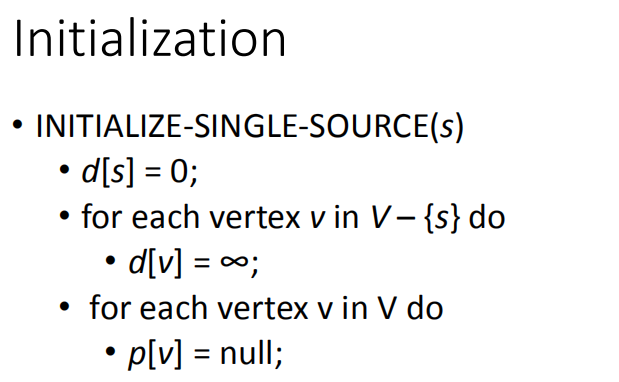

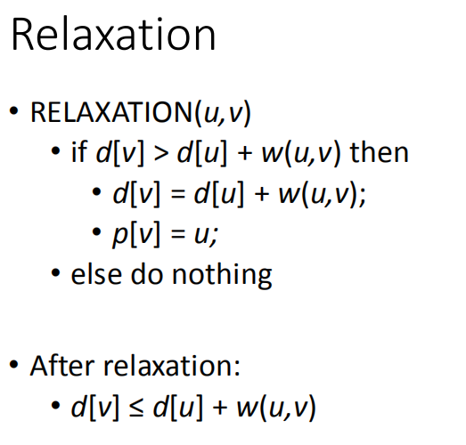

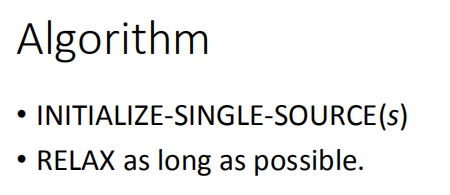

5，Upper Bound Property
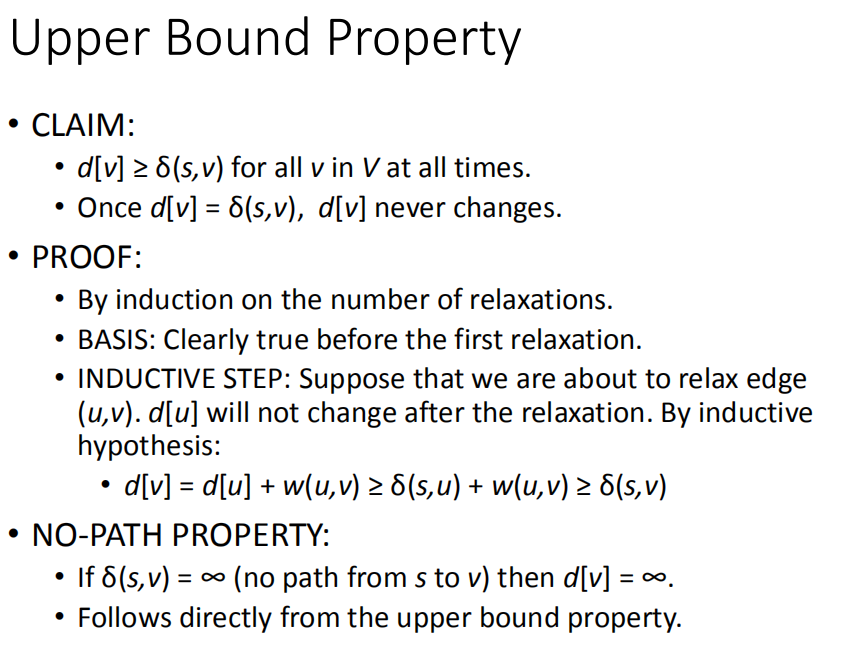
<table>
<colgroup>
<col style="width: 100%" />
</colgroup>
<thead>
<tr class="header">
<th>
Claim:

<blockquote>

δ(s,v) ≤ δ(s,u) + w(u,v) for all (u,v) ∈ E

Note. δ(s,v) 是s和v之间的最短路径的总权重

</blockquote>

证明

<blockquote>

从s到u的最短路径接着是从u到v的单边路径是从s到v的路径。

此路径的长度必须至少等于从s到v的最短路径的长度

</blockquote></th>
</tr>
</thead>
<tbody>
</tbody>
</table>

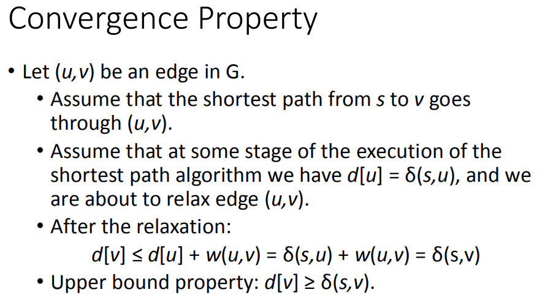

案例
选不被包含的最小点，包含进来，打通其连接点
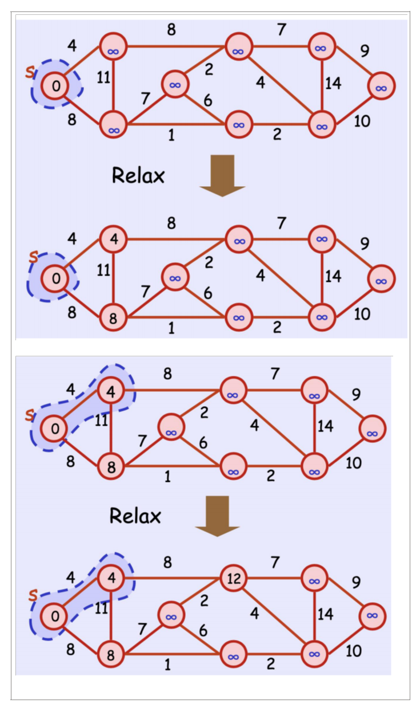

## 三、Bellman-Ford Algorithm 

案例1
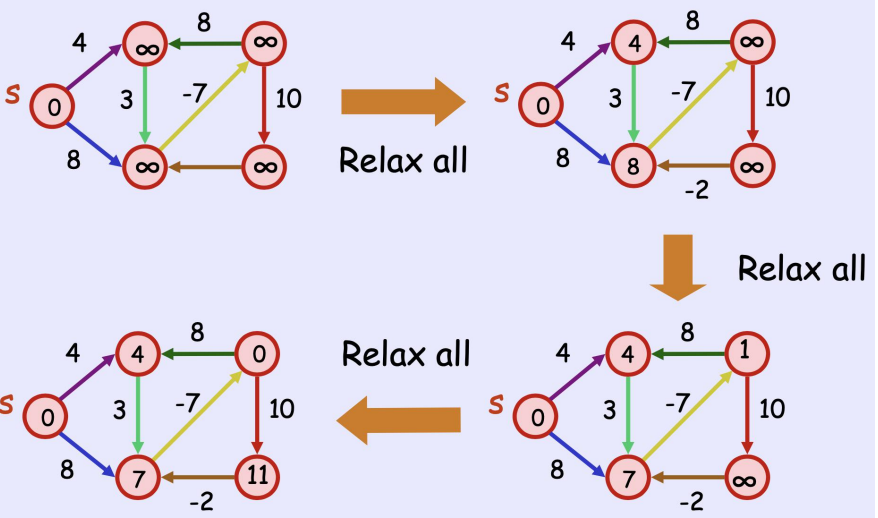

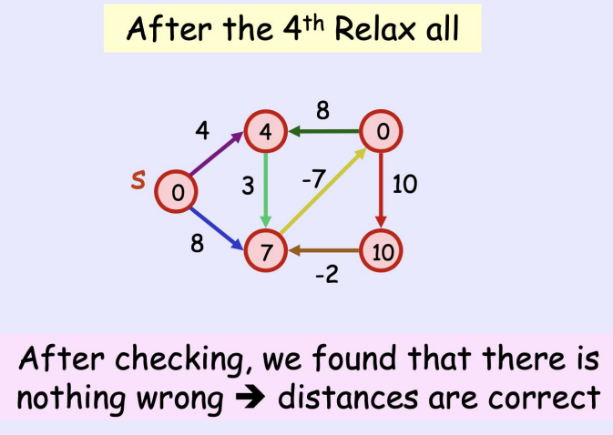

案例2
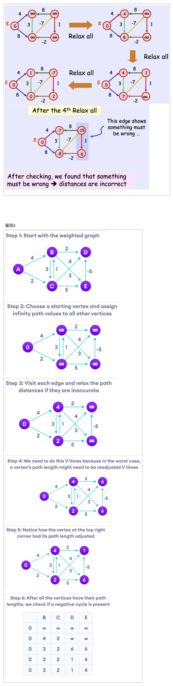
Bellman-Ford Algorithm

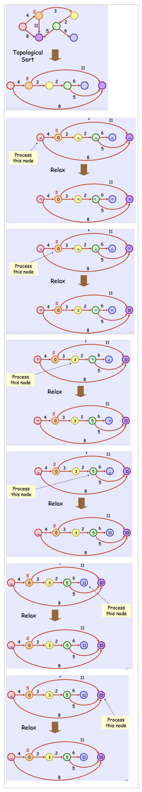
DAGs最短路径算法的正确性
如果不能从s获得v，那么算法返回d\[v\]=∞(v的边缘不会放松)。
如果v可以从s访问，consider the shortest path {v0, v1, ..., vk} with v0 =s and vk =v.
The edges of this path: (v0, v1), (v1, v2), ..., (vk-1, vk) are relaxed in this order since the vertices are processed in topological order
因此，一个DAG中的最短路径是在经过其所有边的一次松弛过程后计算出来的
该算法最坏情况下的时间复杂度为O(m+n)。

## 四、Dijkstra’s Algorithm 
1，概念
Dijkstra算法允许我们找到图的==任意两个顶点之间的最短路径==。

它不同于最小生成树，因为两个顶点之间的最短距离可能不包括图中的所有顶点

Dijkstra算法的工作原理是，顶点A和D之间的最短路径A-\>D的任何子路径B-\>D也是顶点B和D之间的最短路径

2，How Dijkstra's Algorithm works

Djikstra used this property in the opposite direction
我们高估了每个顶点与起始顶点的距离。然后我们访问每个节点及其邻居，以找到指向这些邻居的最短子路径。

该算法采用了一种贪婪的方法，即我们找到了下一个最佳解，希望最终结果是整个问题的最佳解。

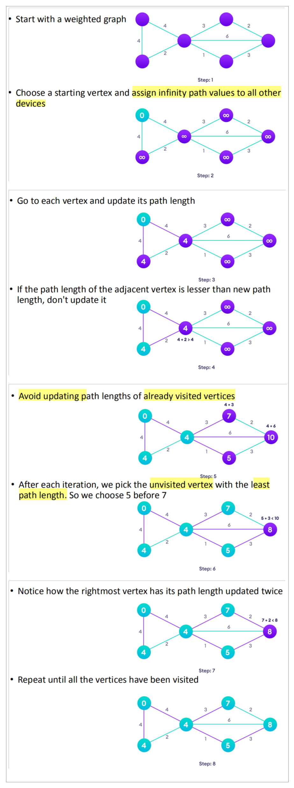

Dijkstra's Algorithm
边的权重：非负
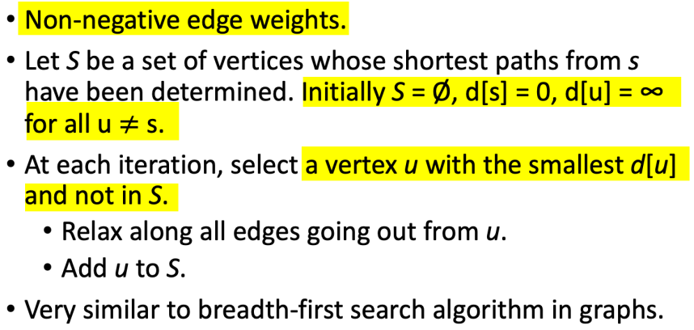

案例
对于当前点，连通连接的点，更新值，选出非包含集合的，最小的点，加入包含集合，设置为当前点，递归
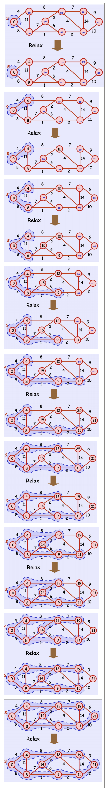

3，Dijkstra算法的正确性
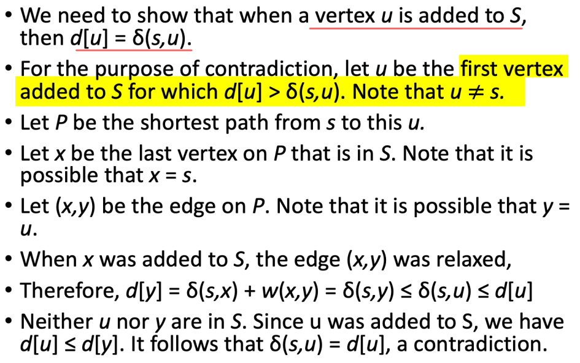

4，Performance
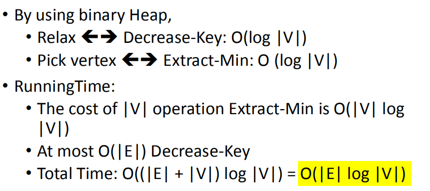

**4，Why do we need to be careful with ==negative weights?==【重点】**
像算法Dijkstra这样的最短路径算法不能检测到这样的周期，可能会给出错误的结果，因为它们可以经历一个负权重循环并减少路径长度
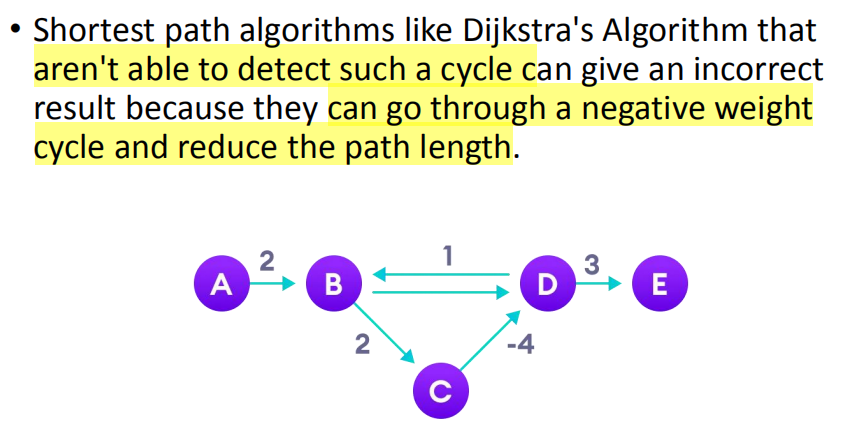

## 五、Floyd-Warshall Algorithm
每一次加入一个新的中转点
1，
查找所==有顶点对之间的最短路径==。

专注于寻找路径的最小权重。如果使用适当的前身矩阵，则可以重建最短的路径本身

Recall optimal substructure property of shortest paths.

2，
Floyd-Warshall Algorithm是一种寻找加权图中所有顶点对之间的最短路径的算法。
该算法同时适用于有向加权图和无向加权图。
但是，它并不适用于具有负循环的图（其中一个循环中的边的和是负的）。

3，Transitive Closure of a Graph
或者，弗洛伊德-沃尔应计算所谓的图“传递闭包”（Warshl的变体）。
传递闭包在所有间接连接的节点对之间按边缘扩展了一个图

例如，如果图有两条边——一条从A到B，一条从B到C——那么传递闭包将图从A扩展到C(因为有一条从A到C的路径存在)

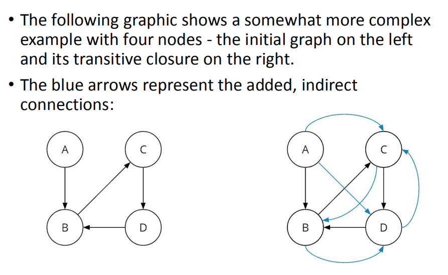

案例

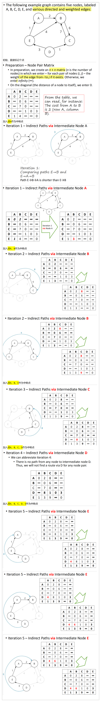
我们已经到达了第五次迭代的结束，现在知道如果我们也允许通过节点E(因此也允许通过A、B、C、D)——也就是通过任何其他节点，所有节点对的成本都是最低的。

案例

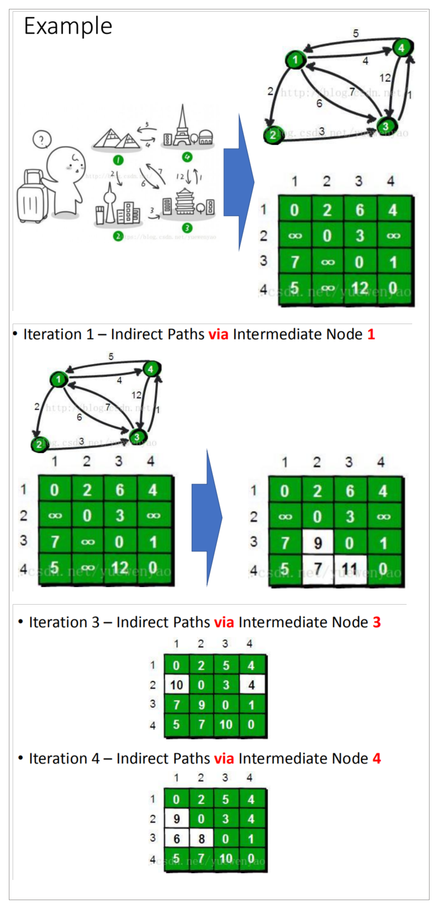

