• P vs. NP
• NP-complete
• co-NP
• NP-hard

## 一、P vs. NP 
1，P,NP
P：用==确定性多项式算法==可以解决的一类问题。
NP：用==非确定性多项式算法==可以解决的一类决策问题。
NP-hard：每个NP问题都被简化为的一类问题
NP-complete (NPC): NP-hard和NP的交集
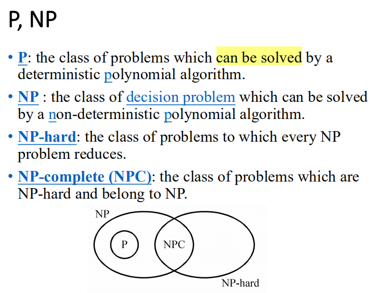

2，Decision Problems
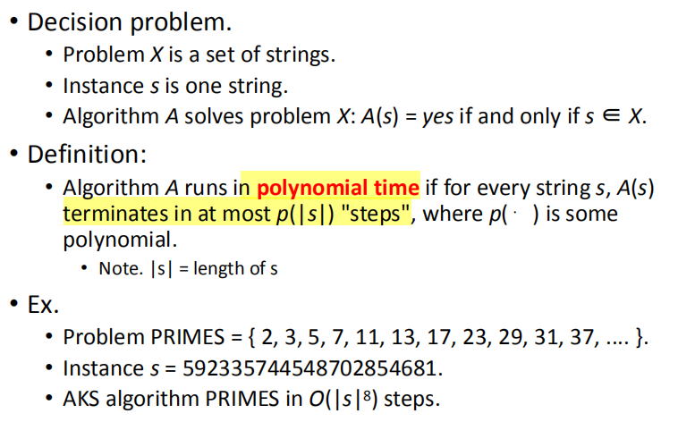
决策问题。解决方案只是“是”或“否”
而==优化问题则比较困难Optimization problems==
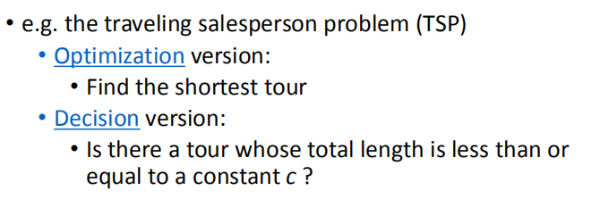

3，P
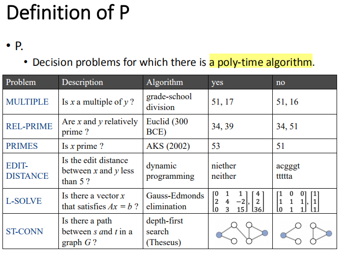

4，NP
Decision problems for which there is a poly-time certifier
存在多种时间认证器的决策问题
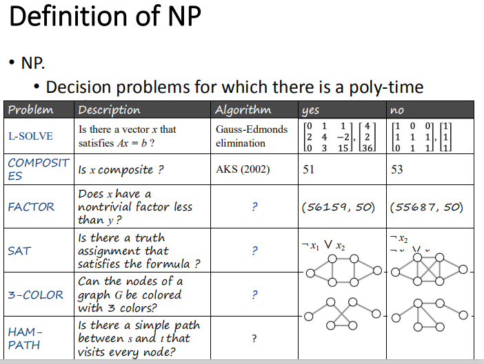

• Certification algorithm intuition.
Certifier从“管理”的角度来看待事物。

Certifier自己<u>不能确定S∈</u>X；相反，它检查==一个提议的证明t，s∈X==
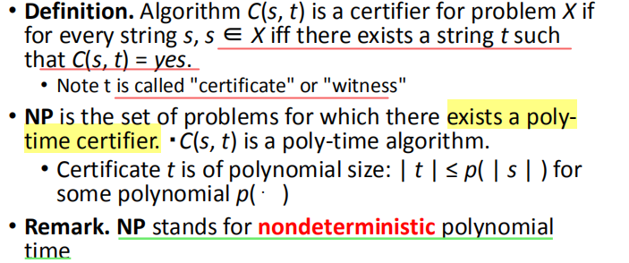

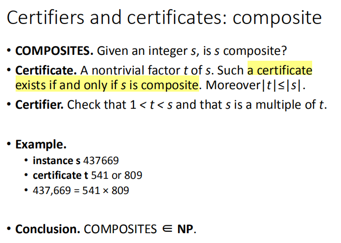

给定一个CNF公式Φ，有一个令人满意的分配吗？
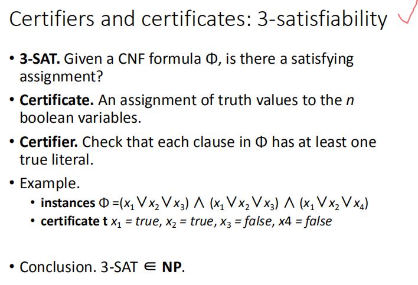

给定一个无向图G=(V、E)，是否存在一个访问每个节点的简单路径P？
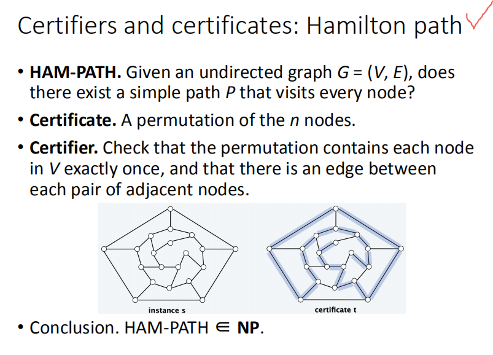
检查排列是否恰好包含V中的每个节点一次，并且每对相邻节点之间是否有一条边

5， P, NP, and EXP
• P. Decision problems for which there is a poly-time algorithm.
• NP. Decision problems for which there is a ==poly-time certifier.==
• EXP. Decision problems for which there is ==an exponential-time algorithm==

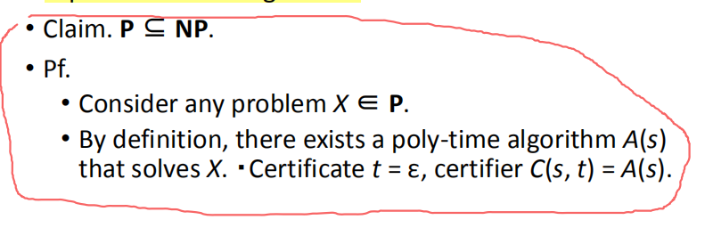

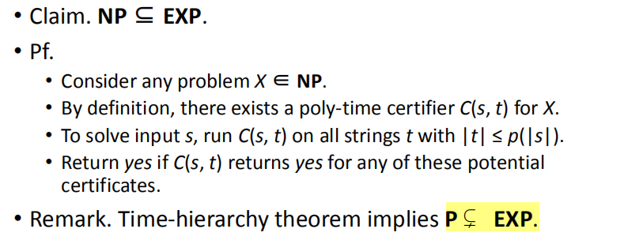
6,P, The main question: P vs. NP
P是否等于NP
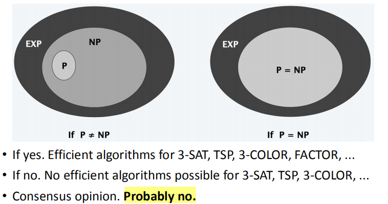

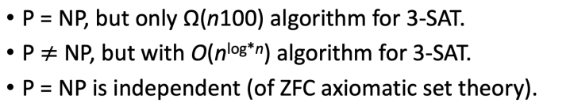
二、NP-complete
1，多项式转换
Definition.
如果问题X的任意实例可以用来解决，问题X多项式(Cook)将简化为问题Y：

标准计算步骤的多项式数，加上

解决问题Y的oracle的多项式数。

定义
问题X多项式(Karp)转换为问题Y，如果给定任何输入x到X，我们可以构造一个输入y，使x是X的yes实例，当且仅当y是Y的yes实例

我们要求\|y\|在\|x\|中是多项式的大小的

注意：
多项式变换是多项式约简，只有对Y的oracle的一个调用，正好在X算法的末尾

几乎所有的化简都是这种形式。

开放性问题：这两个概念对于NP是相同的吗？
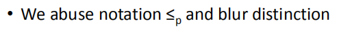

2，NP-complete
定义
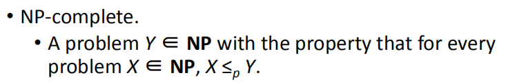

Definition of reduction:
当且仅当问题B(A≤pB)，当A可以用确定性多项式时间算法求解时，问题A才简化为问题B(A≤pB)。

3，Reduction
到目前为止，在最坏情况下，确定性多项式时间算法都不能解决任何NPC问题。
它似乎没有任何多项式时间算法来解决NPC问题。
The theory of NP-completeness always considers the worst case
任何NPC问题的下界似乎都是一个指数函数的阶数。
并不是所有的NP问题都很困难。(e.g.MST问题是一个NP问题。)

4，N=NP?(重点
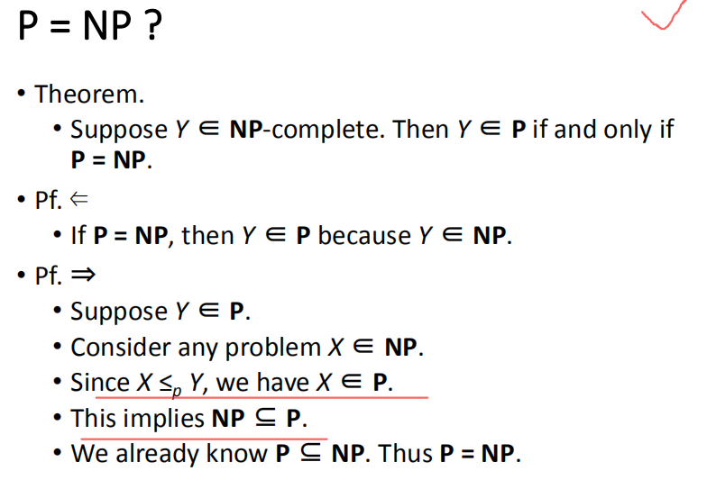

5，Cook’s theorem
NP = P iff the satisfiability problem is a P problem
• SAT is NP-complete.
• Every NP problem reduces to SAT.

6，Circuit satisfiability
给定由D、或和非门构建的组合电路，有没有方法设置电路输入以使输出为1？
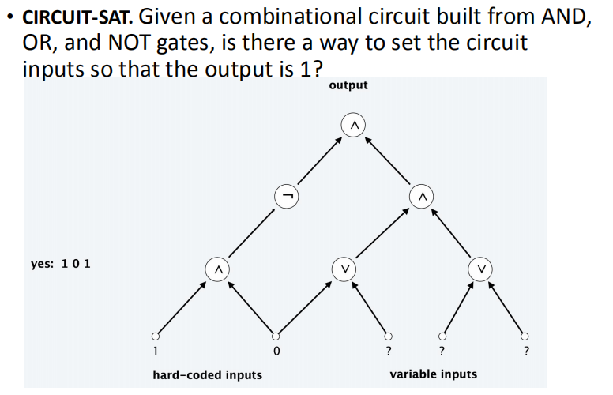

7，
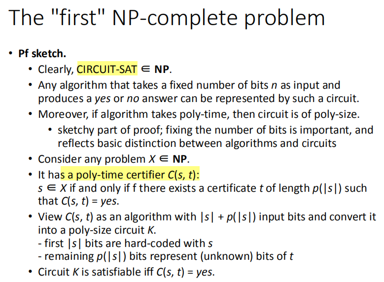

8，Proof of NP-Completeness（重点
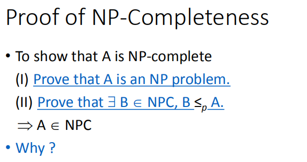

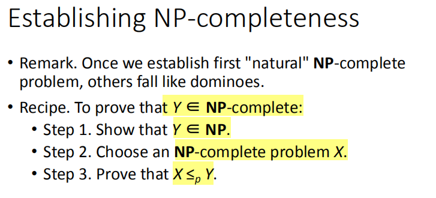

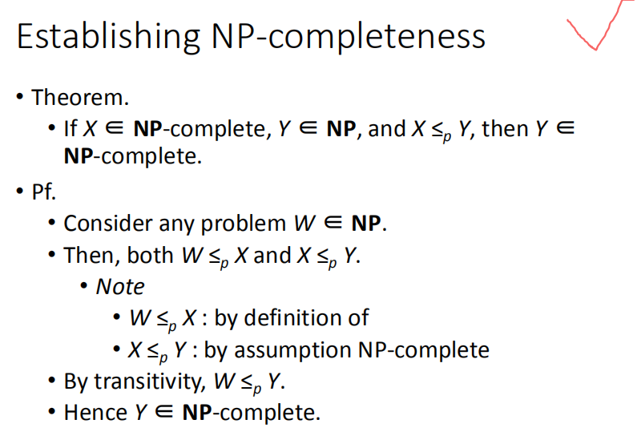

9，3-satisfiability is NP-complete

三、co-NP
1，Asymmetry of NP
NP的不对称信息
我们只需要有是的实例的简短证明。
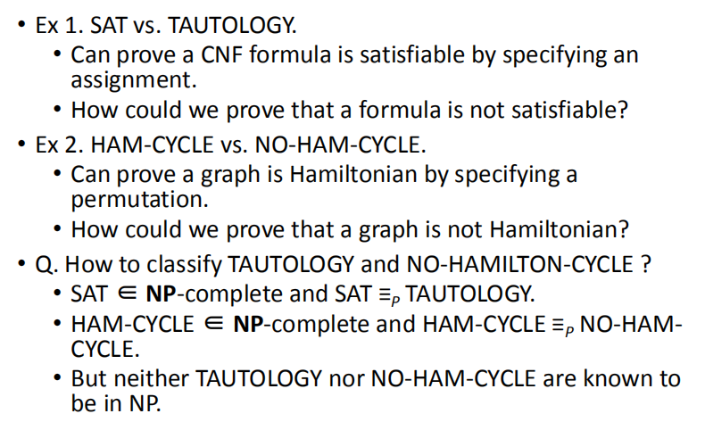
2，NP and co-NP

3，Good characterizations
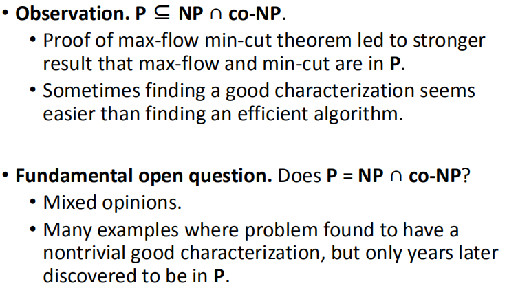

四、NP-hard
1，A note on terminology: consensus
NP-complete
NP中的一个问题，使得NP多时中的每一个问题都简化为它。
NP-hard. \[Bell Labs, Steve Cook, Ron Rivest, Sartaj Sahni\]
一个使NP多项式时间中的每一个问题都简化为它的问题。

• This problem can be P

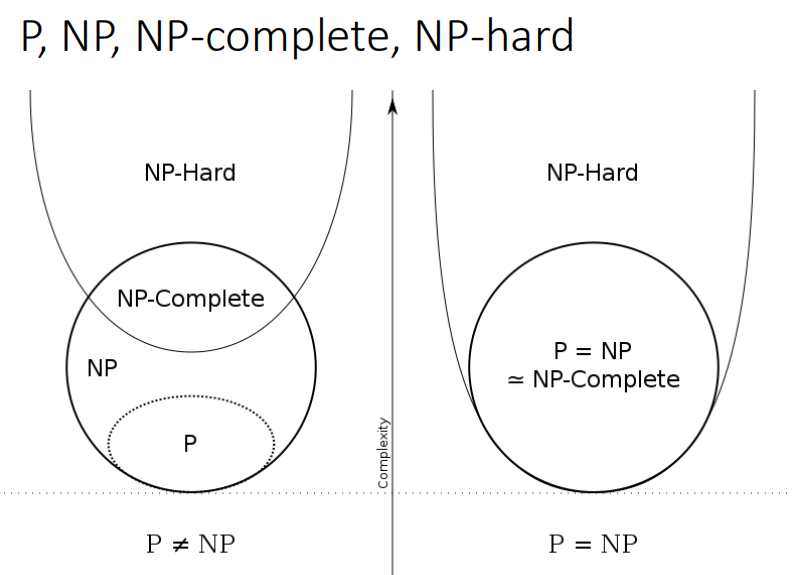

