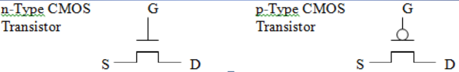

---

---

## 基本概念

1，Where did Digital Logic come from?

<table>
<colgroup>
<col style="width: 17%" />
<col style="width: 19%" />
<col style="width: 62%" />
</colgroup>
<thead>
<tr class="header">
<th>Boolean Algebra</th>
<th>George Boole</th>
<th>true，false；and ,or,not</th>
</tr>
</thead>
<tbody>
<tr class="odd">
<td>Switching Theory</td>
<td>
Claude

Shannon,
</td>
<td>utilizing the properties of electrical switches to compute logic functions</td>
</tr>
<tr class="even">
<td>The Transistor</td>
<td>Bell Laboratories.</td>
<td>the ability to be used as a switch and allowed the creation of much smaller, faster, more reliable, power efficient circuits as there are no moving parts.</td>
</tr>
</tbody>
</table>
2，在晶体管开关的栅极端施加控制电压，晶体管开关就可以打开或关闭。
它控制着漏极和源极之间的电流流动。
有两种主要类型的晶体管，称为n型和p型。

对于n型晶体管，当没有电压(GND)加到栅极时，晶体管充当开路开关，断开漏极和源电路。
当一个电压(比方说3V)加到门极时，晶体管充当一个连接漏极和源极的闭合开关。
p型器件的工作原理与施加在其栅极上的电压相反(互补)。

## Implementing Boolean Operations

## Summery

- Electrical switches can be used to create circuits for computing functions.

- **A semiconductor transistor can act as a miniature switch.**

- **Transistor switches** can be grouped and arranged to make simple **boolean logic operators**.

- Boolean operators can be combined to create more complex circuit functionality.

- Complex circuit functionality can be designed, manipulated and simplified using Boolean Algebra.

- Note: Intel’s newer 8-Core i7 Processor uses approximately 2.6 billion transistors and newer server processors like the 22-core Xeon Broadwell uses over 7 billion
