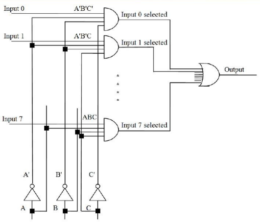
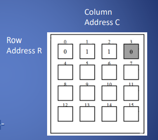
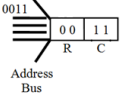
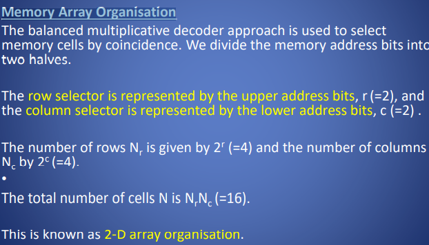
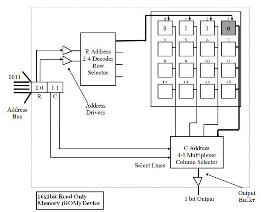
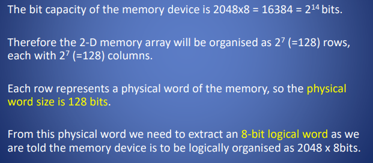
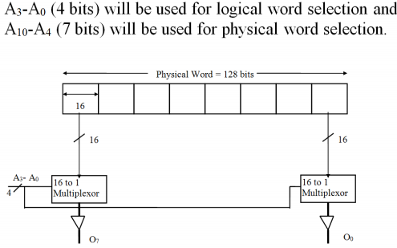
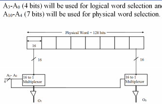
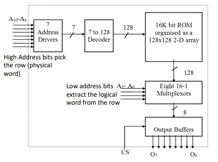

一、基本内容
A decoder is a circuit which takes a number of inputs, n, representing a binary code and uses the signal values of the inputs to select one of 2n outputs.

It is much easier to construct very large decoders like those used for translating address locations on memory devices. It allows the address to be split into two parts using smaller and simpler devices to decode the smaller parts.

二、Multiplexer
A multiplexer is a device which allows the selection of 1 distinct input value from a set of n inputs to be piped to its single output.

三、
以一个简单的存 储设备为例，它包含 16 个存储单 元，每个单元包含 1 位数据

Each cell has a 4-bit memory address. By supplying a particular 4- bit combinat

1，Memory Array Organisation

1，Logical and Physical Memory Words

A **physical word** is an entire single row of bits in the memory device, in which may be stored several logical words. Not all of this row can be read or written in one go as the device may not have enough input/output connections.
其中可以存储几个逻辑字。由于设备 可能没有足够的输入/输出连接，所以不能一次读取或写入所有的行。 逻辑字是一组每次被门控输出或写入存储设备的位。

A **logical word** is a group of bits gated to the output or written to the memory device at one time. One level of the address decoding selects a row (or physical word) in the memory device and the other level selects a portion of that row (the logical word).

The row decoder selects the physical word. From this physical word we need to extract the logical word and gate it to output. This can be done more easily with a multiplexer.
行解码器选择物理字。我们需要从这个物理词中提取逻辑词并将其输出。用
多路复用器可以更容易地做到这一点。

五、例子
1，
Memory Array Organisation – A 16x1bit Read Only Memory

2，Memory Array Organisation Example

The completed schematic for the 2048x8bit ROM

