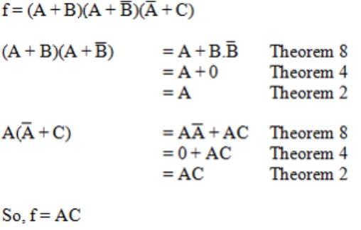

## 一、布尔代数

1，Boolean Algebra defines a set of laws, operations and theorems on the set of elements **{0, 1}**.

Algebra will **allow us to describe a circuit as a mathematical** **expression**, as a functional specification of its outputs in terms of its inputs.
It will allow us to **manipulate the functional specification** for the purposes of simplification of a circuit reducing the number of
logic gates required to implement it.
Algebra will help us **substitute alternative implementation** **solutions for circuits** or parts of circuits that may require using certain types of logic gates.

## 二、Boolean Operators

## 三、Boolean Functions

1，形式

2，函数的对偶【dual of a function】
函数的对偶是通过将AND运算符改为OR AND得到的
反过来1和0的关系也是一样的。变量保持不变。

**3，The complement of a function**
方法1：**先求对偶function，再对每一个单独变量求bar**
**The complement of a function can be found by complementing**
**each variable in the dual of that function.**

**方法2：De Morgan:**

4，运算符优先级别
（）\>NOT\>AND\>OR

5
any Boolean function can in fact be expressed using only **OR and NOT** operators.
any Boolean function can in fact be expressed using only **AND and NOT** operators.
,Boolean functions can be implemented entirely using **only NAND gates or alternatively NOR gates**.

6，常用公式

7，化简

## 四、Truth Tables

A truth table is a method of describing a Boolean function
1，SOP【找1】 和POS【找0】表示
n个变量，2的n次方行

3，Principle of Duality 对偶性原则

4，真值表的n不宜过大

5，常用

