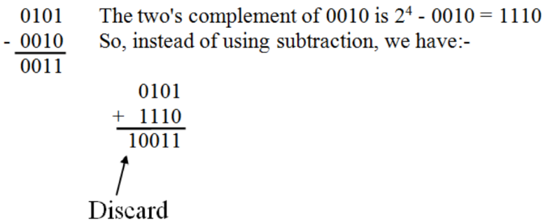

一、二进制
1，基本内容
用0和1来表示数字
Each position represents a power of 2 rather than a power of 10.

2，运算
2.1加法Addition
<table>
<colgroup>
<col style="width: 100%" />
</colgroup>
<thead>
<tr class="header">
<th>
0 + 0 = 0 sum

0 + 1 = 1 sum

1 + 0 = 1 sum

1 + 1 = 0 sum with a carry over of 1
</th>
</tr>
</thead>
<tbody>
</tbody>
</table>

2.2减法Subtraction Definition
<table>
<colgroup>
<col style="width: 100%" />
</colgroup>
<thead>
<tr class="header">
<th>
0 - 0 = 0 Difference

1 - 0 = 1 Difference

1 - 1 = 0 Difference

0 - 1 = 1 Difference with a Borrow of 1
</th>
</tr>
</thead>
<tbody>
</tbody>
</table>

2.3乘法Multiplication Definition

<table>
<colgroup>
<col style="width: 100%" />
</colgroup>
<thead>
<tr class="header">
<th>
0 x 0 = 0 Product

0 x 1 = 0 Product

1 x 0 = 0 Product

1 x 1 = 1 Product
</th>
</tr>
</thead>
<tbody>
</tbody>
</table>

2.4除法Division Definition

3，转换
3.1 十进制转换二进制

3.2二进制转换成十进制

4，Representing Integers【+，-，0】
4.1 An unsigned integer 【+，0】

4.2A signed integer

5，表示负数
5.1方法一 Signed Magnitude Form
最高位为1表示是负数

要用这种表示方式对数字数据进行运算，就需要单独的加法器和减法器电路。
通过使用一种不同的技术来表示负数，可以构造一个只使用加法就能进行加减的电路。

**5.2，Signed Integers in 2’s Complement Form**
**方法1：取反【1’s】再加1**
**方法2：右边向左走，第一个1不动，1左边的数字取反**

二、十六进制Hexadecimal Notation
1，表示符：0,1,2,…,9,A,B,C,D,E,F
Each hexadecimal symbol represents 4 binary digits.

2，四位四位取，从右--》左取

反码补码的补充

