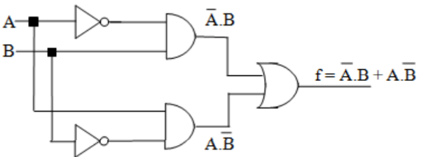
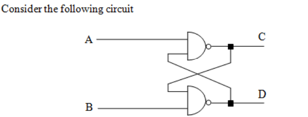
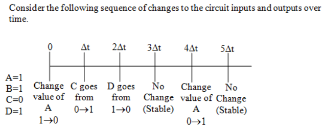
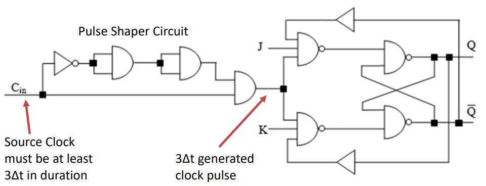

Combinational logic is where the output of a digital circuit is produced by combining the inputs in a manner defined by the logic.
Sequential logic is where the output of a digital
circuit depends on both the inputs and also on the
previous output state of the circuit.

一，two main classes of digital logic
1，Combinational Logic'

<table>
<colgroup>
<col style="width: 100%" />
</colgroup>
<thead>
<tr class="header">
<th>
输入的改变会马上影响输出，而且还有延迟问题

If the inputs A and B should change, then a change would be immediately propagated to the output f. There would be a small propagation delay, of approximately three gate delays, before the correct output became available

</th>
</tr>
</thead>
<tbody>
</tbody>
</table>

2'Sequential Logic'.
makes use of **flip-flops to generate circuits**
whose **outputs are time dependent** and are a function of both
the inputs to the circuit and the current state of its outputs.

3，basic flip-flop circuit operation
假设A=1, B=1, --\>C=0 and D=1.

at time 0, when A=1 and B=1, the output values were C = 0
and D = 1.
Now, at time 5Dt, when A=1 and B=1, the output values are C = 1
and D = 0.
The circuit is seen to be bistable.

二

三、
如果这个电路被放置在J-K触发器的输入端，所产生的电路称为边缘触发J-K触发器。这种触发器在时钟从一个逻辑电平转换到另一个逻辑电平时锁存输入值。
Pulse Shaper Circuit

