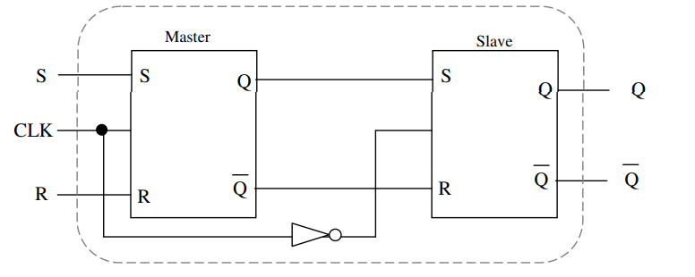

2，D Flipflop【保存值，输入=输出】

1 电路

2 state table

3 symbol
4 requirement table

5 next state

6 state diagram

3,JK

1 电路

2 state table

3 symbol
4 requirement table

5 next state

6 state diagram

4，主从SR触发器 Master-Slave SR flipflop

Clock=1，master flipflip影响output，slave device is disabled并且它的结果不变
Clock=0, slave flipflop影响output。Master flipflop is now disabled so its outputs are unchanged during this LOW clock
cycle.

